# PROJECT 10 — LOAD BALANCER SOLUTION WITH NGINX AND SSL/TLS

### Nginx Reverse Proxy | Let's Encrypt SSL | Certbot | HTTPS | Auto-Renewal | AWS EC2

---

## What I Gained From This Project

After completing this project, I:

- Understood why **Nginx** is a popular alternative to Apache as a Load Balancer — lighter memory footprint, event-driven architecture, and native SSL termination support
- Gained hands-on experience deploying and configuring **Nginx 1.28.3** as a reverse proxy Load Balancer on Ubuntu 26.04 LTS
- Registered a real domain name (`oddshare.com`) and pointed it to my AWS EC2 instance's Elastic IP via DNS A records
- Learned to verify DNS propagation using `ping` to confirm a domain resolves to the correct IP
- Configured **local DNS hostname resolution** on the Nginx LB via `/etc/hosts` (reusing `Web01` and `Web02` from Project 8)
- Used **Certbot 5.6.0** with the `--nginx` plugin to automatically obtain and install a free **Let's Encrypt SSL certificate** for `www.oddshare.com`
- Observed how Certbot **automatically modified** the Nginx config to add `listen 443 ssl`, SSL certificate paths, and HTTP-to-HTTPS redirect rules
- Verified the full HTTPS setup by accessing `https://www.oddshare.com` in the browser
- Set up **automatic certificate renewal** using a cron job running every 12 hours
- Tested renewal with `certbot renew --dry-run` to confirm the auto-renewal pipeline works before the 90-day expiry

---

## Project Overview

This project replaces the **Apache Load Balancer** from Project 8 with an **Nginx Load Balancer**, and adds **SSL/TLS encryption** so all traffic is served over HTTPS. A real domain name (`oddshare.com`) is registered and pointed to the Nginx LB via an Elastic IP. Let's Encrypt provides the free SSL certificate via Certbot, and a cron job ensures the certificate renews automatically every 90 days.

---

## Architecture

```
Browser (HTTPS — Port 443)
           ↓  SSL/TLS encrypted
  Nginx Load Balancer (Ubuntu 26.04)   ← NEW
  domain: www.oddshare.com
  Elastic IP: 54.159.149.52
           ↓              ↓
Web Server 1 (RHEL 8)  Web Server 2 (RHEL 8)
    (Web01)                (Web02)
           ↓              ↓
     NFS Server — shared /var/www/html
                   ↓
          MySQL DB Server (Ubuntu)
```

---

## Step 1 — Launch & SSH into the Nginx LB EC2 Instance

A new EC2 instance was launched with the following configuration:

- **Name:** Nginx-LB
- **OS:** Ubuntu 26.04 LTS (GNU/Linux 7.0.0-1004-aws x86_64)
- **Instance type:** t3.small
- **Security Group inbound rules:** Port 22 (SSH), Port 80 (HTTP), Port 443 (HTTPS)

SSH connection established using the project `.pem` key:

```bash
ssh -i Downloads/udo-task.pem ubuntu@32.199.195.10
```

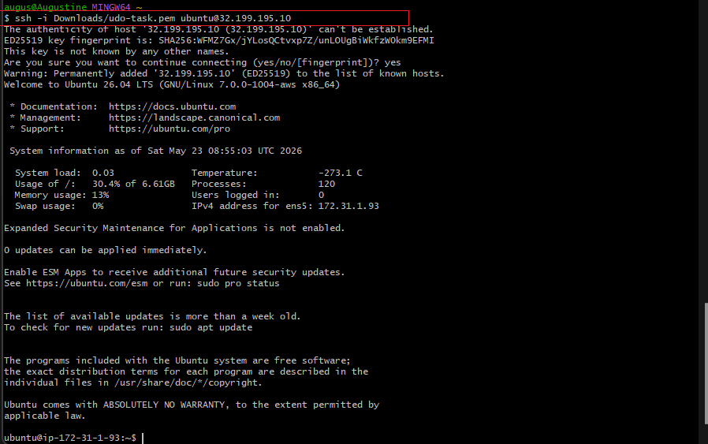

The server identified itself as **Ubuntu 26.04 LTS** with Private IP `172.31.1.93`. Zero pending updates confirmed a clean base image.

---

## Step 2 — Install Nginx

### 2A — Update Package List

```bash
sudo apt update
```

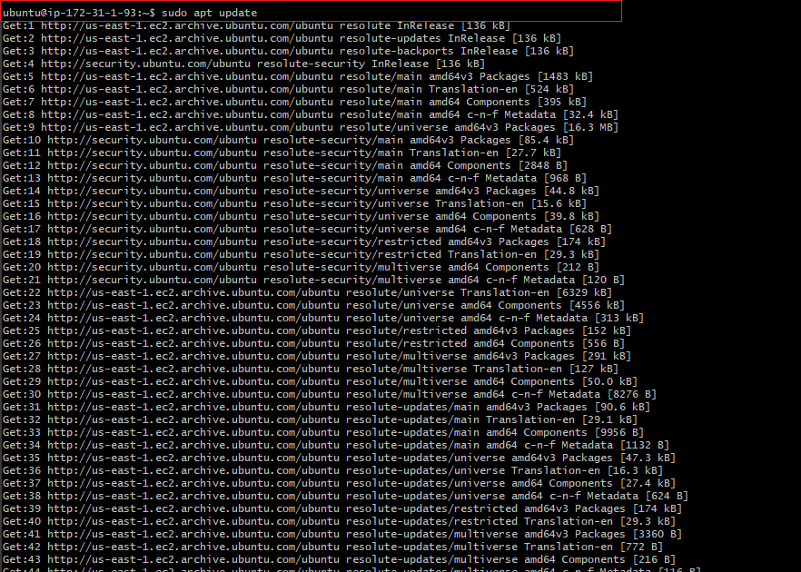

All Ubuntu Resolute repositories (`resolute`, `resolute-updates`, `resolute-backports`, `resolute-security`, and universe/multiverse variants) were fetched successfully — confirming Ubuntu 26.04 uses the codename **"Resolute"**.

### 2B — Install Nginx

```bash
sudo apt install nginx -y
```

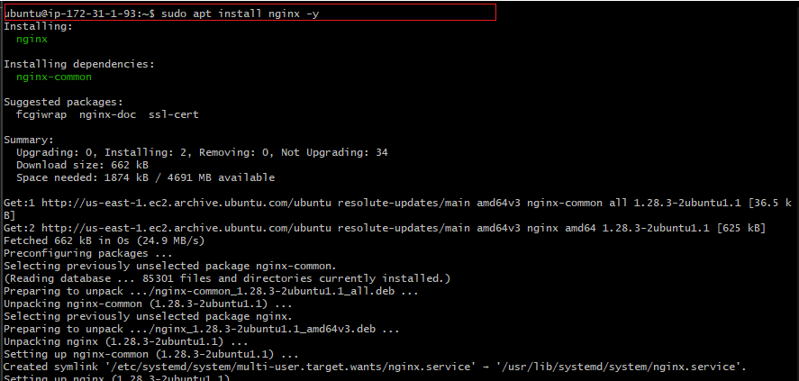

**Nginx 1.28.3** and its dependency `nginx-common` (1.28.3-2ubuntu1.1) installed successfully. Total download: 662 kB. A systemd symlink was automatically created at `/etc/systemd/system/multi-user.target.wants/nginx.service`.

### 2C — Verify Nginx is Running

```bash
sudo systemctl status nginx
```

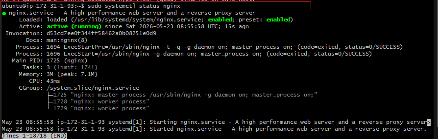

`nginx.service` confirmed **Active: active (running)** since `Sat 2026-05-23 08:55:58 UTC`. The service is **enabled** (starts on boot). Nginx is running with one master process (PID 1725) and two worker processes (PIDs 1728, 1729) — memory usage a lean 3M

---

## Step 3 — Configure Local DNS Hostnames

The same Web Server hostname aliases from Project 8 were reused on the Nginx LB:

```bash
sudo vi /etc/hosts
```

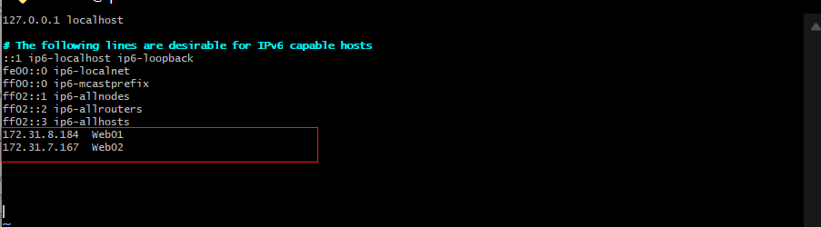

Two entries were appended at the bottom:

```
172.31.8.184  Web01
172.31.7.167  Web02
```

This allows the Nginx upstream config to reference `Web01` and `Web02` by name instead of raw private IPs.

---

## Step 4 — Configure Nginx as Load Balancer

The Nginx config file was opened and the upstream block and server block added inside the `http` section:

```bash
sudo vi /etc/nginx/nginx.conf
```

The `sites-enabled` include line was commented out and the upstream block added:

```nginx
upstream myproject {
    server Web01 weight=5;
    server Web02 weight=5;
}

server {
    server_name www.oddshare.com;
    location / {
        proxy_pass http://myproject;
    }
}
```

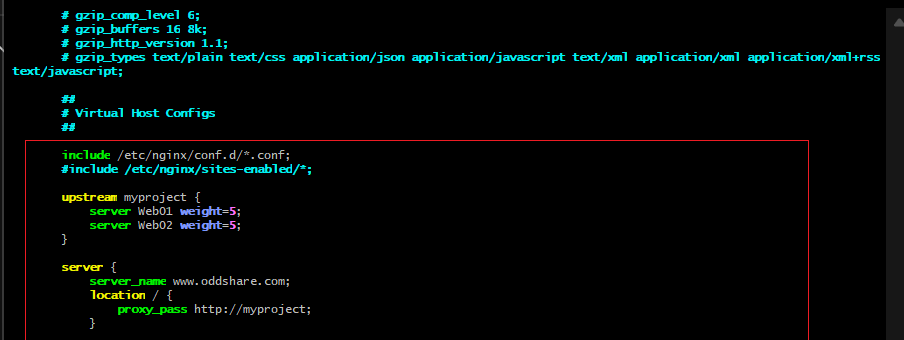

The configuration confirms:
- `upstream myproject` block with `Web01` and `Web02` each assigned `weight=5` (equal 50/50 traffic split)
- `#include /etc/nginx/sites-enabled/*;` commented out to avoid conflicts with the custom upstream block
- `server_name www.oddshare.com` pointing to the registered domain
- `proxy_pass http://myproject` routing all requests through the upstream cluster

Nginx was restarted to apply the configuration:

```bash
sudo systemctl restart nginx
```

---

## Step 5 — Register Domain & Point to Elastic IP

### 5A — Domain Registration

The domain `oddshare.com` was registered and DNS A records were configured to point to the Nginx LB's Elastic IP (`54.159.149.52`):

| Record Type | Name | Value |
|-------------|------|-------|
| A | @ | 54.159.149.52 |
| A | www | 54.159.149.52 |

### 5B — Verify DNS Propagation

DNS resolution was verified from the Nginx LB server:

```bash
ping oddshare.com
```

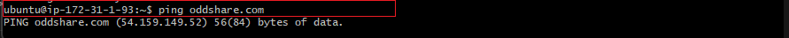

```
PING oddshare.com (54.159.149.52) 56(84) bytes of data.
```

The domain `oddshare.com` correctly resolves to `54.159.149.52` — the Elastic IP assigned to the Nginx LB

### 5C — Test Website Over HTTP (Before SSL)

The Tooling Website login page was accessed via the domain before SSL was applied:

```
http://oddshare.com/login.php
```

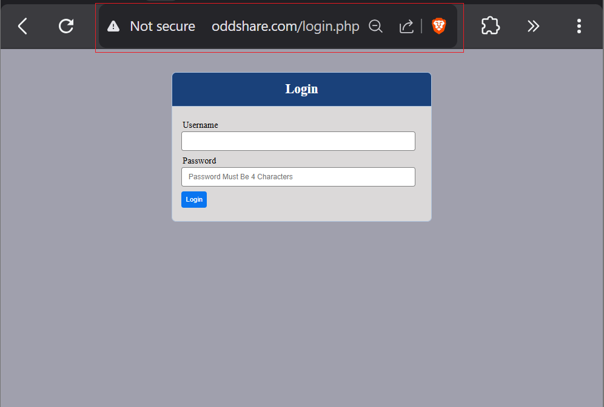

The login page loaded successfully over HTTP. The browser shows **"Not secure"** — confirming the site is reachable through the domain but HTTPS is not yet configured at this stage.

---

## Step 6 — Install Certbot and Obtain SSL Certificate

### 6A — Verify snapd is Running

```bash
sudo systemctl status snapd
```

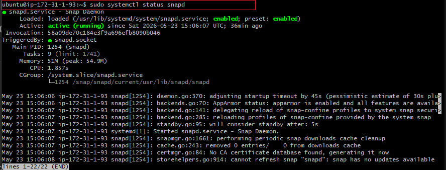

`snapd.service` confirmed **Active: active (running)** since `Sat 2026-05-23 15:06:07 UTC`. The snap daemon is fully operational and ready to install Certbot

### 6B — Install Certbot via Snap

```bash
sudo snap install --classic certbot
```

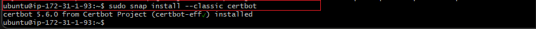

```
certbot 5.6.0 from Certbot Project (certbot-eff/) installed
```

**Certbot 5.6.0** installed successfully via snap

### 6C — Create Certbot Symlink

```bash
sudo ln -s /snap/bin/certbot /usr/bin/certbot
```

This makes `certbot` available as a global command from anywhere in the terminal.

### 6D — Request SSL Certificate

```bash
sudo certbot --nginx
```

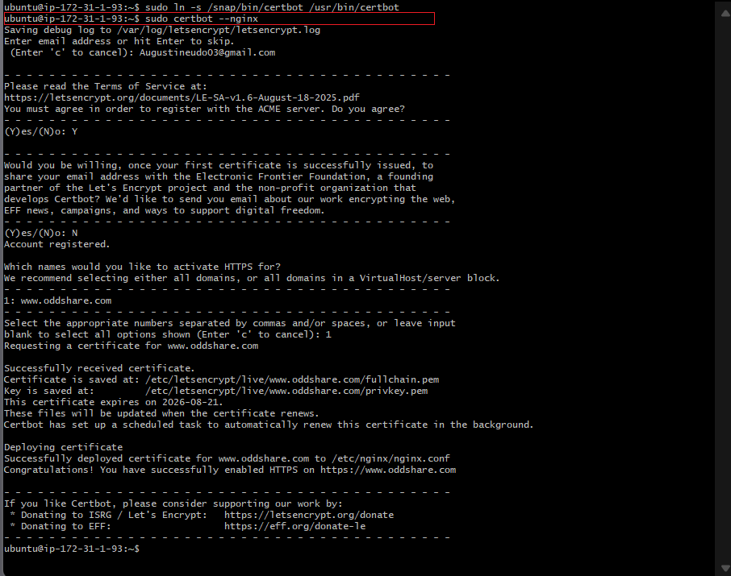

Certbot walked through the interactive setup:

1. **Email address:** `Augustineudo03@gmail.com` (for expiry notifications)
2. **Terms of Service:** Agreed — `Y`
3. **EFF email sharing:** Declined — `N`
4. **Domain selection:** Selected `1: www.oddshare.com`

**Result:**

```
Successfully received certificate.
Certificate is saved at: /etc/letsencrypt/live/www.oddshare.com/fullchain.pem
Key is saved at:         /etc/letsencrypt/live/www.oddshare.com/privkey.pem
This certificate expires on 2026-08-21.
Certbot has set up a scheduled task to automatically renew this certificate.

Deploying certificate
Successfully deployed certificate for www.oddshare.com to /etc/nginx/nginx.conf
Congratulations! You have successfully enabled HTTPS on https://www.oddshare.com
```
 **SSL certificate issued and deployed automatically by Certbot**

---

## Step 7 — Certbot Auto-Modifies Nginx Config

After issuing the certificate, Certbot automatically modified the Nginx config to add SSL directives and an HTTP-to-HTTPS redirect:

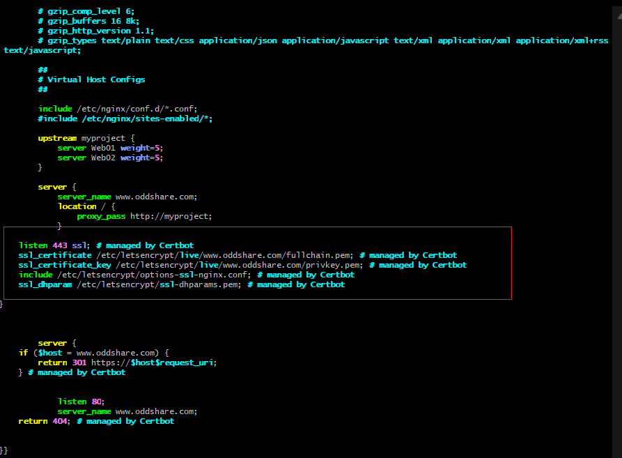

The updated `nginx.conf` now includes:

```nginx
upstream myproject {
    server Web01 weight=5;
    server Web02 weight=5;
}

server {
    server_name www.oddshare.com;
    location / {
        proxy_pass http://myproject;
    }

    listen 443 ssl; # managed by Certbot
    ssl_certificate /etc/letsencrypt/live/www.oddshare.com/fullchain.pem; # managed by Certbot
    ssl_certificate_key /etc/letsencrypt/live/www.oddshare.com/privkey.pem; # managed by Certbot
    include /etc/letsencrypt/options-ssl-nginx.conf; # managed by Certbot
    ssl_dhparam /etc/letsencrypt/ssl-dhparams.pem; # managed by Certbot
}

server {
    if ($host = www.oddshare.com) {
        return 301 https://$host$request_uri;
    } # managed by Certbot

    listen 80;
    server_name www.oddshare.com;
    return 404; # managed by Certbot
}
```

Key changes Certbot made automatically:
- Added `listen 443 ssl` to serve HTTPS on port 443
- Set `ssl_certificate` and `ssl_certificate_key` to the Let's Encrypt certificate paths
- Included `options-ssl-nginx.conf` for secure SSL settings
- Added a second `server` block that **redirects all HTTP (port 80) traffic to HTTPS** with a `301` permanent redirect

---

## Step 8 — Test HTTPS Access in Browser

### Before SSL — HTTP Only

```
http://oddshare.com/login.php    ← "Not secure" warning
```


### After SSL — HTTPS Secured

```
https://oddshare.com/login.php
```

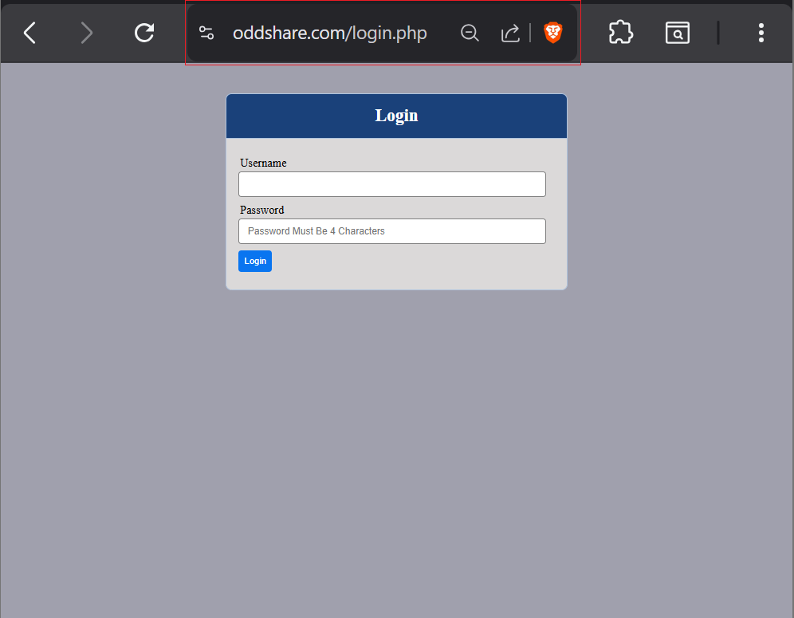

The Tooling Website login page loaded successfully over `https://oddshare.com/login.php`. The browser address bar confirms the site is now served over **HTTPS** via the `oddshare.com` domain

---

## Step 9 — Set Up Automatic Certificate Renewal

Let's Encrypt certificates expire every **90 days**. Certbot was configured to renew automatically.

### 9A — Test Renewal First

```bash
sudo certbot renew --dry-run
```

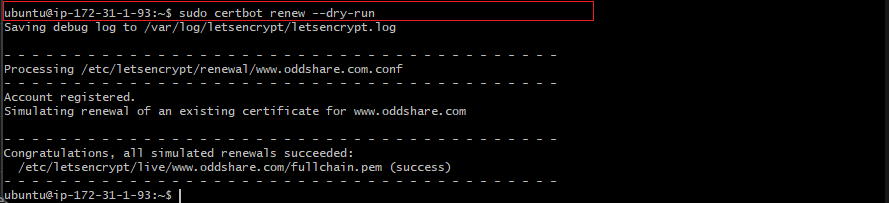

```
Processing /etc/letsencrypt/renewal/www.oddshare.com.conf
Account registered.
Simulating renewal of an existing certificate for www.oddshare.com

Congratulations, all simulated renewals succeeded:
  /etc/letsencrypt/live/www.oddshare.com/fullchain.pem (success)
```

The dry-run confirms the renewal process works correctly — no actual certificate change is made, just a simulation

### 9B — Set Up Cron Job for Auto-Renewal

```bash
crontab -e
```

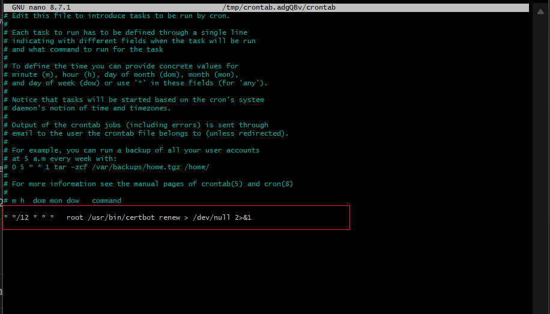

The following line was added at the bottom of the crontab file:

```cron
* */12 * * *   root /usr/bin/certbot renew > /dev/null 2>&1
```

This cron job runs **every 12 hours**, attempts to renew the certificate if it is within 30 days of expiry, and suppresses all output. Certbot only performs the actual renewal when needed — the frequent schedule ensures no certificate ever expires unnoticed.

---

## Load Balancing Configuration Summary

| Parameter | Web Server 1 | Web Server 2 |
|-----------|-------------|-------------|
| Private IP | 172.31.8.184 | 172.31.7.167 |
| Hostname alias | Web01 | Web02 |
| weight | 5 (50% of traffic) | 5 (50% of traffic) |
| Protocol | HTTP (internal) | HTTP (internal) |
| LB method | weighted round-robin | weighted round-robin |

| SSL Configuration | Value |
|------------------|-------|
| Domain | www.oddshare.com |
| Elastic IP | 54.159.149.52 |
| Certificate Authority | Let's Encrypt |
| Certificate path | `/etc/letsencrypt/live/www.oddshare.com/fullchain.pem` |
| Expiry | 2026-08-21 (90-day cycle) |
| Auto-renewal | Cron every 12 hours |
| HTTP redirect | Port 80 → 301 → HTTPS |

---

## Key Issues Faced & How They Were Resolved

### Issue 1 — Ubuntu 26.04 "Resolute" Instead of 20.04

| | |
|---|---|
| **Symptom** | EC2 launched with Ubuntu 26.04 LTS (codename "Resolute") instead of 20.04 (Focal) as specified in the project guide. |
| **Impact** | The apt repositories use `resolute` instead of `focal` or `noble` as the codename. Package names and versions differ — Nginx installed as 1.28.3 instead of older versions referenced in the guide. |
| **Fix** | No changes required — all commands worked correctly on Ubuntu 26.04. The newer OS is fully compatible with Nginx 1.28.3, Certbot 5.6.0, and the snap daemon. Noted that AWS EC2 AMI selection always defaults to the latest Ubuntu LTS. |

---

### Issue 2 — HTTP Site Working But HTTPS Not Yet (Interim State)

| | |
|---|---|
| **Symptom** | Accessing `oddshare.com/login.php` showed "Not secure" in the browser — the Tooling site loaded over HTTP but without the padlock. |
| **Root Cause** | This was the expected state **before** running Certbot. The Nginx config at this point only had `listen 80` and no SSL directives. |
| **Fix** | Running `sudo certbot --nginx` obtained the certificate and automatically modified the Nginx config to add `listen 443 ssl`, SSL certificate paths, and the HTTP-to-HTTPS `301` redirect. After this, `https://oddshare.com` loaded securely. |

---

## Final Result — Nginx Load Balancer + SSL Fully Operational

- **HTTPS secured:** all traffic to `www.oddshare.com` served over port 443 with a valid Let's Encrypt SSL certificate
- **HTTP redirect:** any HTTP (port 80) request is permanently redirected (301) to HTTPS automatically
- **Load balanced:** Nginx distributes traffic equally between Web Server 1 (Web01) and Web Server 2 (Web02) with `weight=5` each
- **Certificate auto-renewal:** cron job runs every 12 hours ensuring the certificate never expires unattended
- **Dry-run verified:** `certbot renew --dry-run` confirmed the renewal process succeeds before the first real expiry
- **Domain live:** `oddshare.com` resolves to the Elastic IP `54.159.149.52` and serves the Propitix Tooling Website over HTTPS

---