# ANSIBLE CONFIGURATION MANAGEMENT – AUTOMATE PROJECT 7 TO 10
### Jenkins | Ansible | GitHub | AWS EC2

---

## What I Gained From This Project

After completing this project, I:

- Understood the concept of a Jump Server (Bastion Host) and how it improves infrastructure security
- Installed and configured Ansible on an EC2 instance to act as a control node
- Gained hands-on experience writing YAML-based Ansible playbooks
- Configured Jenkins to automatically archive build artifacts on every GitHub push
- Learned how to use SSH Agent Forwarding to authenticate Ansible across multiple servers
- Allocated an Elastic IP to a Jenkins-Ansible server to maintain a stable webhook endpoint
- Successfully automated the installation of Wireshark across 5 servers (RHEL + Ubuntu) with a single command

---

## Project Overview

This document details the setup of Ansible Configuration Management on AWS EC2, automating the configuration of servers from Projects 7–10. A Jenkins-Ansible server acts as both a CI/CD server and an Ansible control node, using a GitHub webhook to trigger automated builds and artifact archiving.

---

## Step 0 — SSH into the Jenkins-Ansible Server

Connected to the Jenkins-Ansible EC2 instance (Ubuntu 24.04.4 LTS) using the `.pem` key:

```bash
ssh -i Downloads/udo.pem ubuntu@35.175.107.183
```

Host fingerprint confirmed and permanently added to `known_hosts`. Private IP confirmed as `172.31.72.207`.

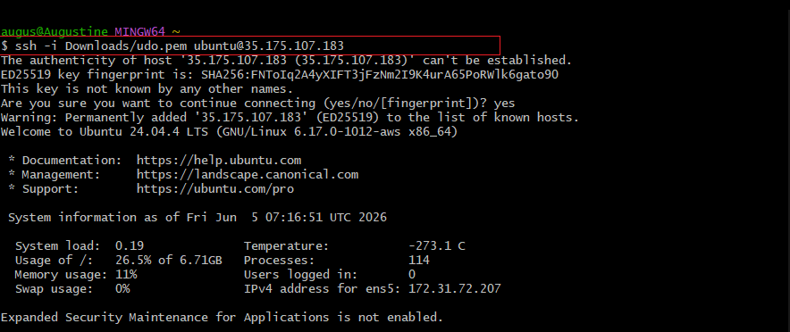

---

## Step 1 — Install and Configure Ansible

### Update Package List

```bash
sudo apt update
```

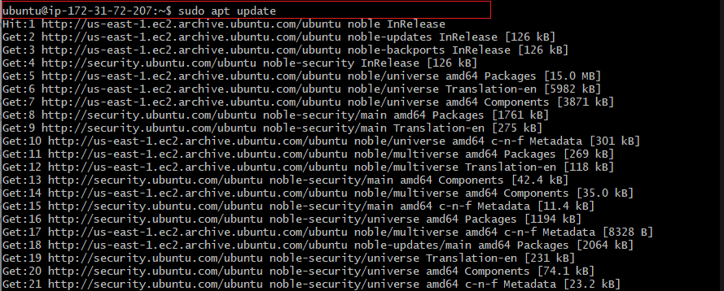

### Install Ansible

```bash
sudo apt install ansible
```

Ansible and all required Python dependencies were installed, including `ansible-core`, `python3-dnspython`, `python3-kerberos`, `python3-passlib`, and others. Total disk space used: **315 MB**.

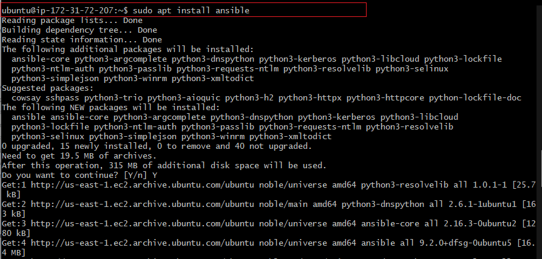

### Verify Ansible Version

```bash
ansible --version
```

**Result:** Ansible core **2.16.3** installed successfully

```
ansible [core 2.16.3]
config file = None
executable location = /usr/bin/ansible
python version = 3.12.3
jinja version = 3.1.2
```

> **Note:** `config file = None` — Ansible was installed without a default config file. This was addressed later by creating `/etc/ansible/ansible.cfg` manually (see Project 12).

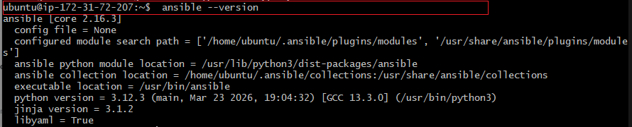

---

## Step 2 — Allocate Elastic IP to Jenkins-Ansible Server

To avoid reconfiguring the GitHub webhook every time the server restarts (which changes the public IP), an **Elastic IP** was allocated and associated with the Jenkins-Ansible instance.

### Associate Elastic IP

- **Elastic IP:** `3.219.69.161`
- **Instance:** `i-05cdaa0a3d6ce055d`
- **Private IP:** `172.31.72.207`

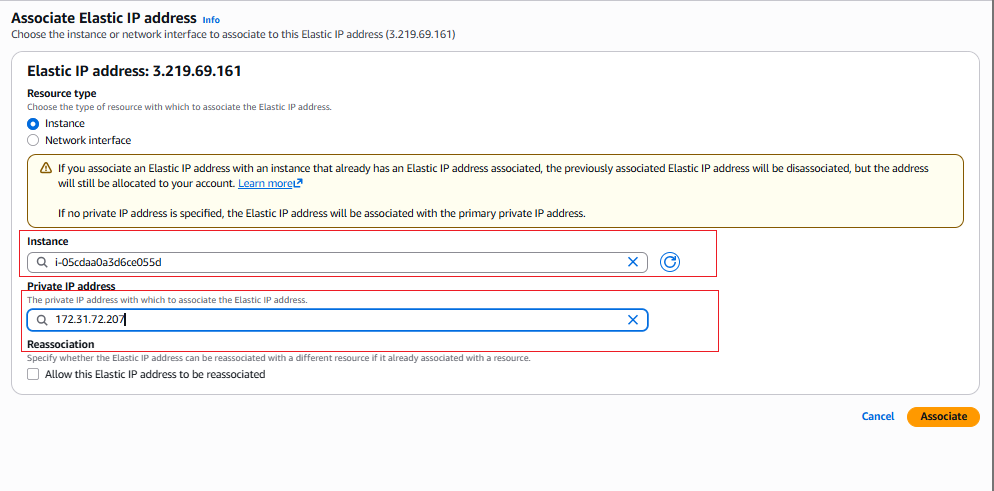

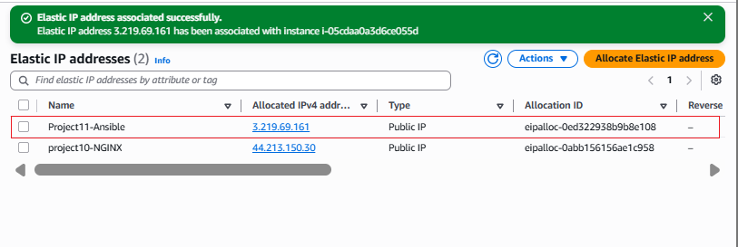

**Result:** Elastic IP `3.219.69.161` permanently associated with Jenkins-Ansible

This means the GitHub webhook URL stays the same regardless of server restarts:
```
http://3.219.69.161:8080/github-webhook/
```

---

## Step 3 — Clone the Repository and Create Feature Branch

### Clone ansible-config-mgt Repository

On the local machine (Windows PowerShell):

```bash
git clone https://github.com/udobuzor/ansible-config-mgt.git
cd ansible-config-mgt
```

### Create a Descriptive Feature Branch

```bash
git checkout -b feature/prj-11-ansible-config
```

**Result:** Switched to new branch `feature/prj-11-ansible-config`

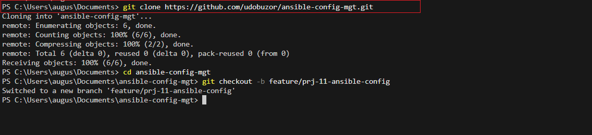

Following DevOps best practices, the branch name includes the project number and a clear description of the work being done.

---

## Step 4 — Set Up SSH Agent Forwarding

Ansible needs to SSH into all target servers from the Jenkins-Ansible host. SSH Agent Forwarding was configured so the private key on the local machine is forwarded through to the Ansible server.

### On Local Machine (Git Bash)

```bash
# Start SSH Agent
eval $(ssh-agent -s)
# Agent pid 2176

# Add the PEM key
ssh-add ~/Downloads/udo.pem
# Identity added: Downloads/udo.pem

# Confirm key loaded
ssh-add -l
# 2048 SHA256:fHVIHLBEN437px... Downloads/udo.pem (RSA)

# SSH into Jenkins-Ansible with agent forwarding
ssh -A ubuntu@3.219.69.161
```

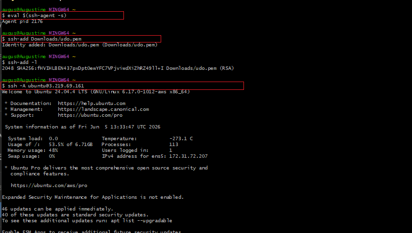

The `-A` flag forwards the SSH key so Ansible running on the Jenkins-Ansible server can use it to connect to all other servers without copying the private key to the server.

---

## Step 5 — Create Ansible Directory Structure

Created the required folders and files inside the `ansible-config-mgt` repository:

```
ansible-config-mgt/
├── inventory/
│   ├── dev.yml       ← development servers
│   ├── staging.yml   ← staging environment
│   ├── uat.yml       ← UAT environment
│   └── prod.yml      ← production environment
└── playbooks/
    └── common.yml    ← first playbook
```

---

## Step 6 — Configure the Dev Inventory

Updated `inventory/dev.yml` with all server private IPs and their correct SSH users:

```ini
[nfs]
172.31.69.47 ansible_ssh_user='ec2-user'

[webservers]
172.31.76.18 ansible_ssh_user='ec2-user'
172.31.65.225 ansible_ssh_user='ec2-user'

[db]
172.31.79.222 ansible_ssh_user='ubuntu'

[lb]
172.31.67.53 ansible_ssh_user='ubuntu'
```

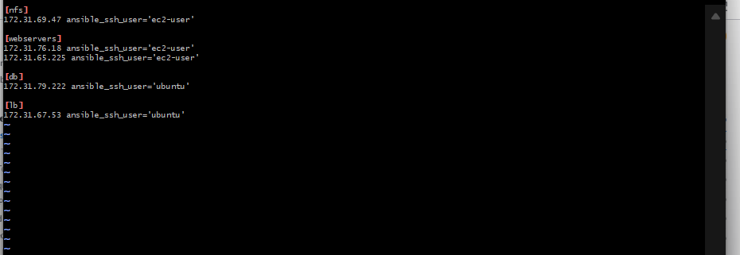

> **Note:** RHEL-based servers (NFS, webservers) use `ec2-user`. Ubuntu-based servers (DB, LB) use `ubuntu`.

---

## Step 7 — Write the common.yml Playbook

Created `playbooks/common.yml` — the first Ansible playbook, designed to run common configuration tasks across all servers. The playbook installs Wireshark on both RHEL (yum) and Ubuntu (apt) servers:

```yaml
---
- name: update web, nfs
  hosts: webservers, nfs, db
  remote_user: ec2-user
  become: yes
  become_user: root
  tasks:
    - name: ensure wireshark is at the latest version
      yum:
        name: wireshark
        state: latest

- name: update LB server, db servers
  hosts: lb, db
  remote_user: ubuntu
  become: yes
  become_user: root
  tasks:
    - name: Update apt repo
      apt:
        update_cache: yes

    - name: ensure wireshark is at the latest version
      apt:
        name: wireshark
        state: latest
```

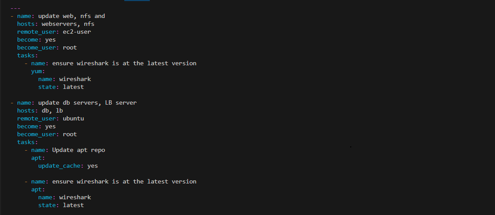

The playbook is split into two plays:
- **Play 1:** Targets `webservers`, `nfs`, and `db` — installs Wireshark via `yum` (RHEL)
- **Play 2:** Targets `lb` — updates apt cache and installs Wireshark via `apt` (Ubuntu)

---

## Step 8 — Push Code, Create Pull Request, and Merge

### Commit and Push to Feature Branch

```bash
git add .
git commit -m "Add ansible inventory and common playbook"
git push origin feature/prj-11-ansible-config
```

### Create Pull Request on GitHub

Opened a Pull Request on GitHub from `feature/prj-11-ansible-config` → `main`:
- **Title:** Add ansible inventory and common playbook
- **Description:** updated main branch
- **Status:** Able to merge — no conflicts

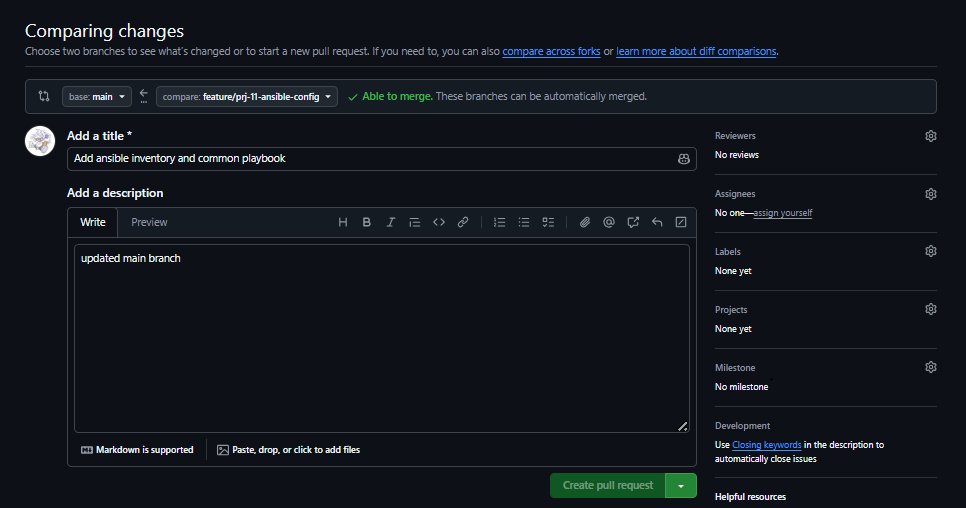

### Merge the Pull Request

Confirmed the merge commit message and merged to `main`:

```
Merge pull request #1 from udobuzor/feature/prj-11-ansible-configA
Add ansible inventory and common playbook
```

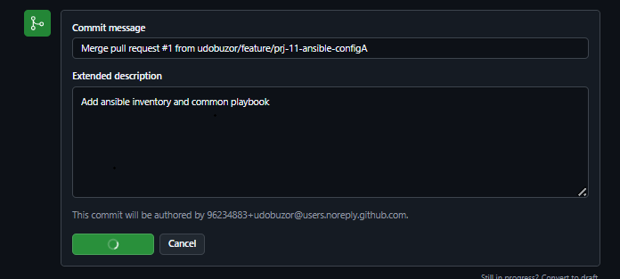

### Pull Latest Changes Locally

```bash
git checkout main
git pull origin main
```

**Result:** Fast-forward merge — 4 files changed, 39 insertions:
- `inventory/dev.yml` — 13 lines added
- `inventory/staging.yml` — created
- `inventory/uat.yml` — created
- `playbooks/common.yml` — 26 lines added


---

## Step 9 — Verify Jenkins Archived the Build Artifacts

After the merge to `main`, Jenkins was automatically triggered by the GitHub webhook. Verified the build artifacts were saved on the Jenkins-Ansible server:

**Build 2 (initial test — README only):**
```bash
ls /var/lib/jenkins/jobs/ansible-config-mgt/builds/2/archive
# README.md
```

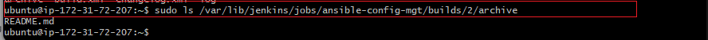

**Build 3 (after full merge — all files present):**
```bash
ls /var/lib/jenkins/jobs/ansible-config-mgt/builds/3/archive
# README.md  inventory  playbooks
```

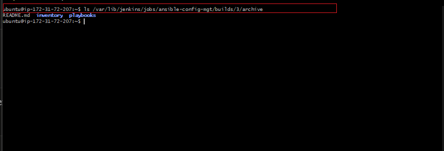

**Result:** Jenkins successfully archived all repository files on every GitHub push

---

## Step 10 — Set Up SSH Agent and Run the Playbook

### Configure SSH Agent Forwarding (Final Setup)

On the local machine, started the agent, loaded the key, and connected with forwarding:

```bash
eval $(ssh-agent -s)
ssh-add ~/Downloads/udo.pem
ssh-add -l
# 2048 SHA256:fHVIHLBEN437px... /c/Users/augus/Downloads/udo.pem (RSA)

ssh -A ubuntu@3.219.69.161
```

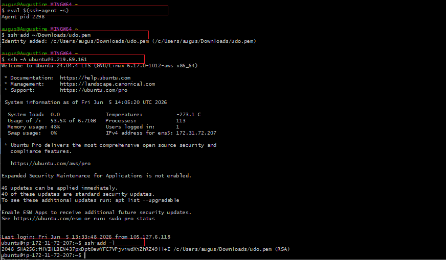

### Run the Ansible Playbook

From the Jenkins build archive directory on the Jenkins-Ansible server:

```bash
cd /var/lib/jenkins/jobs/ansible-config-mgt/builds/4/archive
ansible-playbook -i inventory/dev.yml playbooks/common.yml
```

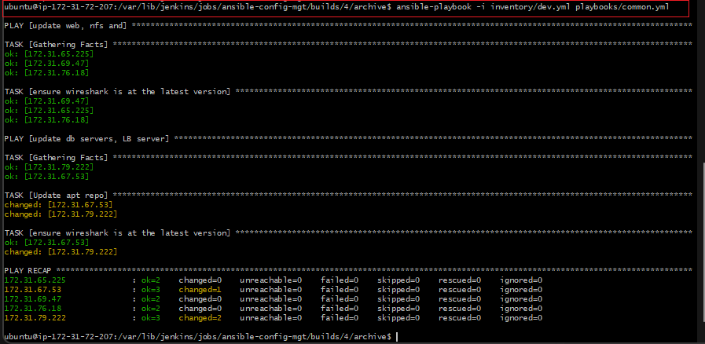

**PLAY RECAP:**

| Host | ok | changed | unreachable | failed |
|------|----|---------|-------------|--------|
| 172.31.65.225 | 2 | 0 | 0 | 0 |
| 172.31.67.53 | 3 | 1 | 0 | 0 |
| 172.31.69.47 | 2 | 1 | 0 | 0 |
| 172.31.76.18 | 2 | 0 | 0 | 0 |
| 172.31.79.222 | 3 | 2 | 0 | 0 |

All 5 servers reached successfully with **0 failures**

---

## Step 11 — Verify Wireshark Installation on Target Servers

SSHed into one of the web servers to confirm Wireshark was installed by Ansible:

```bash
ssh -i Downloads/udo.pem ec2-user@44.192.114.138
wireshark --version
```

**Result:** Wireshark **2.6.2 (v2.6.2)** installed successfully on the RHEL server

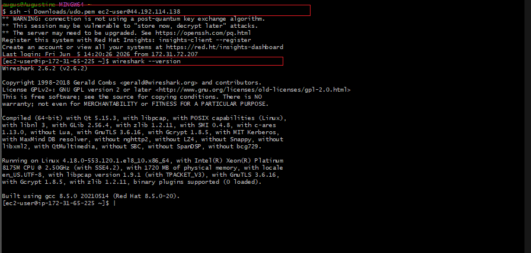

---

| Component | Details |
|-----------|---------|
| **Control Node** | Jenkins-Ansible EC2 — Ubuntu 24.04, `172.31.72.207` |
| **Elastic IP** | `3.219.69.161` (stable webhook endpoint) |
| **Ansible Version** | core 2.16.3 |
| **Servers Managed** | 5 (2 webservers, 1 NFS, 1 DB, 1 LB) |
| **Playbook** | `common.yml` — installs Wireshark on all servers |
| **Trigger** | GitHub push to `main` → Jenkins webhook → build archived |

---

## Issues Encountered & Resolutions

| Issue | Root Cause | Fix |
|-------|-----------|-----|
| `Could not open a connection to your authentication agent` | SSH agent not started before `ssh-add` | Run `eval $(ssh-agent -s)` first, then `ssh-add` |
| `Permission denied (publickey)` when SSHing to server | Missing `-i` flag or wrong key file | Use `ssh -i ~/Downloads/udo.pem ubuntu@<IP>` explicitly |
| All hosts `UNREACHABLE` — Connection timed out | AWS Security Group missing inbound SSH rule from Jenkins-Ansible | Added SSH rule for `172.31.0.0/16` in shared Security Group |
| Host key checking prompted during playbook run | New servers not in `known_hosts`, Ansible paused mid-run | Set `host_key_checking = False` in `ansible.cfg` |
| `config file = None` after Ansible install | No default `ansible.cfg` created during installation | Created `/etc/ansible/ansible.cfg` manually (addressed in Project 12) |
| Jenkins build only showed `README.md` in archive | Webhook triggered before inventory and playbook files were merged | Merged PR to `main`, Jenkins re-triggered and archived all files correctly |
| GitHub webhook IP changed after server restart | EC2 public IP changes on every stop/start | Allocated and associated Elastic IP `3.219.69.161` to the instance |