# ANSIBLE REFACTORING, STATIC ASSIGNMENTS, IMPORTS AND ROLES
### Jenkins | Ansible | GitHub | AWS EC2

---

## What I Gained From This Project

After completing this project, I:

- Learned how to refactor Ansible code using imports and roles for better maintainability
- Gained practical experience setting up a multi-stage Jenkins pipeline with artifact copying
- Understood the difference between static and dynamic assignments in Ansible
- Built reusable Ansible roles (`webserver`) to configure UAT servers automatically
- Resolved real-world Linux permission issues with Jenkins and directory ownership
- Configured Ansible's `ansible.cfg` from scratch and understood how `roles_path` works
- Successfully deployed a live tooling website to UAT web servers using a fully automated pipeline

---

## Project Overview

This document details the refactoring of Ansible code from Project 11, introducing a cleaner Jenkins pipeline with artifact saving, static assignments, playbook imports, and a dedicated `webserver` role to configure UAT web servers on AWS EC2.

---

## Step 1 — Jenkins Job Enhancement (save_artifacts)

### Installing the Copy Artifact Plugin

Navigated to **Manage Jenkins → Plugins → Available** and searched for `Copy Artifact`. Installed the **Copy Artifact** plugin (version 795.ve8e151429b_27) which adds a build step to copy artifacts from another project.

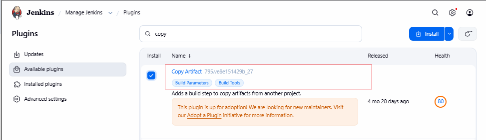

### Creating the save_artifacts Freestyle Job

- Clicked **New Item**
- Named it `save_artifacts`
- Selected **Freestyle project**
- Clicked **OK**

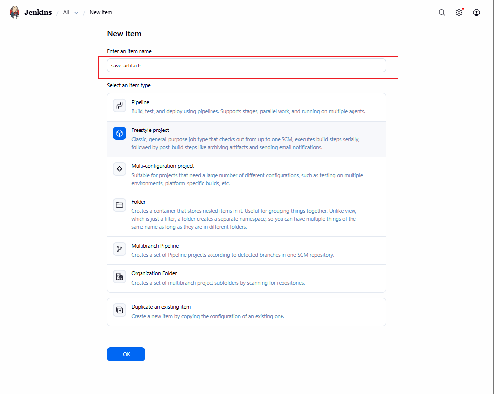

Configured **Discard Old Builds** with Log Rotation, keeping a maximum of **3 builds** to save server disk space.

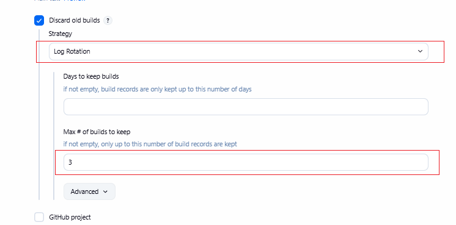

Under **Build Triggers**, checked  **"Build after other projects are built"** and entered `ansible-config-mgt` as the project to watch, set to **"Trigger only if build is stable"**.

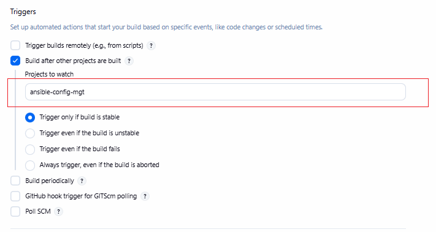

Under **Build Steps**, added **"Copy artifacts from another project"** with:
- **Project name:** `ansible-config-mgt`
- **Which build:** Latest successful build
- **Artifacts to copy:** `**`
- **Target directory:** `/home/ubuntu/ansible-config-artifact`

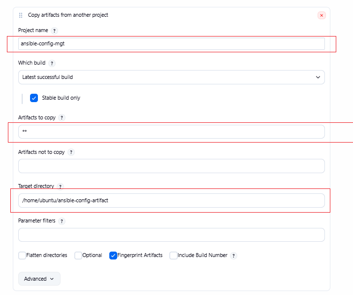

---

## Issue Encountered — AccessDeniedException on Target Directory

When the `save_artifacts` job ran for the first time, it failed with:

```
FATAL: /home/ubuntu/ansible-config-artifact
java.nio.file.AccessDeniedException: /home/ubuntu/ansible-config-artifact
```

### Root Cause

Jenkins runs as the `jenkins` system user. Even though the `ansible-config-artifact` directory had been created with `chmod 777` and owned by `jenkins`, the **parent directory** `/home/ubuntu` had restrictive permissions:

```
drwxr-x--x  6 ubuntu ubuntu 4096  /home/ubuntu
```

The `--x` at the end meant **others** (including the `jenkins` user) could traverse into the directory but could **not read** it — which was enough to block Jenkins from creating files inside subdirectories.

### Fix Applied

```bash
sudo chmod 755 /home/ubuntu
```

This changed permissions to `drwxr-xr-x`, giving the `jenkins` user read + execute access on the parent directory. After this change the build succeeded immediately.

**Key lesson:** When a process can enter a directory (`x`) but not list or write inside it (`r`), even `777` on subdirectories won't help — the parent must be accessible too.

---

## Step 2 — Refactor Ansible Code with site.yml and Static Assignments

### Creating site.yml as the Entry Point

Inside the `playbooks/` folder, created `site.yml` as the master playbook — the single entry point for all infrastructure configuration. Initially it imported `common.yml`:

```yaml
---
- hosts: all
- import_playbook: ../static-assignments/common.yml
```

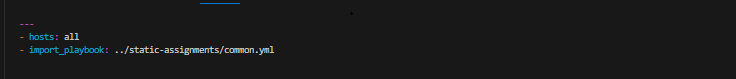

### Creating common-del.yml to Remove Wireshark

Created `static-assignments/common-del.yml` to delete Wireshark from all servers — demonstrating playbook reuse via imports:

```yaml
---
- name: update web and nfs
  hosts: webservers, nfs
  remote_user: ec2-user
  become: yes
  become_user: root
  tasks:
  - name: delete wireshark
    yum:
      name: wireshark
      state: removed

- name: update LB server and db servers
  hosts: lb, db
  remote_user: ubuntu
  become: yes
  become_user: root
  tasks:
  - name: delete wireshark
    apt:
      name: wireshark-qt
      state: absent
      autoremove: yes
      purge: yes
      autoclean: yes
```

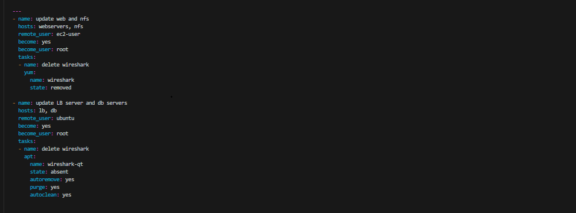

Updated `site.yml` to import `common-del.yml` instead:

```yaml
---
- hosts: all
- import_playbook: ../static-assignments/common-del.yml
```

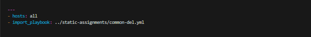

### Running the Deletion Playbook Against Dev Servers

```bash
ansible-playbook -i inventory/dev.yml playbooks/site.yml
```

**Result:** Wireshark successfully deleted from all 5 dev servers 

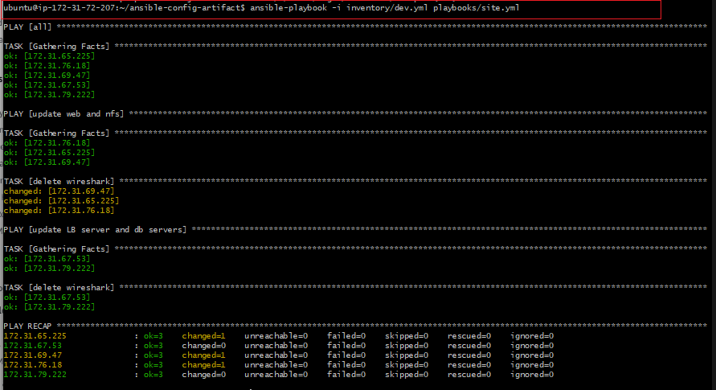

**PLAY RECAP:**

| Host | ok | changed | unreachable | failed |
|------|----|---------|-------------|--------|
| 172.31.65.225 | 3 | 1 | 0 | 0 |
| 172.31.67.53 | 3 | 0 | 0 | 0 |
| 172.31.69.47 | 3 | 1 | 0 | 0 |
| 172.31.76.18 | 3 | 1 | 0 | 0 |
| 172.31.79.222 | 3 | 0 | 0 | 0 |

---

## Step 3 — Configure UAT Webservers with the 'webserver' Role

### Launching UAT EC2 Instances

Launched 2 new EC2 instances using **RHEL 8** image, named:
- `Web1-UAT` — Private IP: `172.31.76.113`
- `Web2-UAT` — Private IP: `172.31.72.76`

### Updating the UAT Inventory

Updated `inventory/uat.yml` with the private IPs of both UAT servers:

```ini
[uat-webservers]
172.31.72.76 ansible_ssh_user='ec2-user'
172.31.76.113 ansible_ssh_user='ec2-user'
```

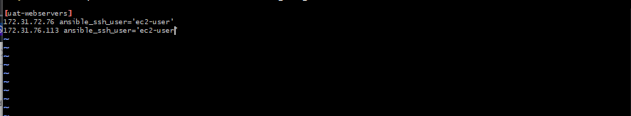

---

## Issue Encountered — Ansible Config File Not Found

When running `ansible --version`, the output showed:

```
config file = None
```

Ansible was installed but had no configuration file, meaning it couldn't locate the roles directory.

### Fix Applied — Created ansible.cfg from Scratch

```bash
sudo mkdir -p /etc/ansible
sudo vi /etc/ansible/ansible.cfg
```

Added the following configuration:

```ini
[defaults]
roles_path = /home/ubuntu/ansible-config-mgt/roles
host_key_checking = False
timeout = 160
gathering = smart
log_path = ~/ansible.log

[ssh_connection]
ssh_args = -o ControlMaster=auto -o ControlPersist=30m -o ForwardAgent=yes
```

After saving, verified Ansible picked it up:

```bash
ansible --version
# config file = /etc/ansible/ansible.cfg  
```

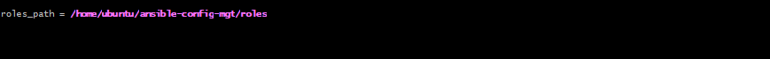

**Key lesson:** Without `roles_path` set in `ansible.cfg`, Ansible cannot find roles stored in custom directories. Always verify `ansible --version` shows the correct config file path.

---

## Step 4 — Writing the webserver Role Tasks

Navigated to `roles/webserver/tasks/main.yml` and wrote the full configuration tasks:

```yaml
---
- name: install apache
  become: true
  ansible.builtin.yum:
    name: "httpd"
    state: present

- name: install git
  become: true
  ansible.builtin.yum:
    name: "git"
    state: present

- name: clone a repo
  become: true
  ansible.builtin.git:
    repo: https://github.com/udobuzor/tooling.git
    dest: /var/www/html
    force: yes

- name: copy html content one level up
  become: true
  command: cp -r /var/www/html/html/ /var/www/

- name: Start service httpd, if not started
  become: true
  ansible.builtin.service:
    name: httpd
    state: started

- name: recursively remove /var/www/html/html/ directory
  become: true
  ansible.builtin.file:
    path: /var/www/html/html
    state: absent
```

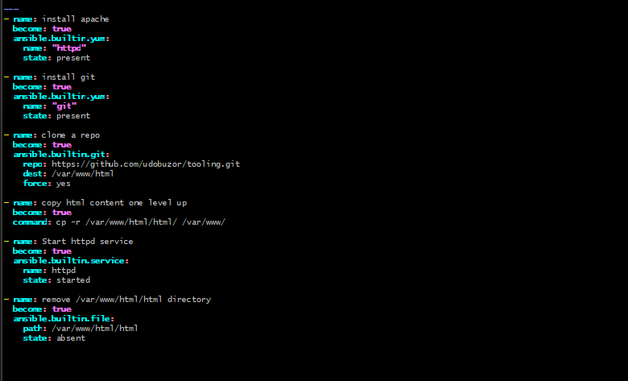

---

## Step 5 — Reference the webserver Role in Static Assignments

### Creating uat-webservers.yml

Created `static-assignments/uat-webservers.yml` to reference the `webserver` role:

```yaml
---
- hosts: uat-webservers
  roles:
    - webserver
```

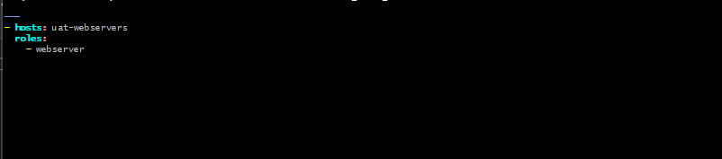

### Updating site.yml to Import uat-webservers.yml

Updated `playbooks/site.yml` to include both the common playbook and the UAT assignment:

```yaml
---
- hosts: all
- import_playbook: ../static-assignments/common.yml

- hosts: uat-webservers
- import_playbook: ../static-assignments/uat-webservers.yml
```

---

## Step 6 — Commit, Push, and Run the Final Playbook

Committed all changes to the `refactor` branch, opened a Pull Request, and merged to `main`. Jenkins automatically triggered both jobs (`ansible-config-mgt` → `save_artifacts`) on the GitHub push.

Ran the playbook against the UAT inventory:

```bash
ansible-playbook -i /home/ubuntu/ansible-config-mgt/inventory/uat.yml \
/home/ubuntu/ansible-config-mgt/playbooks/site.yml
```

**Result:** Both UAT web servers fully configured 

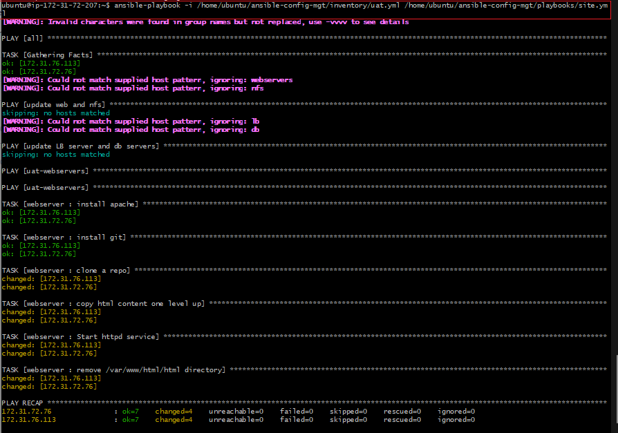

**PLAY RECAP:**

| Host | ok | changed | unreachable | failed |
|------|----|---------|-------------|--------|
| 172.31.72.76 | 7 | 4 | 0 | 0 |
| 172.31.76.113 | 7 | 4 | 0 | 0 |

Tasks completed on each UAT server:
-  Apache (httpd) installed
-  Git installed
-  Tooling repository cloned from GitHub
-  HTML content copied to `/var/www/`
-  httpd service started
-  Cleanup of nested `/var/www/html/html/` directory

---

##  Final Result — Tooling Website Live on Both UAT Servers

Accessed both UAT web servers from the browser using their public IPs:

**Web1-UAT:** `http://35.168.110.185/index.php`

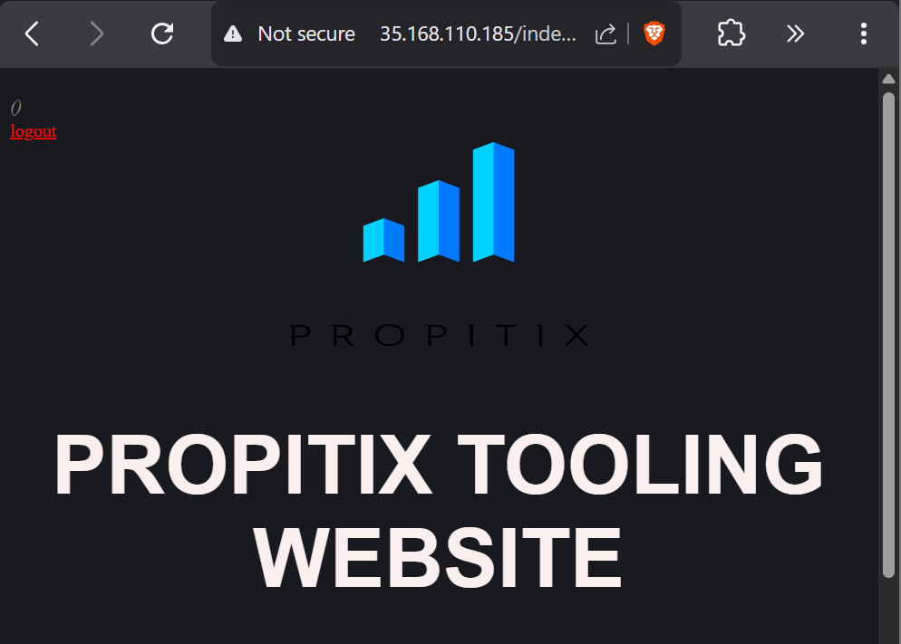

**Web2-UAT:** `http://3.238.72.253/index.php`

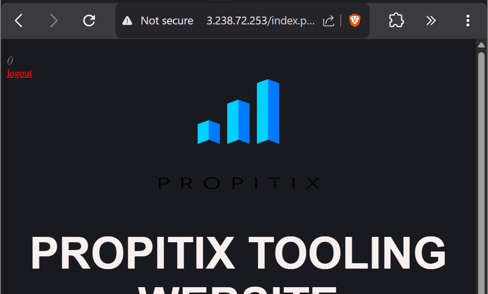

**Result:** PROPITIX Tooling Website loading successfully on both UAT servers 🚀

---

## Warnings Explained — Host Pattern Not Found

During UAT playbook runs, these warnings appeared:

```
[WARNING]: Could not match supplied host pattern, ignoring: webservers
[WARNING]: Could not match supplied host pattern, ignoring: nfs
[WARNING]: Could not match supplied host pattern, ignoring: lb
[WARNING]: Could not match supplied host pattern, ignoring: db
```

**These are not errors.** The `site.yml` imports `common.yml` which targets `webservers`, `nfs`, `lb`, and `db` groups — but `uat.yml` only defines `uat-webservers`. Ansible simply skips plays with no matching hosts. The UAT play ran correctly regardless.

---

## Final Architecture

```
ansible-config-mgt/
├── inventory/
│   ├── dev.yml         ← dev environment hosts
│   ├── uat.yml         ← UAT environment hosts
│   ├── stage.yml
│   └── prod.yml
├── playbooks/
│   └── site.yml        ← master entry point
├── static-assignments/
│   ├── common.yml      ← install packages
│   ├── common-del.yml  ← delete packages
│   └── uat-webservers.yml ← UAT role assignment
└── roles/
    └── webserver/
        └── tasks/
            └── main.yml ← Apache + Git + clone + start
```

**Jenkins Pipeline Flow:**
```
GitHub Push → ansible-config-mgt job → save_artifacts job → /home/ubuntu/ansible-config-artifact
```