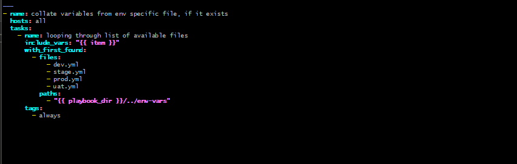
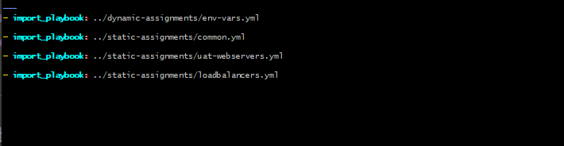
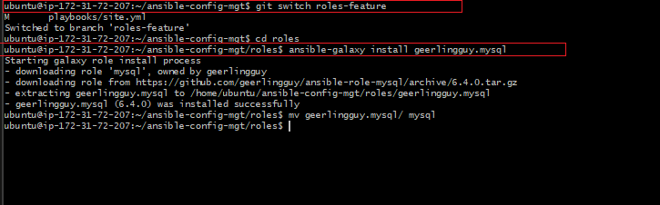
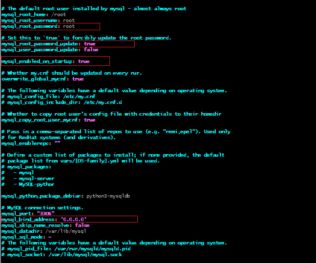
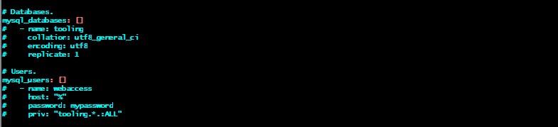
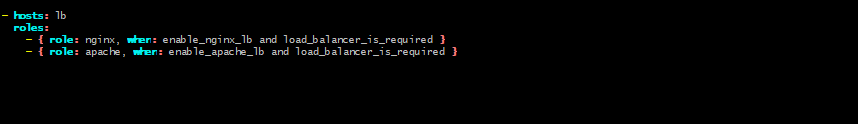
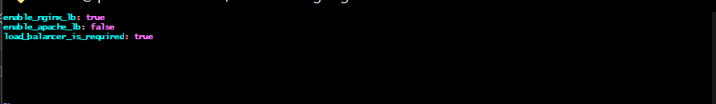

# ANSIBLE DYNAMIC ASSIGNMENTS (INCLUDE) AND COMMUNITY ROLES
### Ansible Galaxy | Dynamic Assignments | Community Roles | Load Balancer Switching

---

## What I Gained From This Project

After completing this project, I:

- Understood the difference between static (`import`) and dynamic (`include`) assignments in Ansible
- Learned how to use `include_vars` with `with_first_found` to load environment-specific variables dynamically
- Used Ansible Galaxy to download and configure a production-ready MySQL community role (`geerlingguy.mysql`)
- Created custom Nginx and Apache load balancer roles from scratch using `ansible-galaxy init`
- Configured conditional role execution using variables (`enable_nginx_lb`, `enable_apache_lb`, `load_balancer_is_required`)
- Learned how to switch between load balancers by simply changing variable values in environment files

---

## Project Overview

This project extends the Ansible configuration from Projects 11 and 12 by introducing dynamic variable loading, community roles from Ansible Galaxy, and a flexible load balancer switching mechanism using environment-specific variable files.

---

## Step 1 — Create the dynamic-assignments Branch and Folder Structure

Created a new branch for this work:

```bash
git checkout -b dynamic-assignments
```


Created the required folder structure:

```bash
mkdir -p dynamic-assignments env-vars
touch dynamic-assignments/env-vars.yml
touch env-vars/dev.yml env-vars/stage.yml env-vars/uat.yml env-vars/prod.yml
```

Final structure:

```
ansible-config-mgt/
├── dynamic-assignments/
│   └── env-vars.yml
├── env-vars/
│   ├── dev.yml
│   ├── stage.yml
│   ├── uat.yml
│   └── prod.yml
├── inventory/
├── playbooks/
│   └── site.yml
└── static-assignments/
    ├── common.yml
    ├── common-del.yml
    ├── uat-webservers.yml
    └── loadbalancers.yml
```

---

## Step 2 — Create env-vars.yml (Dynamic Variable Loader)

Populated `dynamic-assignments/env-vars.yml` with the `with_first_found` loop to dynamically load the correct environment variables file at runtime:

```yaml
---
- name: collate variables from env specific file, if it exists
  hosts: all
  tasks:
    - name: looping through list of available files
      include_vars: "{{ item }}"
      with_first_found:
        - files:
            - dev.yml
            - stage.yml
            - prod.yml
            - uat.yml
          paths:
            - "{{ playbook_dir }}/../env-vars"
      tags:
        - always
```



**How it works:** `with_first_found` loops through the list of files and loads the first one it finds. `{{ playbook_dir }}` dynamically resolves to the directory where `site.yml` is running, then navigates up to `env-vars/`. This means the correct environment file is always loaded without hardcoding paths.

---

## Issue Encountered — Documentation Syntax Errors

The official project documentation provided the following `site.yml` which contains **multiple syntax errors**:

```yaml
# INCORRECT — from the official docs
---
- hosts: all
- name: Include dynamic variables
  tasks:
  import_playbook: ../static-assignments/common.yml
  include: ../dynamic-assignments/env-vars.yml
  tags:
    - always

- hosts: webservers
- name: Webserver assignment
  import_playbook: ../static-assignments/webservers.yml
```

### Errors Found in the Documentation

| Error | Problem | Fix |
|-------|---------|-----|
| `tasks:` mixed with `import_playbook:` | `import_playbook` is top-level only, cannot go inside `tasks:` | Separate them into different plays |
| `- hosts:` and `- name:` on separate list items | Each `-` creates a new play; `name` and `hosts` must be in the same block | Combine into one play block |
| `include:` used | Deprecated since Ansible 2.8 | Use `include_vars`, `include_tasks`, or `import_playbook` |
| `when:` on `import_playbook` | Not supported on `import_playbook` | Move `when` condition inside the imported playbook |

### How it Was Debugged

Running the playbook with the doc's version produced:

```
ERROR! 'tasks' is not a valid attribute for a PlaybookInclude
The error appears to be in 'playbooks/site.yml': line 3, column 3
```

And after further attempts:

```
fatal: [172.31.72.76]: FAILED! => {"message": "/home/ubuntu/ansible-config-mgt/
playbooks/../dynamic-assignments/env-vars.yml must be stored as a dictionary/hash"}
```

This confirmed that `include_vars` expects a simple `key: value` variables file, but `env-vars.yml` contains a full play structure. The solution was to use `import_playbook` instead.

### Corrected site.yml

```yaml
---
- import_playbook: ../dynamic-assignments/env-vars.yml

- import_playbook: ../static-assignments/common.yml

- import_playbook: ../static-assignments/uat-webservers.yml

- import_playbook: ../static-assignments/loadbalancers.yml
```



**Key insight:** `env-vars.yml` is itself a play (it has `hosts:` and `tasks:`), so it must be called with `import_playbook`. The `include_vars` module inside it then loads the actual variable values from `env-vars/uat.yml`.

---

## Step 3 — Install MySQL Community Role via Ansible Galaxy

Switched to the `roles-feature` branch and installed the `geerlingguy.mysql` role:

```bash
git switch roles-feature
cd roles
ansible-galaxy install geerlingguy.mysql
mv geerlingguy.mysql/ mysql
```



**Result:** geerlingguy.mysql **6.4.0** installed successfully

### Configure MySQL Role for Tooling Website

Read the role's `README.md` and updated `roles/mysql/defaults/main.yml` with the correct credentials for the tooling website:

**Root configuration:**

```yaml
mysql_root_password: root
mysql_root_password_update: true
mysql_enabled_on_startup: true
mysql_bind_address: '0.0.0.0'
```



**Database and user configuration:**

```yaml
mysql_databases:
  - name: tooling
    collation: utf8_general_ci
    encoding: utf8

mysql_users:
  - name: webaccess
    host: "%"
    password: mypassword
    priv: "tooling.*:ALL"
```



| Setting | Purpose |
|---------|---------|
| `mysql_root_password` | Sets MySQL root password |
| `mysql_bind_address: 0.0.0.0` | Allows remote connections from any host |
| `mysql_databases` | Automatically creates the `tooling` database |
| `mysql_users` | Creates `webaccess` user with full access to `tooling.*` from any host (`%`) |

---

## Step 4 — Create Nginx and Apache Load Balancer Roles

Created both LB roles using `ansible-galaxy init`:

```bash
cd ~/ansible-config-mgt/roles
ansible-galaxy init nginx
ansible-galaxy init apache
```


### Set Default Variables in Both Roles

Added conditional variables to `roles/nginx/defaults/main.yml`:

```yaml
---
enable_nginx_lb: false
load_balancer_is_required: false
```


Added the same pattern to `roles/apache/defaults/main.yml`:

```yaml
---
enable_apache_lb: false
load_balancer_is_required: false
```

Setting both to `false` by default ensures neither LB is active unless explicitly enabled through the environment variables file.

---

## Step 5 — Configure loadbalancers.yml Static Assignment

Created `static-assignments/loadbalancers.yml` with conditional role execution:

```yaml
---
- hosts: lb
  roles:
    - { role: nginx, when: enable_nginx_lb and load_balancer_is_required }
    - { role: apache, when: enable_apache_lb and load_balancer_is_required }
```



The `when` conditions mean:
- Nginx only installs if **both** `enable_nginx_lb: true` AND `load_balancer_is_required: true`
- Apache only installs if **both** `enable_apache_lb: true` AND `load_balancer_is_required: true`
- Since you can't run both simultaneously, only one variable should be `true` at a time

---

## Step 6 — Configure Environment Variables for Load Balancer Switching

### Enable Nginx LB in UAT environment

Updated `env-vars/uat.yml`:

```yaml
enable_nginx_lb: true
load_balancer_is_required: true
```


### Full UAT Variables (Final State)

```yaml
enable_nginx_lb: true
enable_apache_lb: false
load_balancer_is_required: true
```



---

## Step 7 — How to Test Load Balancer Switching

The power of dynamic assignments is that switching load balancers requires **only changing a variable** — no playbook edits needed.

### Test 1 — Enable Nginx LB
```bash
vi env-vars/uat.yml
```
```yaml
enable_nginx_lb: true
enable_apache_lb: false
load_balancer_is_required: true
```
```bash
ansible-playbook -i inventory/uat.yml playbooks/site.yml
```
**Expected:** Nginx installs on LB server

---

### Test 2 — Switch to Apache LB
```bash
vi env-vars/uat.yml
```
```yaml
enable_nginx_lb: false
enable_apache_lb: true
load_balancer_is_required: true
```
```bash
ansible-playbook -i inventory/uat.yml playbooks/site.yml
```
**Expected:** Apache installs on LB server

---

### Test 3 — Disable Load Balancer Completely
```yaml
enable_nginx_lb: false
enable_apache_lb: false
load_balancer_is_required: false
```
**Expected:** LB play skipped entirely

---

## Final Result — Dynamic Assignments Fully Operational

| Component | Details |
|-----------|---------|
| **Dynamic loader** | `env-vars.yml` uses `with_first_found` to load correct env file |
| **MySQL Role** | `geerlingguy.mysql` 6.4.0 — creates `tooling` DB and `webaccess` user |
| **Nginx Role** | Custom role with `enable_nginx_lb` conditional |
| **Apache Role** | Custom role with `enable_apache_lb` conditional |
| **LB Switching** | Controlled entirely via `env-vars/uat.yml` variables |

**Final site.yml structure:**

```
site.yml
  ├── import_playbook: dynamic-assignments/env-vars.yml   ← loads env vars dynamically
  ├── import_playbook: static-assignments/common.yml      ← static, always runs
  ├── import_playbook: static-assignments/uat-webservers.yml ← configures UAT servers
  └── import_playbook: static-assignments/loadbalancers.yml  ← conditional LB setup
```

---

## Issues Encountered & Resolutions

| Issue | Root Cause | Fix |
|-------|-----------|-----|
| `'tasks' is not a valid attribute for a PlaybookInclude` | Doc's `site.yml` placed `import_playbook` inside `tasks:` block | Moved `import_playbook` to top-level, outside `tasks:` |
| `env-vars.yml must be stored as a dictionary/hash` | Used `include_vars` to load a file containing a full play structure | Switched to `import_playbook` since `env-vars.yml` is a play, not a variables file |
| `Could not find static-assignments/webservers.yml` | File named `uat-webservers.yml` but `site.yml` referenced `webservers.yml` | Updated `site.yml` to reference the correct filename `uat-webservers.yml` |
| LB play skipping — `no hosts matched` | No `lb` group defined in `uat.yml` inventory | Added LB server IP under `[lb]` group in `inventory/uat.yml` |
| `when:` on `import_playbook` not supported | Documentation showed `when` at play level on `import_playbook` | Moved `when` conditions inside `loadbalancers.yml` on the role declarations |