# PROJECT 14 — EXPERIENCE CONTINUOUS INTEGRATION WITH JENKINS | ANSIBLE | ARTIFACTORY | SONARQUBE | PHP

### Jenkins | Ansible | JFrog Artifactory | SonarQube | PHP | PostgreSQL | MySQL | Ubuntu (AWS EC2)

---

## What I Gained From This Project

After completing this project, I:

- Built and operated a **full end-to-end CI/CD pipeline** from code commit to deployment, entirely from scratch
- Deepened my understanding of the difference between **Continuous Integration, Continuous Delivery, and Continuous Deployment**
- Gained hands-on experience with **SonarQube** for static code quality analysis and quality gate enforcement
- Installed and configured **JFrog Artifactory** as a binary artifact repository for versioned deployments
- Integrated **Jenkins with Ansible** so that a successful pipeline automatically triggers an Ansible playbook deployment
- Configured and troubleshot **Jenkins slave nodes (agents)** on separate EC2 instances and ran pipelines across them
- Set up **Multibranch Scan Webhook Triggers** so GitHub pushes automatically fire Jenkins builds

---

## Project Overview

This project simulates a **real-world CI/CD pipeline** for a PHP-based application (`php-todo`) running on AWS EC2. The pipeline integrates the following toolchain:

| Tool | Role |
|------|------|
| **Jenkins** | CI/CD orchestration server |
| **Ansible** | Configuration management & deployment |
| **SonarQube** | Static code analysis & quality gate |
| **JFrog Artifactory** | Artifact (binary) repository |
| **PHP / Composer** | Application runtime & dependency manager |
| **MySQL** | Application database |
| **PostgreSQL** | SonarQube backend database |
| **GitHub** | Source code repository & webhook trigger |

The pipeline flow is:

```
GitHub Push
    ↓
Jenkins (Multibranch Pipeline)
    ↓
Initial Cleanup → Checkout SCM → Prepare Dependencies
    ↓
Execute Unit Tests → Code Analysis (phploc)
    ↓
SonarQube Quality Gate
    ↓
Package Artifact (zip) → Upload to Artifactory
    ↓
Deploy to Dev Environment (triggers Ansible pipeline)
```

---

## Step 0 — Server Infrastructure Setup

The following EC2 instances were provisioned on AWS for this project:

| Server | Purpose | OS |
|--------|---------|-----|
| Jenkins Master | CI/CD orchestration | Ubuntu 24.04 |
| SonarQube | Code quality analysis | Ubuntu 24.04 |
| JFrog Artifactory | Artifact storage | Ubuntu 24.04 |
| PHP-Todo App Server | Application runtime | Ubuntu 24.04 |
| MySQL DB Server | Application database | Ubuntu 24.04 |
| Slave-1 | Jenkins build agent | Ubuntu 24.04 |
| Slave-2 | Jenkins build agent | Ubuntu 24.04 |
---

## Step 1 — SonarQube Installation on Ubuntu (AWS EC2)

SonarQube requires specific Linux kernel tuning before installation. These settings prevent performance degradation under load.

### 1a. Tune Linux Kernel Parameters

Temporary session settings:

```bash
sudo sysctl -w vm.max_map_count=262144
sudo sysctl -w fs.file-max=65536
```

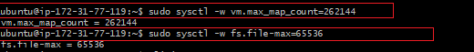

To make changes **permanent**, append to `/etc/security/limits.conf`:

```
sonarqube   -   nofile   65536
sonarqube   -   nproc    4096
```

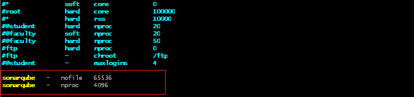

### 1b. SSH Into the SonarQube EC2 Instance

```bash
ssh -i Downloads/udo.pem ubuntu@100.53.149.175
```

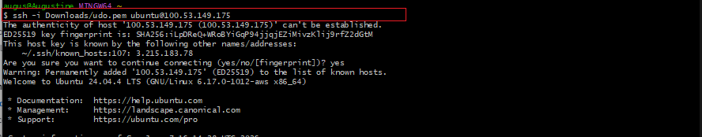

### 1c. Update and Upgrade System Packages

```bash
sudo apt-get update
sudo apt-get upgrade -y
```

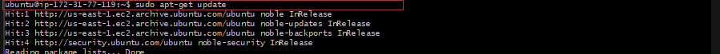

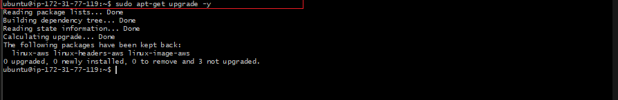

### 1d. Install OpenJDK 17

SonarQube requires Java.

```bash
sudo apt-get install openjdk-21-jdk -y
java -version
```

**Result:** OpenJDK 21.0.11 confirmed

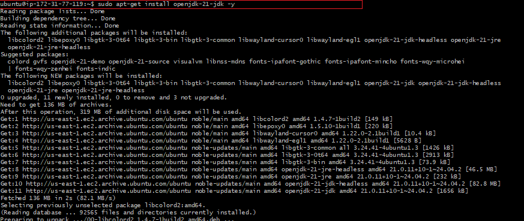

### 1e. Install and Configure PostgreSQL

SonarQube uses PostgreSQL as its backend database.

```bash
# Add PostgreSQL repo
sudo sh -c 'echo "deb http://apt.postgresql.org/pub/repos/apt/ $(lsb_release -cs)-pgdg main" >> /etc/apt/sources.list.d/pgdg.list'
wget -qO- https://www.postgresql.org/media/keys/ACCC4CF8.asc | gpg --dearmor | sudo tee /etc/apt/trusted.gpg.d/postgresql.gpg > /dev/null

sudo apt-get update
sudo apt-get -y install postgresql postgresql-contrib
```

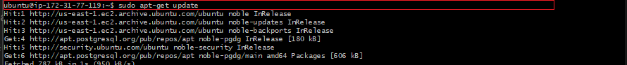

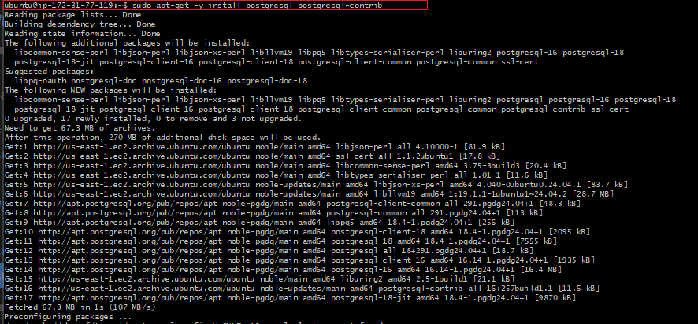

Start and enable PostgreSQL:

```bash
sudo systemctl start postgresql
sudo systemctl enable postgresql
```

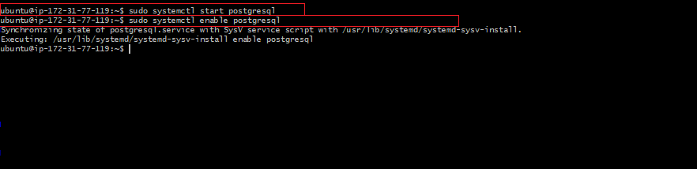

Set up the SonarQube database user:

```bash
sudo passwd postgres
su - postgres
createuser sonar
psql
```

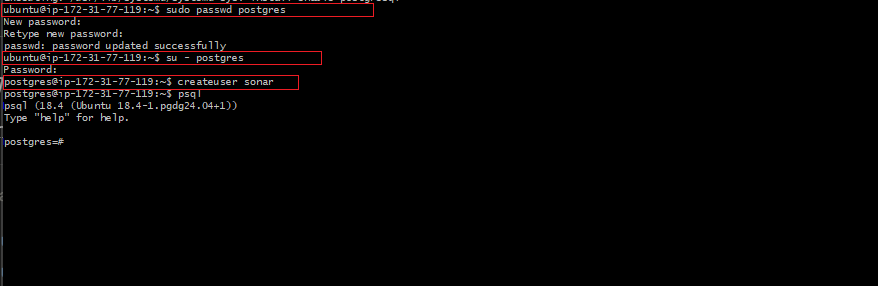

```sql
ALTER USER sonar WITH ENCRYPTED password 'sonar';
CREATE DATABASE sonarqube OWNER sonar;
GRANT ALL PRIVILEGES ON DATABASE sonarqube TO sonar;
\q
```

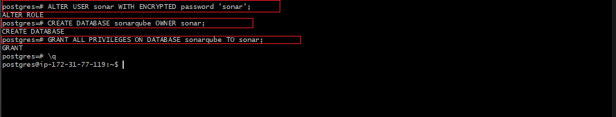

### 1f. Transfer and Extract SonarQube

The SonarQube zip was transferred from the local machine to the server via SCP:

```bash
scp -i ~/Downloads/udo.pem ~/Downloads/sonarqube-*.zip ubuntu@100.53.149.175:/tmp/
```

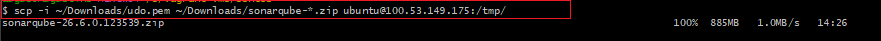

On the server:

```bash
sudo apt-get install unzip -y
sudo unzip /tmp/sonarqube-26.6.0.123539.zip -d /opt
```

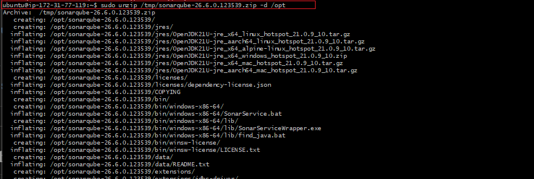

### 1g. Configure sonar.properties

```bash
sudo vim /opt/sonarqube-26.6.0.123539/conf/sonar.properties
```

Key settings configured:

```properties
sonar.jdbc.username=sonar
sonar.jdbc.password=sonar
sonar.jdbc.url=jdbc:postgresql://localhost:5432/sonarqube
```

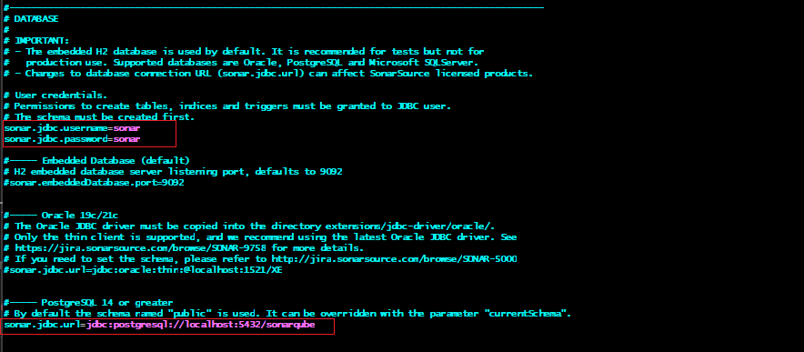

### 1h. Create systemd Service for SonarQube

```bash
sudo nano /etc/systemd/system/sonar.service
```

```ini
[Unit]
Description=SonarQube service
After=syslog.target network.target

[Service]
Type=forking
ExecStart=/opt/sonarqube/bin/linux-x86-64/sonar.sh start
ExecStop=/opt/sonarqube/bin/linux-x86-64/sonar.sh stop
User=sonar
Group=sonar
Restart=always
LimitNOFILE=65536
LimitNPROC=4096

[Install]
WantedBy=multi-user.target
```

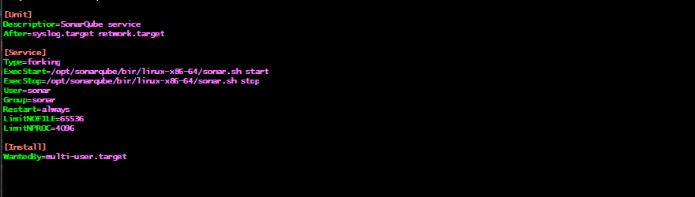

### 1i. Start SonarQube

```bash
sudo systemctl start sonar
sudo systemctl enable sonar
sudo systemctl status sonar
```

**Result:** SonarQube service active and running

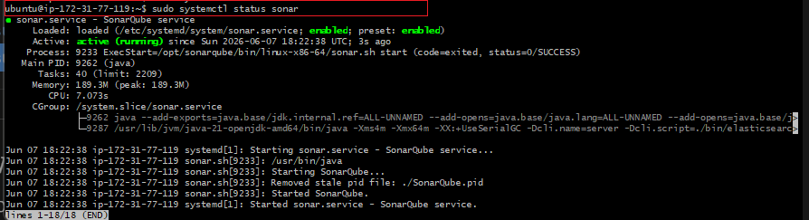

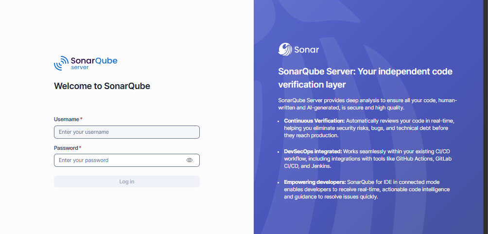

---

## Step 2 — JFrog Artifactory Installation

Artifactory OSS 6.9.6 was installed manually on a dedicated EC2 instance.

### 2a. Prepare the Server

```bash
sudo apt-get update
sudo apt install openjdk-8-jdk -y
```

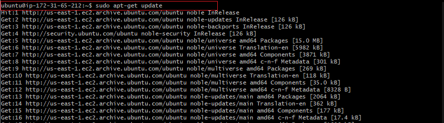

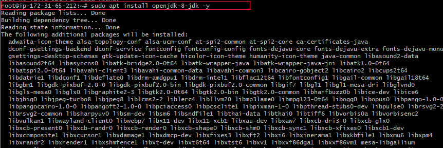

### 2b. Download and Extract Artifactory

```bash
sudo wget https://jfrog.bintray.com/artifactory/jfrog-artifactory-oss-6.9.6.zip
sudo apt install unzip -y
sudo unzip -o jfrog-artifactory-oss-6.9.6.zip -d /opt/
```

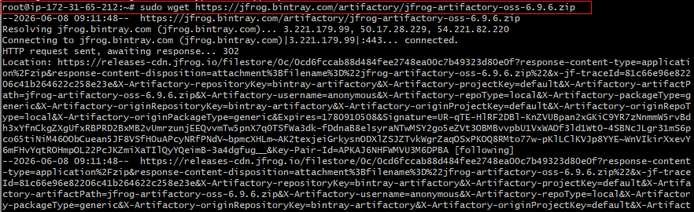

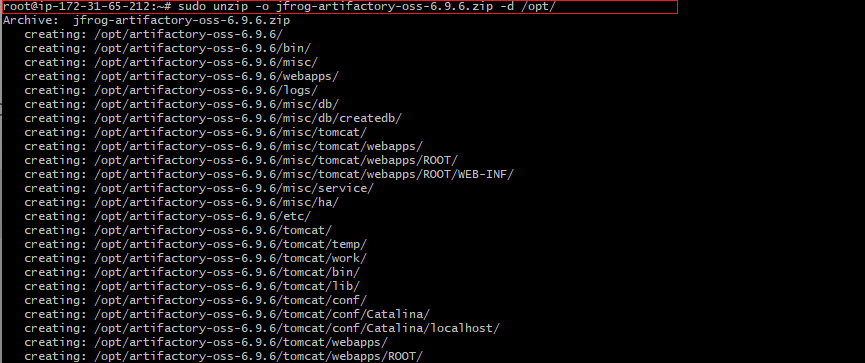

### 2c. Start Artifactory

```bash
cd /opt/artifactory-oss-6.9.6
./bin/artifactory.sh start
```

**Result:** Tomcat started, Artifactory running on port 8081

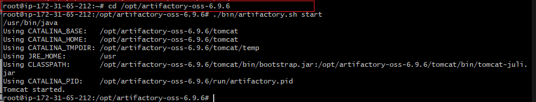

### 2d. Create php-todo Repository in Artifactory UI

After logging in at `http://<IP>:8081/artifactory`:

- Admin → Repositories → Local → New Local Repository
- Package type: **Generic**
- Repository Key: **php-todo**

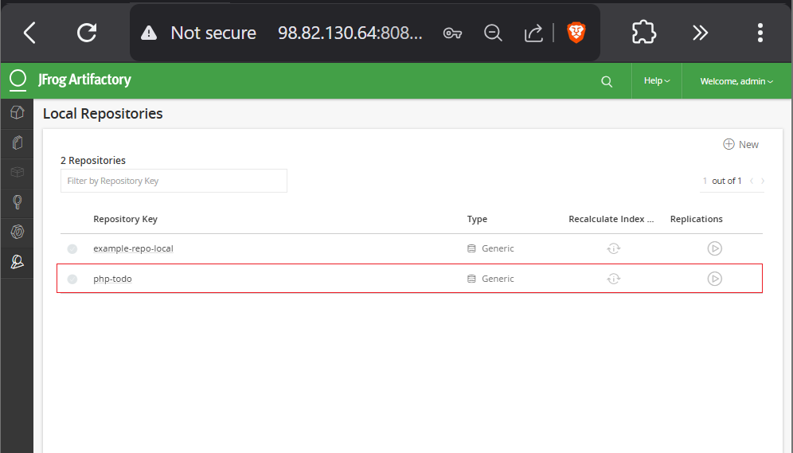

---

## Step 3 — PHP-Todo Application Setup

### 3a. Fork and Prepare the Repository

The `php-todo` repository was forked from `darey-devops/php-todo` into the personal GitHub account `udobuzor/php-todo`.

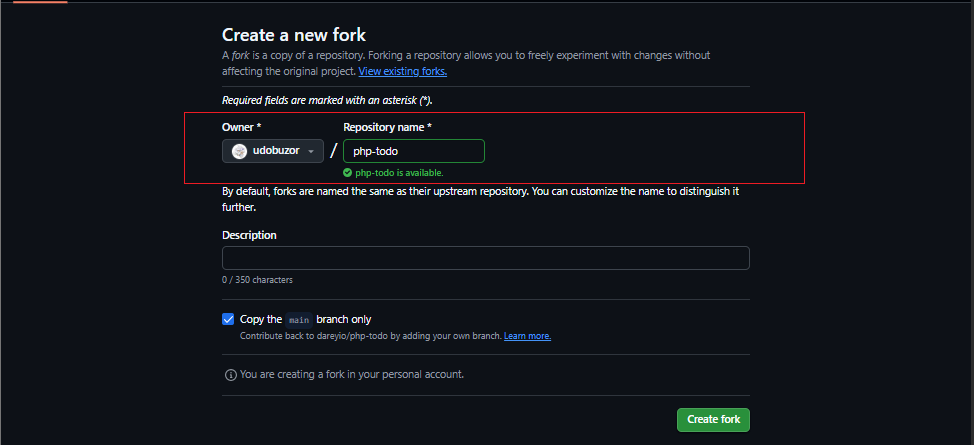

### 3b. Install PHP Dependencies on the App Server

```bash
sudo apt install -y zip libapache2-mod-php phploc \
  php-{xml,bcmath,bz2,intl,gd,mbstring,mysql,zip}
```

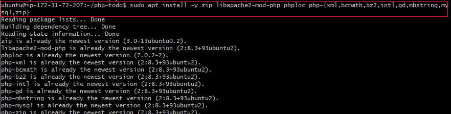

### 3c. Install Composer

```bash
curl -sS https://getcomposer.org/installer | php
sudo mv composer.phar /usr/local/bin/composer
composer --version
php --version
```

**Result:** Composer 2.10.1, PHP 8.3.6 installed

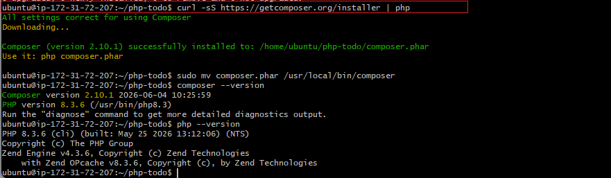

### 3d. Set Up MySQL Database

On the DB server (`172.31.65.153`):

```bash
sudo apt install mysql-server
```
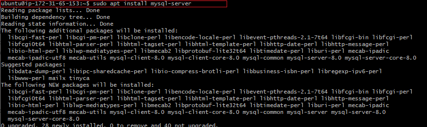

```sql
CREATE DATABASE homestead;
CREATE USER 'homestead'@'%' IDENTIFIED BY 'sePret^i';
GRANT ALL PRIVILEGES ON *.* TO 'homestead'@'%';
FLUSH PRIVILEGES;
```

MySQL bind address was updated to allow remote connections:

```ini
bind-address = 0.0.0.0
```

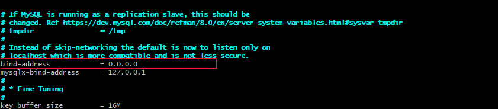

### 3e. Configure .env.sample

```env
APP_ENV=local
APP_DEBUG=true
APP_KEY=SomeRandomString
APP_URL=http://localhost

DB_HOST=172.31.65.153
DB_DATABASE=homestead
DB_USERNAME=homestead
DB_PASSWORD=sePret^i
```

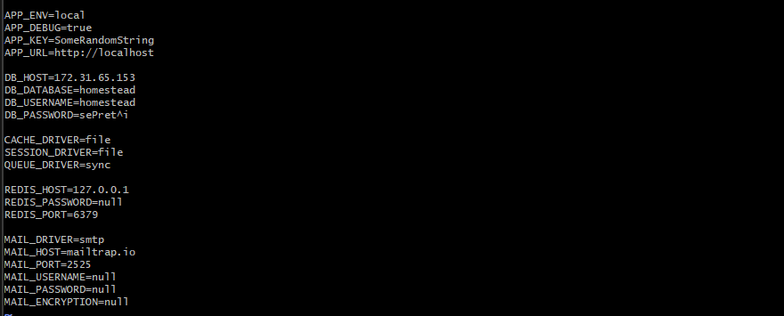

---

## Step 4 — Jenkins Configuration

### 4a. Install Jenkins Plugins

The following plugins were installed via **Manage Jenkins → Plugins → Available**:

| Plugin | Purpose |
|--------|---------|
| Blue Ocean | Visual pipeline UI |
| Ansible | Run Ansible playbooks from Jenkins |
| SonarQube Scanner | Trigger SonarQube analysis |
| Artifactory (JFrog) | Upload artifacts to Artifactory |
| Plot | Display phploc code analysis charts |
| Multibranch Scan Webhook Trigger | Auto-trigger on GitHub push |

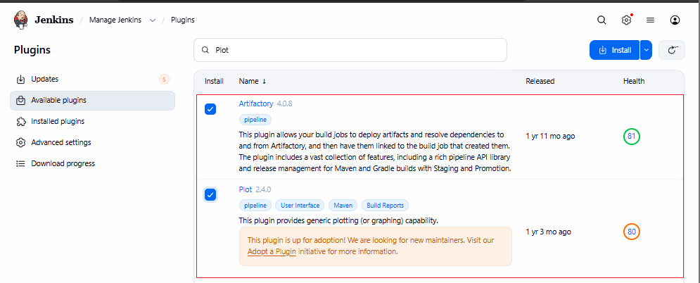

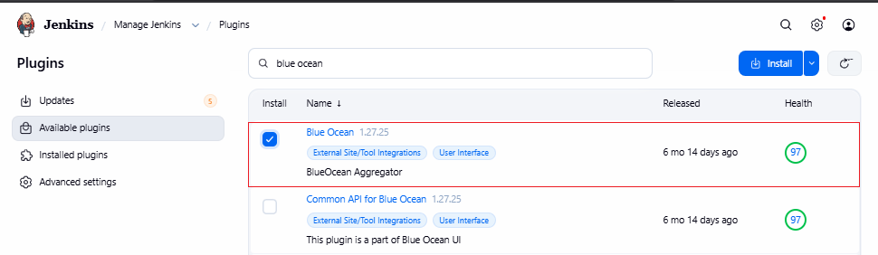

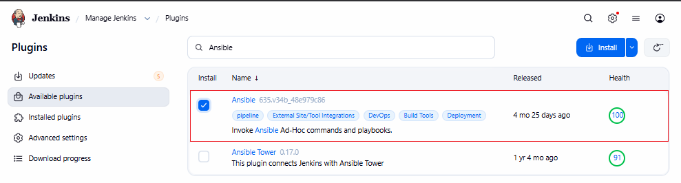

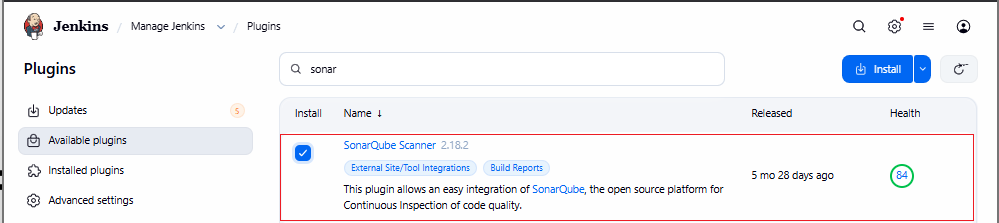

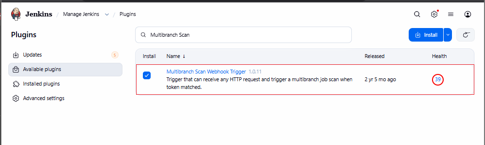

### 4b. Configure Ansible Tool in Jenkins

**Manage Jenkins → Global Tool Configuration → Ansible:**

- Name: `ansible`
- Path to executables: `/usr/bin`

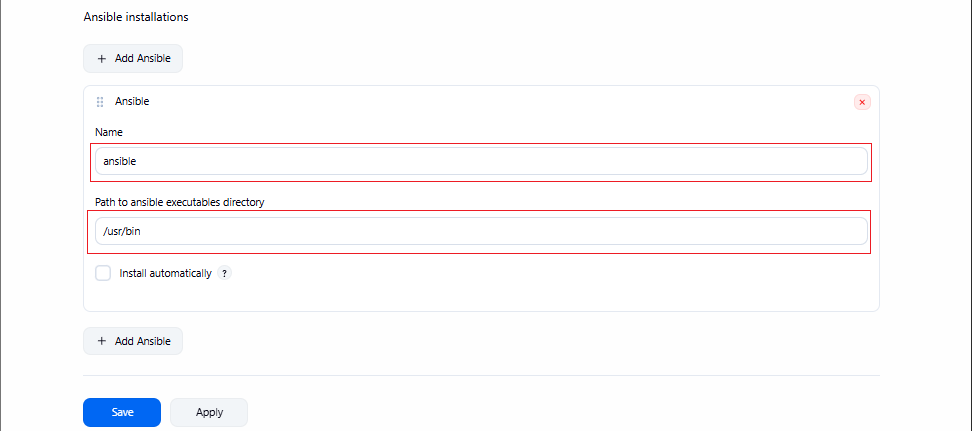

### 4c. Configure SonarQube Server in Jenkins

**Manage Jenkins → Configure System → SonarQube Servers:**

- Name: `sonarqube`
- Server URL: `http://44.192.67.36:9000`
- Authentication token: Secret text credential (generated from SonarQube)

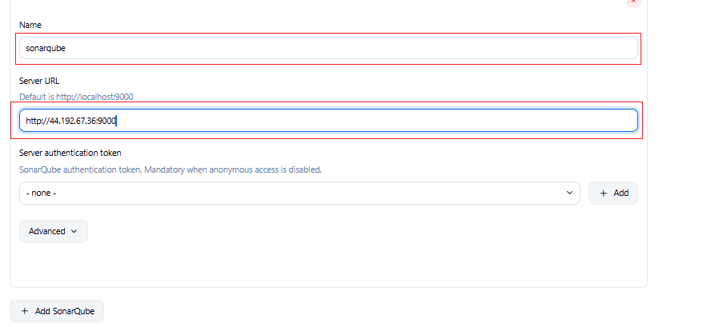

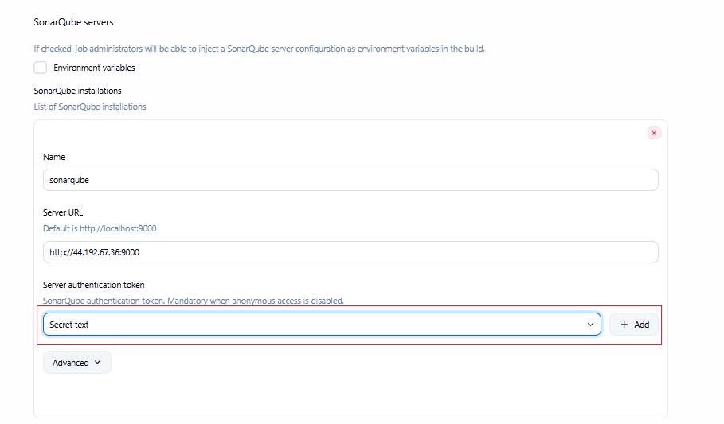

### 4d. Configure SonarQube Scanner Tool

**Manage Jenkins → Global Tool Configuration → SonarQube Scanner:**

- Name: `SonarQubeScanner`
- Install automatically:
- Version: SonarQube Scanner 8.1.0.6389

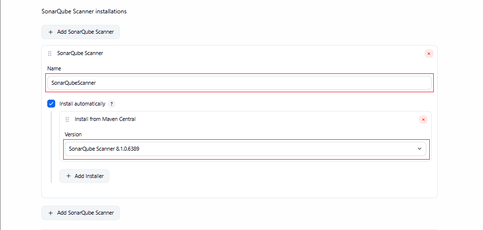

### 4e. Configure JFrog Artifactory in Jenkins

**Manage Jenkins → Configure System → JFrog Platform Instances:**

- Instance ID: `artifactory-server`
- JFrog Platform URL: `http://98.82.130.64:8081`
- Username: `admin`
- Password: (Artifactory admin password)

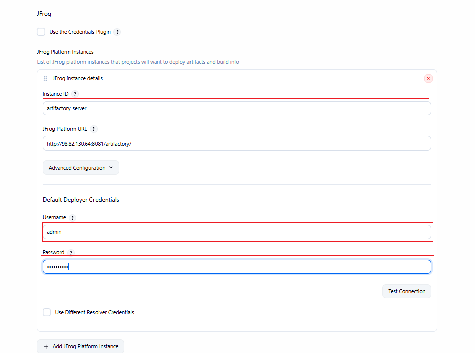

### 4f. Add SSH Credentials for Slaves

**Manage Jenkins → Credentials → System → Global → Add Credentials:**

- Kind: SSH Username with private key
- Username: `ubuntu`
- Private Key: (RSA private key pasted directly)

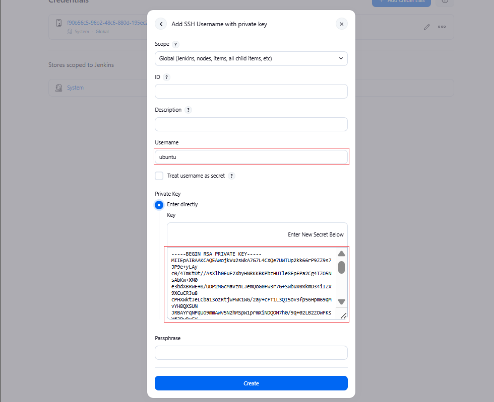

---

## Step 5 — SonarQube Quality Gate Webhook

To allow SonarQube to notify Jenkins when analysis completes, a webhook was configured in SonarQube:

**SonarQube → Administration → Configuration → Webhooks → Create:**

- Name: `jenkins`
- URL: `http://3.219.69.161:8080/sonarqube-webhook/`

> **Important:** The trailing slash on the URL is required. Without it, the webhook silently fails and Jenkins hangs waiting for a response that never comes.

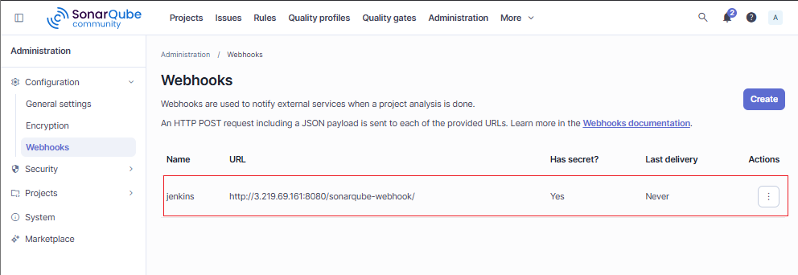

---

## Step 6 — Ansible Pipeline Setup

### 6a. Create the Ansible Multibranch Pipeline in Blue Ocean

The `ansible-config-mgt` repository was connected via Blue Ocean:

- Source: GitHub → Organisation: `udobuzor` → Repository: `ansible-config-mgt`
- Build Configuration Mode: **by Jenkinsfile**
- Script Path: `deploy/Jenkinsfile`

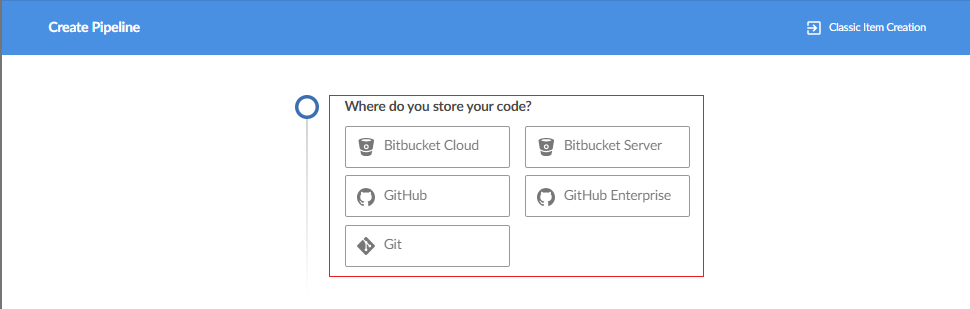

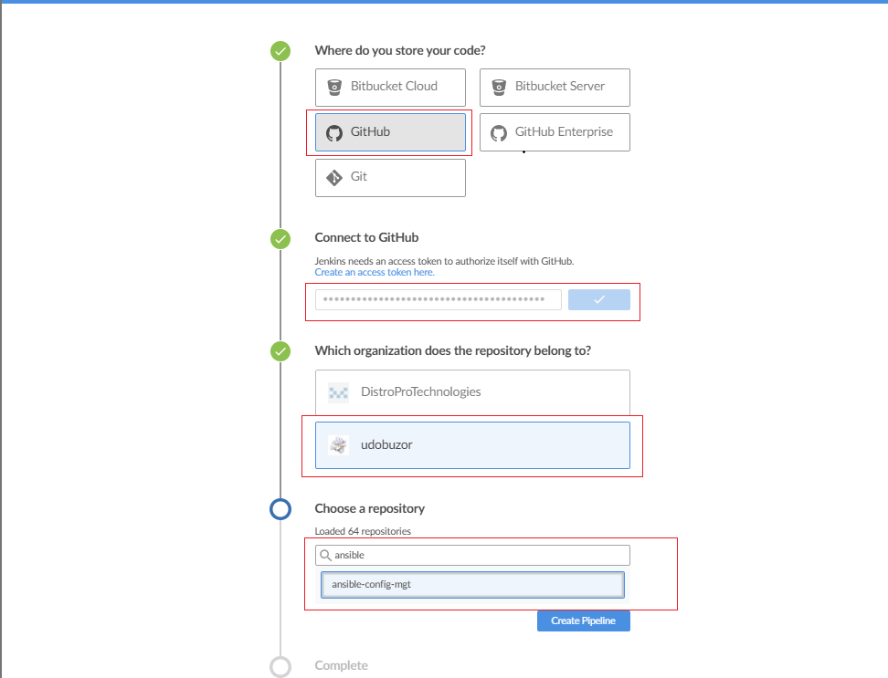

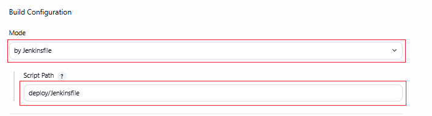

### 6b. Ansible Jenkinsfile (deploy/Jenkinsfile)

```groovy
pipeline {
    agent any
    parameters {
        string(name: 'inventory', defaultValue: 'dev',
               description: 'Environment to deploy to')
    }
    stages {
        stage('Initial cleanup') {
            steps {
                dir("${WORKSPACE}") { deleteDir() }
            }
        }
        stage('Checkout SCM') {
            steps {
                git branch: 'main',
                url: 'https://github.com/udobuzor/ansible-config-mgt.git'
            }
        }
        stage('Prepare Ansible For Execution') {
            steps {
                sh 'echo ${WORKSPACE}'
                sh 'sed -i "3 a roles_path=${WORKSPACE}/roles" ${WORKSPACE}/deploy/ansible.cfg'
            }
        }
        stage('Run Ansible playbook') {
            steps {
                ansiblePlaybook(
                    become: true,
                    credentialsId: 'private-key',
                    disableHostKeyChecking: true,
                    installation: 'ansible',
                    inventory: 'inventory/${inventory}.yml',
                    playbook: 'playbooks/site.yml'
                )
            }
        }
        stage('Clean Workspace after build') {
            steps {
                cleanWs(cleanWhenAborted: true,
                        cleanWhenFailure: true,
                        cleanWhenNotBuilt: true,
                        cleanWhenUnstable: true,
                        deleteDirs: true)
            }
        }
    }
}
```

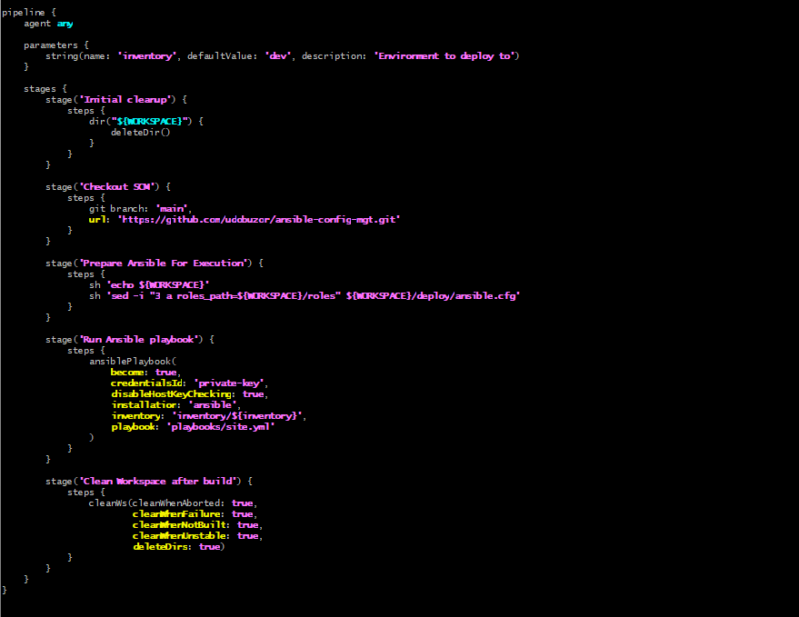

### 6c. ansible.cfg

```ini
[defaults]
timeout = 160
callback_whitelist = profile_tasks
log_path = ~/ansible.log
host_key_checking = False
gathering = smart
ansible_python_interpreter=/usr/bin/python3
allow_world_readable_tmpfiles=true

[ssh_connection]
ssh_args = -o ControlMaster=auto -o ControlPersist=30m -o ControlPath=/tmp/ansible-ssh-%h-%p-%r \
           -o ServerAliveInterval=60 -o ServerAliveCountMax=60 -o ForwardAgent=yes
```

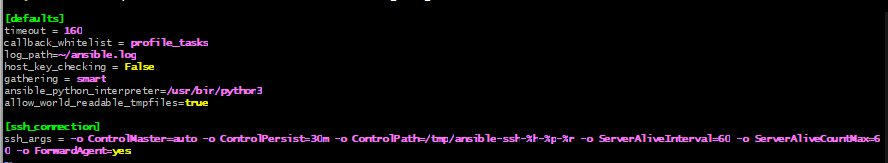

**Result:** Ansible pipeline ran successfully across all stages

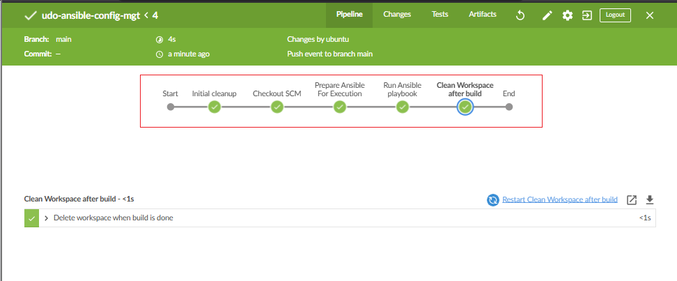

---

## Step 7 — PHP-Todo CI/CD Pipeline

### 7a. Final Jenkinsfile for php-todo

```groovy
pipeline {
    agent {label 'slave'}

    parameters {
        choice(
            name: 'environment',
            choices: ['dev', 'staging', 'uat'],
            description: 'Select environment to deploy to'
        )
    }

    stages {
        stage("Initial cleanup") {
            steps {
                dir("${WORKSPACE}") { deleteDir() }
            }
        }
        stage('Checkout SCM') {
            steps {
                git branch: 'main',
                url: 'https://github.com/udobuzor/php-todo.git'
            }
        }
        stage('Prepare Dependencies') {
            steps {
                sh 'mv .env.sample .env'
                sh 'composer install'
                sh 'php artisan migrate'
                sh 'php artisan db:seed'
                sh 'php artisan key:generate'
            }
        }
        stage('Execute Unit Tests') {
            steps {
                sh './vendor/bin/phpunit'
            }
        }
        stage('Code Analysis') {
            steps {
                sh 'phploc app/ --log-csv build/logs/phploc.csv'
            }
        }
        stage('SonarQube Quality Gate') {
            when {
                branch pattern: "^develop*|^hotfix*|^release*|^main*",
                comparator: "REGEXP"
            }
            environment {
                scannerHome = tool 'SonarQubeScanner'
            }
            steps {
                withSonarQubeEnv('sonarqube') {
                    sh "${scannerHome}/bin/sonar-scanner -Dsonar.projectKey=php-todo -Dsonar.sources=app/ -Dsonar.php.exclusions=**/vendor/**"
                }
                timeout(time: 1, unit: 'MINUTES') {
                    waitForQualityGate abortPipeline: true
                }
            }
        }
        stage('Package Artifact') {
            steps {
                sh 'zip -qr php-todo.zip ${WORKSPACE}/*'
            }
        }
        stage('Upload Artifact to Artifactory') {
            steps {
                script {
                    def server = Artifactory.server 'artifactory-server'
                    def uploadSpec = """{
                        "files": [{
                            "pattern": "php-todo.zip",
                            "target": "php-todo/",
                            "props": "type=zip;status=ready"
                        }]
                    }"""
                    server.upload spec: uploadSpec
                }
            }
        }
        stage('Deploy to Dev Environment') {
            steps {
                build job: 'udo-ansible-config-mgt/main',
                parameters: [[$class: 'StringParameterValue',
                name: 'inventory', value: "${params.environment}"]],
                propagate: false,
                wait: true
            }
        }
    }
}
```

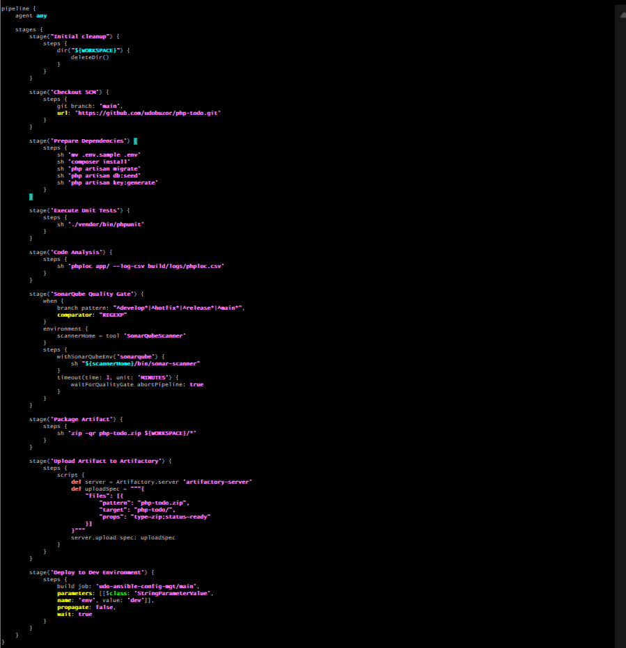

### 7b. SonarQube Quality Gate — Passed

The SonarQube analysis on `php-todo` returned:

- **Quality Gate: Passed** (with warnings)
- 6.5k Lines of Code
- Security: 7 open issues (B)
- Reliability: 16 open issues (C)
- Maintainability: 16 open issues (A)
- Coverage: 0.0% (unit test coverage not yet written)

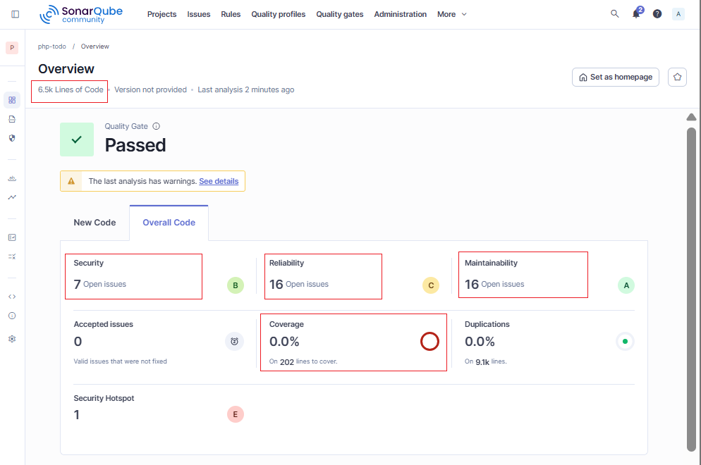

### 7c. Artifact Uploaded to Artifactory

`php-todo.zip` (7.76 MB) was successfully uploaded to the `php-todo` repository in Artifactory.

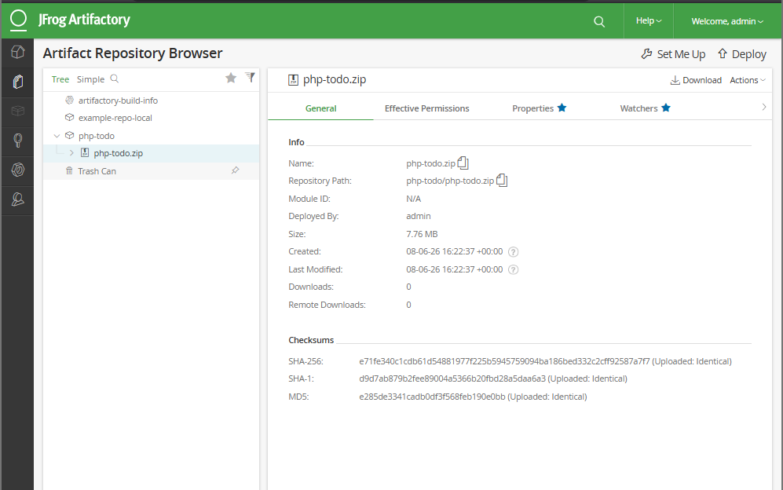

### 7d. Full Pipeline — All Stages Green

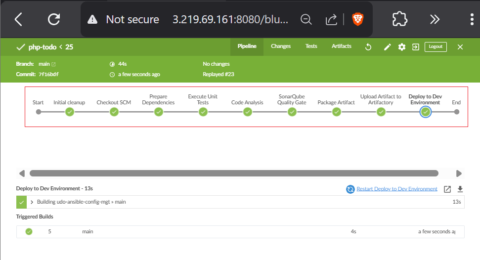

---

## Step 8 — Jenkins Slave Nodes (Build Agents)

To distribute pipeline workload and demonstrate multi-node execution, two EC2 instances were configured as Jenkins slave agents.

### 8a. Provision Slave Servers

Two new Ubuntu 24.04 EC2 instances were launched. Java 21 was installed on each:

```bash
sudo apt update
sudo apt install openjdk-21-jdk -y
```

A `jenkins` user was created on each slave:

```bash
sudo useradd -m -s /bin/bash jenkins
sudo mkdir -p /home/jenkins/.ssh
sudo chown -R jenkins:jenkins /home/jenkins/.ssh
sudo chmod 700 /home/jenkins/.ssh
```

### 8b. Set Up SSH Key Authentication

On the Jenkins master, an SSH key pair was generated for the `jenkins` user:

```bash
sudo su - jenkins
ssh-keygen -t rsa -b 4096 -C "jenkins@master"
cat ~/.ssh/id_rsa.pub
```

The public key was copied to each slave's `/home/jenkins/.ssh/authorized_keys`:

```bash
sudo vi /home/jenkins/.ssh/authorized_keys
# Paste master public key
sudo chmod 600 /home/jenkins/.ssh/authorized_keys
```

The slave hosts were added to the Jenkins master's `known_hosts`:

```bash
sudo su - jenkins
ssh-keyscan -H 172.31.28.104 >> ~/.ssh/known_hosts
ssh-keyscan -H 172.31.21.240 >> ~/.ssh/known_hosts
```

SSH connection from master to slave confirmed:

```bash
ssh jenkins@52.91.16.75   # slave-1
ssh jenkins@54.198.62.82  # slave-2
```

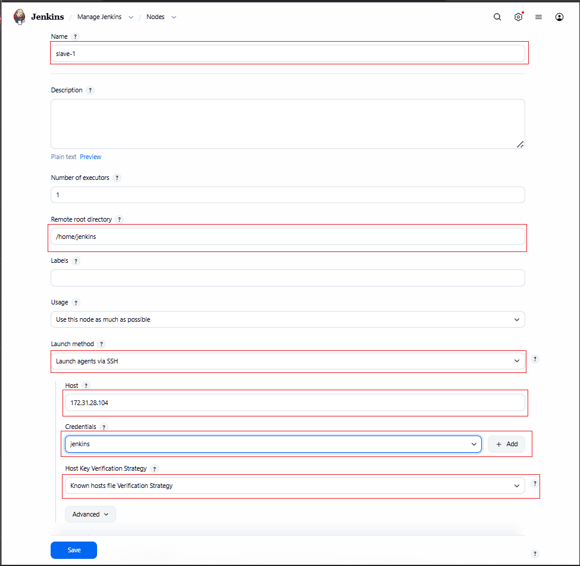

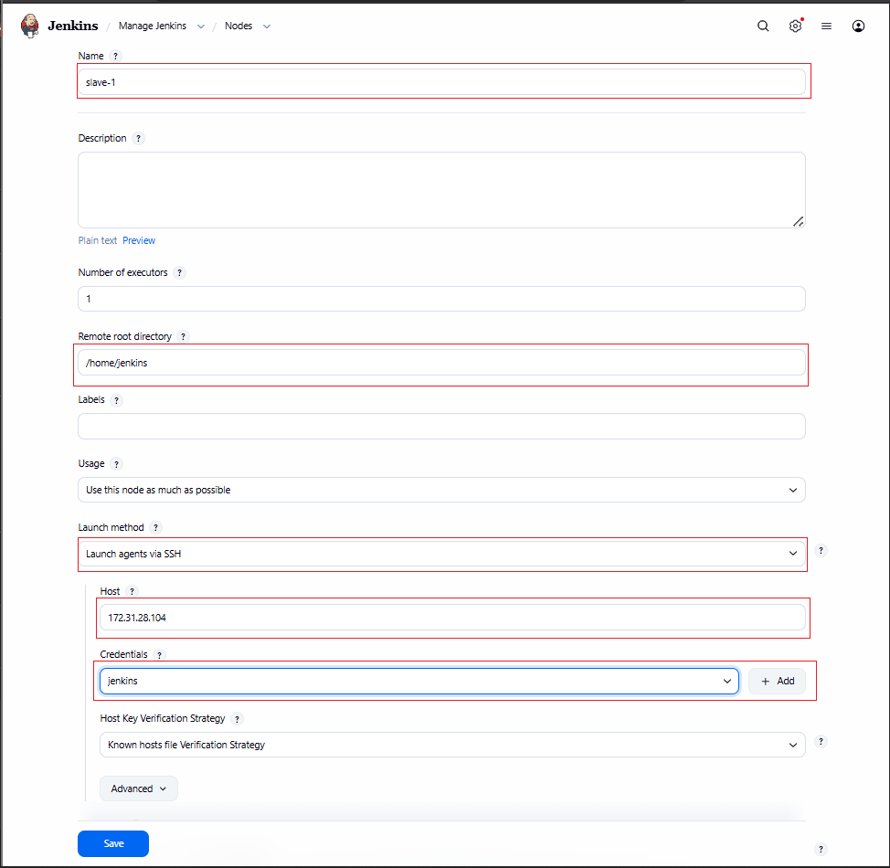

### 8c. Register Slaves in Jenkins UI

**Manage Jenkins → Nodes → New Node** for each slave:

| Field | Value |
|-------|-------|
| Remote root directory | `/home/jenkins` |
| Labels | `slave` |
| Launch method | Launch agents via SSH |
| Host | (slave private IP) |
| Credentials | SSH private key (jenkins user) |
| Host Key Verification | Known Host style verififcation |

**Result:** Both slave-1 and slave-2 online

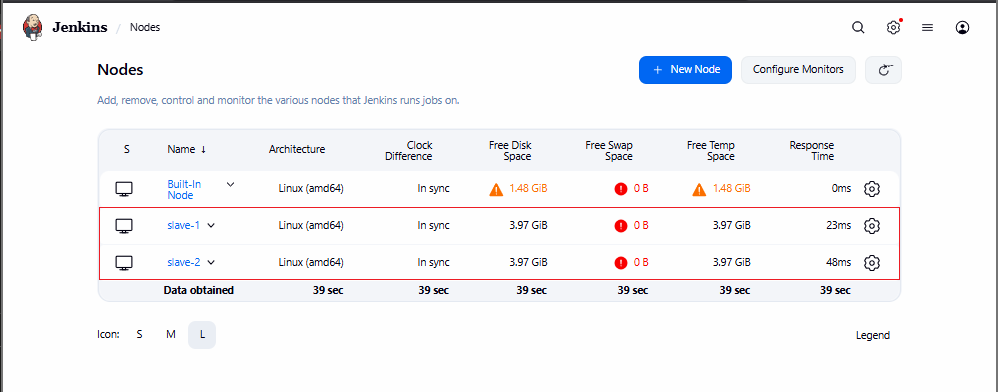

### 8d. Pipeline Running on Slave Nodes

After updating the Jenkinsfile agent line to `agent {label 'slave'}`, the pipeline ran on the slave nodes. The console log confirmed execution on `slave-1`:

```
Running on slave-1 in /home/jenkins/workspace/php-todo_main
```

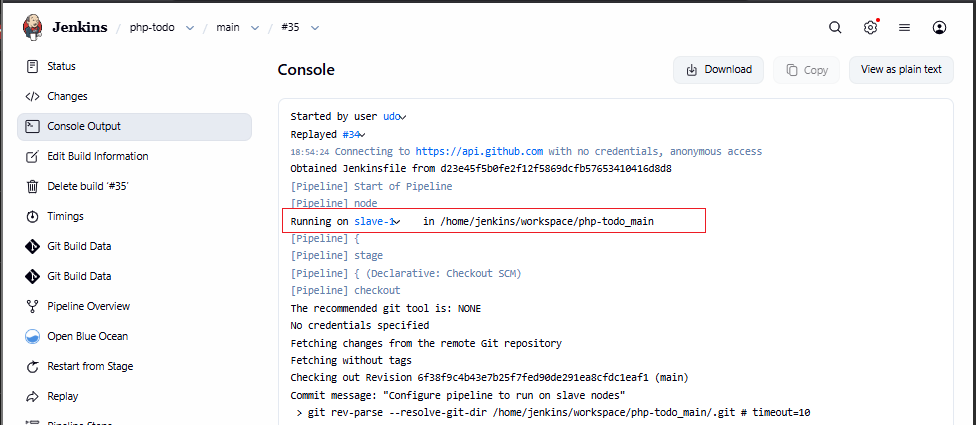

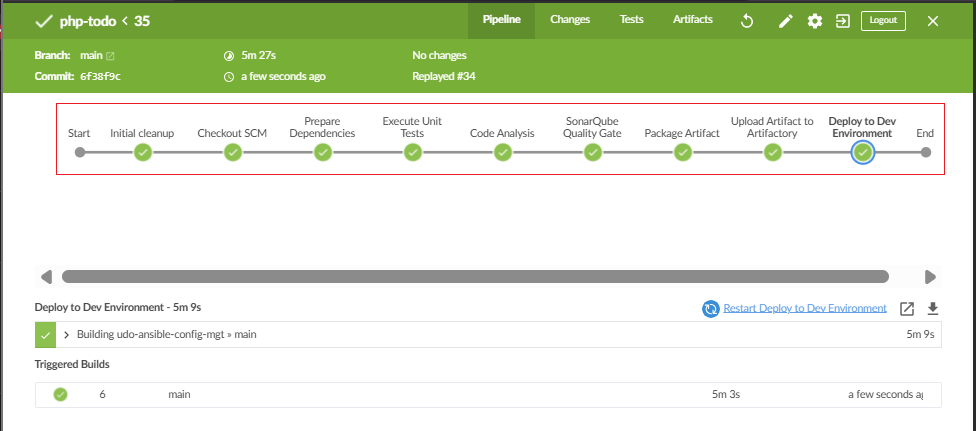

---

## Step 9 — GitHub Webhook Auto-Trigger

### 9a. Install Multibranch Scan Webhook Trigger Plugin

The **Multibranch Scan Webhook Trigger** plugin (v1.0.11) was installed from the Jenkins plugin manager.


### 9b. Configure Trigger Token in Jenkins

**php-todo → Configure → Scan Repository Triggers:**

- Scan by webhook
- Trigger token: `github-webhook`

The webhook URL format:
```
http://<Jenkins-IP>:8080/multibranch-webhook-trigger/invoke?token=github-webhook
```

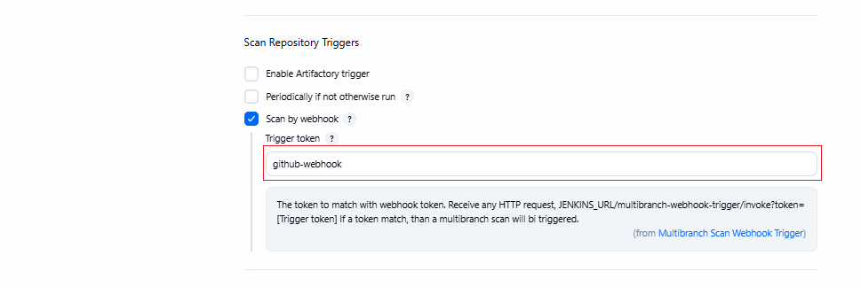

### 9c. Configure Webhook in GitHub

**GitHub → php-todo repo → Settings → Webhooks → Add webhook:**

- Payload URL: `http://<Jenkins-IP>:8080/multibranch-webhook-trigger/invoke?token=github-webhook`
- Content type: `application/json`
- Events: Just the push event

---

## Step 10 — Deploy to Multiple Environments

The pipeline was parameterised to support deploying to multiple environments. The `environment` parameter maps directly to the Ansible inventory file used:

```groovy
parameters {
    choice(
        name: 'environment',
        choices: ['dev', 'staging', 'uat'],
        description: 'Select environment to deploy to'
    )
}
```

The Deploy stage passes this to the Ansible job:

```groovy
stage('Deploy to Environment') {
    steps {
        build job: 'udo-ansible-config-mgt/main',
        parameters: [[$class: 'StringParameterValue',
        name: 'inventory', value: "${params.environment}"]],
        propagate: false,
        wait: true
    }
}
```

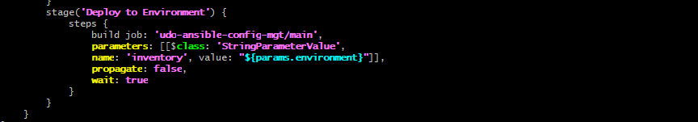

The Ansible Jenkinsfile uses `inventory/${inventory}.yml` to select the correct hosts file for each environment:

Available inventory files in `ansible-config-mgt/inventory/`:

```
dev.yml      staging.yml      uat.yml
```

---

## Issues Encountered and How They Were Resolved

This section documents the significant problems hit during the project and the debugging process used to fix them.

---

### Issue 1 — SonarQube `sonar.projectKey` Error on Slave Nodes

**Error:**
```
ERROR You must define the following mandatory properties for 'Unknown': sonar.projectKey
script returned exit code 3
```

**Root Cause (multi-layered):**
This error appeared after switching to slave nodes and had three compounding causes:

1. **The SonarQubeScanner tool was not installed on the slaves.** Auto-install requires the `/home/jenkins/tools/` directory to exist — it did not, so Jenkins had nowhere to install the tool.

2. **The `-Dsonar.projectKey` flags were not being passed.** Even after the tool was found, the bash `xtrace` output showed the scanner binary being called with zero arguments, confirming the flags were dropped.

3. **Jenkins was executing a cached old Jenkinsfile.** The `Initial cleanup` stage deletes the main workspace, but Jenkins caches the Jenkinsfile in a separate `@script` workspace. The outdated Jenkinsfile was being used for multiple builds even after updates were pushed to GitHub.

**Fixes Applied:**

First, the tools directory was confirmed missing on the slave:
```bash
ls -la /home/jenkins/tools/
# ls: cannot access '/home/jenkins/tools/': No such file or directory
```

Created it and set correct ownership:
```bash
sudo mkdir -p /home/jenkins/tools
sudo chown -R jenkins:jenkins /home/jenkins/
sudo chmod -R 755 /home/jenkins/
```

Cleared all Jenkins workspace caches to force a fresh Jenkinsfile checkout:
```bash
sudo rm -rf /var/lib/jenkins/workspace/php-todo_main
sudo rm -rf /var/lib/jenkins/workspace/php-todo_main@script
sudo rm -rf /var/lib/jenkins/workspace/php-todo_main@tmp
sudo rm -rf /var/lib/jenkins/workspace/php-todo_main@script@tmp
```

Tried passing flags inline — still failed due to interpolation issues across slave environments.

**Final Fix — `sonar-project.properties` file committed to the repository:**

A `sonar-project.properties` file was created at the root of the `php-todo` repo:

```properties
sonar.projectKey=php-todo
sonar.projectName=php-todo
sonar.sources=app/
sonar.php.exclusions=**/vendor/**
sonar.sourceEncoding=UTF-8
```

Committed and pushed:
```bash
git add sonar-project.properties
git commit -m "Add sonar project properties file"
git push origin main
```

The Jenkinsfile SonarQube stage was then simplified to:

```groovy
stage('SonarQube Quality Gate') {
    environment {
        scannerHome = tool 'SonarQubeScanner'
    }
    steps {
        withSonarQubeEnv('sonarqube') {
            sh "${scannerHome}/bin/sonar-scanner"
        }
        timeout(time: 1, unit: 'MINUTES') {
            waitForQualityGate abortPipeline: true
        }
    }
}
```

The scanner automatically detects and reads `sonar-project.properties` from the workspace root, so no `-D` flags are needed in the pipeline at all.

**Why this works on slaves when inline flags didn't:**
The properties file travels with the code. Every time Jenkins checks out the repo — whether on master, slave-1, or slave-2 — the file is present in the workspace. There is no dependency on server-side config files, no shell escaping to worry about, and no Groovy interpolation involved. The scanner reads it natively.

### Issue 2 — JFrog Artifactory Double URL (`artifactory/artifactory`)

**Error:**
```
JFrog Artifactory not found at http://44.210.104.27:8081/artifactory/artifactory
```

**Root Cause:**
The JFrog plugin was configured under **JFrog Platform Instances** (the newer plugin section), which automatically appends `/artifactory` to the URL. The URL entered in Jenkins config already included `/artifactory`, resulting in a doubled path.

**Fix:**

| Plugin Section | Correct URL format |
|----------------|-------------------|
| JFrog Platform Instances | `http://<IP>:8081` (no `/artifactory`) |
| Legacy Artifactory section | `http://<IP>:8081/artifactory` |

Changed the URL to `http://44.210.104.27:8081` and the Test Connection returned **Found Artifactory 6.9.6**.

---

### Issue 3 — Literal `<your-artifactory-repo>` in Jenkinsfile Not Updating

**Symptom:**
Despite editing the Jenkinsfile and pushing to GitHub, the pipeline kept showing the literal placeholder `<your-artifactory-repo>` in the upload target, causing the deploy URL to be `artifactory/%3Cyour-artifactory-repo%3E/php-todo` (URL-encoded angle brackets).

**Root Cause:**
Jenkins caches the Jenkinsfile in a separate `@script` workspace directory. The `Initial cleanup` stage deletes the main workspace but **not** the `@script` cache. Jenkins re-reads the Jenkinsfile from this cache, not from the fresh GitHub checkout.

**Fix:**

1. Verified the correct version was on GitHub:
```bash
curl -s https://raw.githubusercontent.com/udobuzor/php-todo/main/Jenkinsfile | grep target
# Should return: "target": "php-todo/",
```

2. Cleared all workspace caches manually:
```bash
sudo rm -rf /var/lib/jenkins/workspace/php-todo_main@script
sudo rm -rf /var/lib/jenkins/workspace/php-todo_main@script@tmp
```

3. Restarted Jenkins and triggered a fresh scan before rebuilding.

**Lesson:** `deleteDir()` in the `Initial cleanup` stage only clears `${WORKSPACE}` (the main checkout directory). It does **not** clear `${WORKSPACE}@script` where Jenkins stores the Jenkinsfile separately. Always clear the `@script` directory when a Jenkinsfile change is not being picked up.

---

### Issue 4 — Jenkins Slave SSH Authentication Failure

**Error:**
```
[SSH] WARNING: No entry currently exists in the Known Hosts file for this host.
Key exchange was not finished, connection is closed.
SSH Connection failed with IOException
```

**Root Cause:**
Two separate problems were identified:

1. The slave host keys were not in the Jenkins master's `known_hosts` file (running as the `jenkins` user).
2. The `ssh-keyscan` was initially run as the `ubuntu` user instead of the `jenkins` user, so the keys were added to the wrong user's `known_hosts`.

**Fix:**

Step 1 — Switch to `jenkins` user and run `ssh-keyscan`:
```bash
sudo su - jenkins
ssh-keyscan -H 172.31.28.104 >> ~/.ssh/known_hosts
ssh-keyscan -H 172.31.21.240 >> ~/.ssh/known_hosts
```

Step 2 — The Jenkins master's SSH public key must be in each slave's `/home/jenkins/.ssh/authorized_keys` (as the `jenkins` user, not `ubuntu`):
```bash
# On slave server
sudo mkdir -p /home/jenkins/.ssh
sudo vi /home/jenkins/.ssh/authorized_keys
# Paste contents of: sudo cat /var/lib/jenkins/.ssh/id_rsa.pub (from master)
sudo chown -R jenkins:jenkins /home/jenkins/.ssh
sudo chmod 700 /home/jenkins/.ssh
sudo chmod 600 /home/jenkins/.ssh/authorized_keys
```

Step 3 — Update credentials in Jenkins to use the actual `id_rsa` private key (not a placeholder).

**Lesson:** Jenkins agents connect as the user configured in the node settings (in this case `jenkins`). All SSH keys, directory permissions, and `known_hosts` entries must belong to that user — running commands as `ubuntu` sets up the wrong user's environment.

---

### Issue 5 — `php artisan migrate` Timeout on Slave Nodes

**Error:**
```
[PDOException]
SQLSTATE[HY000] [2002] Connection timed out
```

**Root Cause:**
The slave nodes could not reach the MySQL database server on port 3306. The DB server's AWS Security Group only permitted inbound connections from the Jenkins master's IP — not from the slave node IPs.

**Diagnosis:**
```bash
nc -zv 172.31.65.153 3306
# nc: connect to 172.31.65.153 port 3306 (tcp) failed: Connection timed out
```

**Fix:**
Added an inbound rule to the DB server's Security Group in AWS Console:

```
Type:     MySQL/Aurora
Protocol: TCP
Port:     3306
Source:   172.31.0.0/16   ← entire VPC CIDR
```

This allows all servers within the VPC to connect to the DB, regardless of which slave node the pipeline runs on.

**Lesson:** When adding slave nodes, audit **all** Security Group rules that previously only permitted the Jenkins master IP. Any resource the master could reach (databases, SonarQube, Artifactory) must also be reachable from the slave IPs.

---