# AWS CLOUD SOLUTION FOR 2 COMPANY WEBSITES
### Using a Reverse Proxy Technology (Nginx) on AWS

---

## What I Gained From This Project

After completing this project, I:

- Gained deep hands-on experience designing and deploying a **3-tier AWS architecture** from scratch
- Strengthened my understanding of **VPC networking** — subnets, route tables, Internet Gateways, and NAT Gateways
- Learned how to configure **Auto Scaling Groups** with Launch Templates for high availability
- Gained practical experience with **Application Load Balancers** (external and internal) and routing rules
- Understood how to secure infrastructure using **Security Groups**, **ACM certificates**, and **KMS encryption**
- Deployed **Amazon EFS** with access points and **Amazon RDS MySQL** in a private data layer
- Configured **Route53** DNS records with alias routing to load balancers
- Built a production-grade cloud infrastructure that is **resilient, scalable, and cost-aware**

---

## Project Overview

This project involves building a secure, scalable AWS infrastructure for a fictitious company **Oddshare** that hosts two websites:
- A **WordPress** CMS website (main business site)
- A **Tooling** website (for the DevOps team)

The architecture uses **Nginx as a reverse proxy**, sitting behind an external ALB, which routes traffic to web servers through an internal ALB — all within a private VPC.

**Key AWS services used:** VPC, EC2, ALB, ASG, EFS, RDS, ACM, Route53, KMS, IAM

---

## Architecture Overview

```
Internet
    │
    ▼
Route53 (DNS)
    │
    ▼
External ALB (Internet-facing, public subnets)
    │
    ▼
Nginx Servers (public subnets, Auto Scaling Group)
    │
    ▼
Internal ALB (private subnets)
    │
    ├──► WordPress Servers (private-subnet-1 & 2, ASG)
    │
    └──► Tooling Servers (private-subnet-1 & 2, ASG)
              │
              ▼
    RDS MySQL + EFS (private-subnet-3 & 4 — data layer)
```
---

## Prerequisites

Before starting:

- AWS Master (Root) account created
- Sub-account **DevOps** created under an **Organization Unit** named `Dev`
- All resources created inside the **DevOps account**
- AWS Budget alert configured at **$10–$20** to avoid surprise charges
- Domain registered and hosted zone created in **Route53**

---

## Step 1 — Set Up AWS Organization

- Created AWS Master/Root account
- Created sub-account named **DevOps** (requires a separate email address)
- Created Organization Unit (OU) named **Dev**
- Moved DevOps account into the Dev OU
- Logged into the DevOps account for all subsequent steps

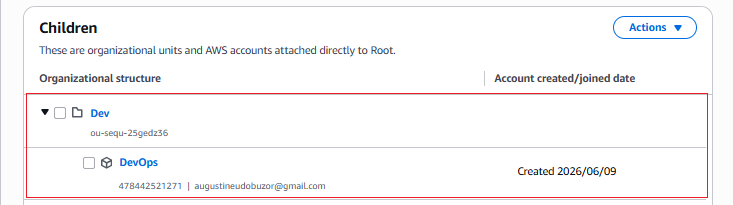

---

## Step 2 — Register Domain & Create Hosted Zone

Registered the domain **oddshare.com** and created a public hosted zone in Route53:

- AWS Console → Route53 → Hosted Zones → Create Hosted Zone
- Domain: `oddshare.com`
- Type: Public Hosted Zone

After creation, Route53 automatically generated **NS** and **SOA** records.

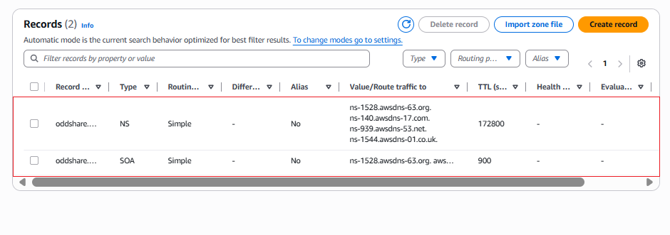

Copied the 4 NS values from Route53 and updated the nameservers at the domain registrar (Vercel) to point to AWS:

```
ns-1528.awsdns-63.org
ns-140.awsdns-17.com
ns-939.awsdns-53.net
ns-1544.awsdns-01.co.uk
```
---

## Step 3 — Create VPC

### 3A — Create VPC

- VPC → Create VPC → VPC only
- Name: `oddshare-vpc`
- IPv4 CIDR: `10.0.0.0/16`

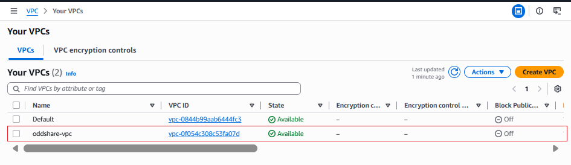

### 3B — Create Subnets

Created 6 subnets across 2 Availability Zones in a single session using **Add new subnet**:

| Name | Type | CIDR | AZ |
|------|------|------|----|
| public-subnet-1 | Public | 10.0.1.0/24 | us-east-1a |
| public-subnet-2 | Public | 10.0.2.0/24 | us-east-1b |
| private-subnet-1 | Private (web) | 10.0.3.0/24 | us-east-1a |
| private-subnet-2 | Private (web) | 10.0.4.0/24 | us-east-1b |
| private-subnet-3 | Private (data) | 10.0.5.0/24 | us-east-1a |
| private-subnet-4 | Private (data) | 10.0.6.0/24 | us-east-1b |

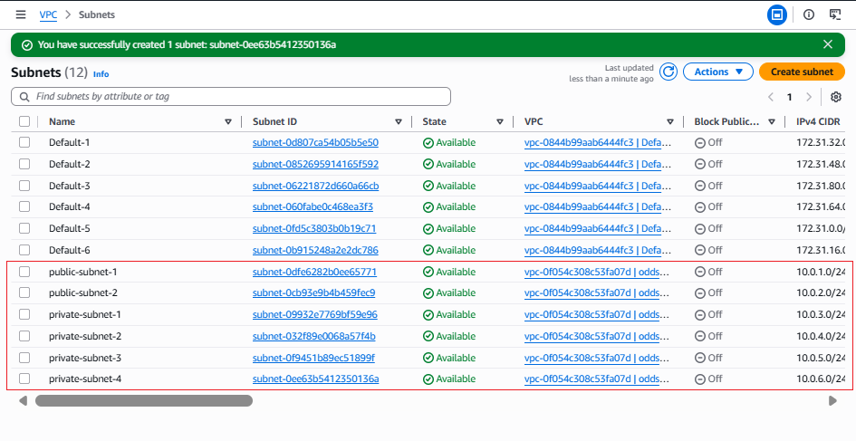

Enabled **auto-assign public IPv4** on both public subnets:
- Select subnet → Actions → Edit subnet settings → Enable auto-assign public IPv4

### 3C — Create Internet Gateway

- VPC → Internet Gateways → Create
- Name: `oddshare-igw`
- After creation: Actions → **Attach to VPC** → select `oddshare-vpc`

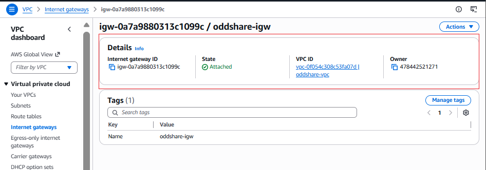

### 3D — Create NAT Gateway

- VPC → NAT Gateways → Create
- Name: `oddshare-nat`
- Subnet: `public-subnet-1`
- Connectivity type: Public
- Click **Allocate Elastic IP**

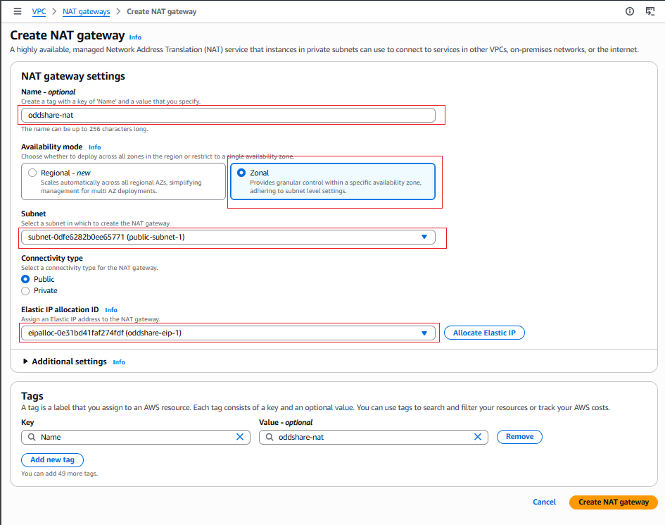

> NAT Gateway is placed in a public subnet so private instances can reach the internet (e.g., for package installs) without being directly reachable from the internet.

> NAT Gateway is the most expensive resource in this project (~$1/day). Delete first when tearing down.

### 3E — Create Route Tables

**Public Route Table** (`oddshare-public-rtb`):
- Add route: `0.0.0.0/0` → Internet Gateway (`oddshare-igw`)
- Associate with: `public-subnet-1` and `public-subnet-2`

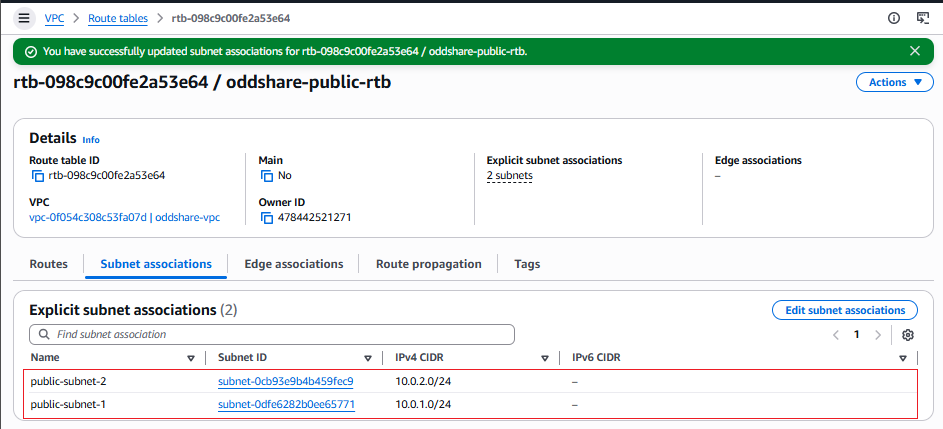

**Private Route Table** (`oddshare-private-rtb`):
- Add route: `0.0.0.0/0` → NAT Gateway (`oddshare-nat`)
- Associate with: `private-subnet-1`, `private-subnet-2`, `private-subnet-3`, `private-subnet-4`

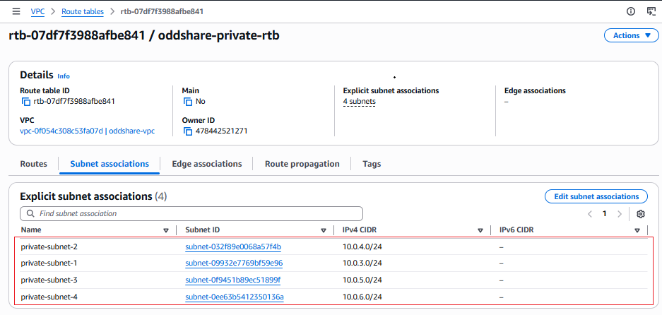

---

## Step 4 — Create Security Groups

All security groups created under `oddshare-vpc`:

| Security Group | Inbound Rules |
|----------------|---------------|
| `ext-alb-sg` | HTTP (80) from `0.0.0.0/0`; HTTPS (443) from `0.0.0.0/0` |
| `bastion-sg` | SSH (22) from My IP only |
| `nginx-sg` | HTTP (80) from `ext-alb-sg`; HTTPS (443) from `ext-alb-sg`; SSH (22) from `bastion-sg` |
| `int-alb-sg` | HTTP (80) from `nginx-sg`; HTTPS (443) from `nginx-sg` |
| `webserver-sg` | HTTP (80) from `int-alb-sg`; HTTPS (443) from `int-alb-sg`; SSH (22) from `bastion-sg` |
| `datalayer-sg` | MySQL (3306) from `webserver-sg`; NFS (2049) from `webserver-sg` and `nginx-sg` |

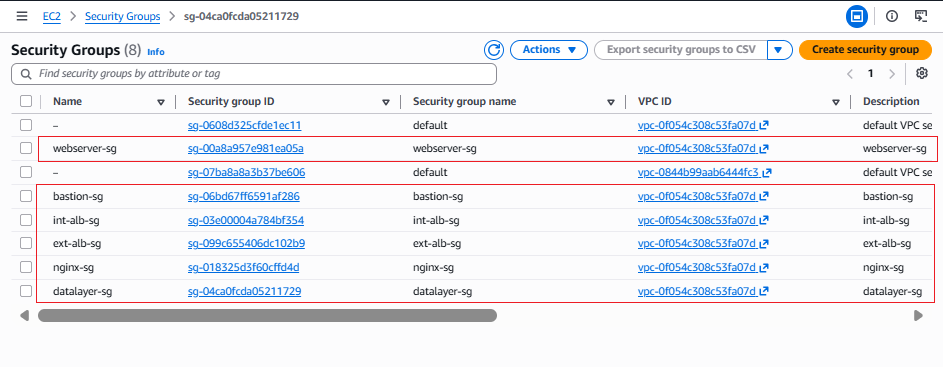

---

## Step 5 — Request TLS Certificate from ACM

- AWS Console → Certificate Manager → Request a public certificate
- Added two domain names:
  - `oddshare.com`
  - `*.oddshare.com` (wildcard — covers all subdomains)
- Validation method: DNS validation
- Clicked **Create records in Route53** to auto-add the CNAME validation record
- Waited for status to show **Issued**

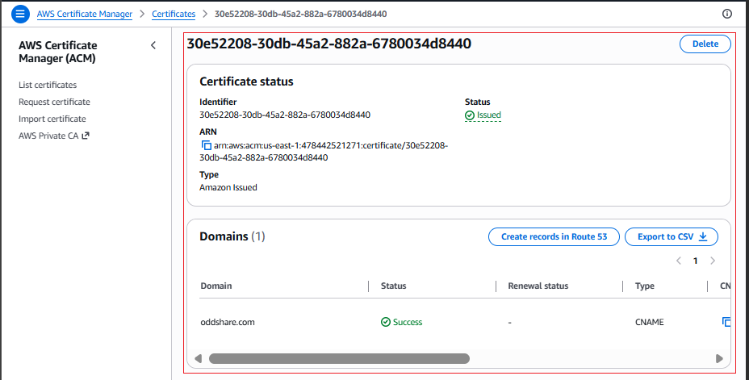

> The wildcard `*.oddshare.com` covers `www.oddshare.com`, `tooling.oddshare.com`, and any future subdomains with a single certificate.

---

## Step 6 — Set Up EFS

- AWS Console → EFS → Create file system → **Customize**
- Name: `oddshare-efs`
- Storage class: Regional
- Throughput mode: Bursting
- Encryption: Enabled (default KMS key)
- Automatic backups: Disabled

**Network settings:**
- VPC: `oddshare-vpc`
- Mount targets:
  - AZ: `us-east-1a` → `private-subnet-1` → Security group: `datalayer-sg`
  - AZ: `us-east-1b` → `private-subnet-2` → Security group: `datalayer-sg`

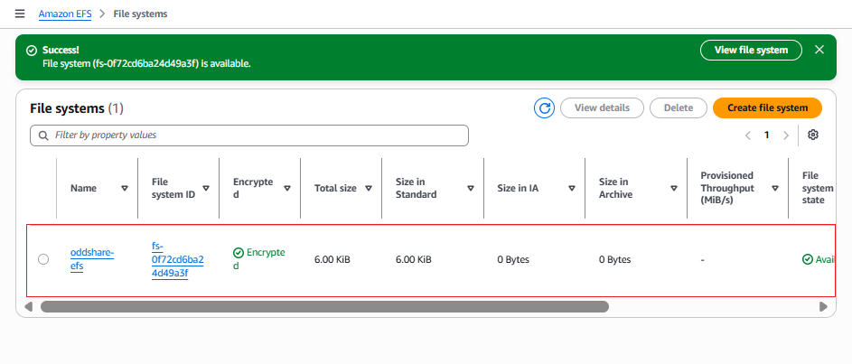

**Created 2 Access Points:**

| Name | Root Directory Path |
|------|---------------------|
| `wordpress` | `/wordpress` |
| `tooling` | `/tooling` |

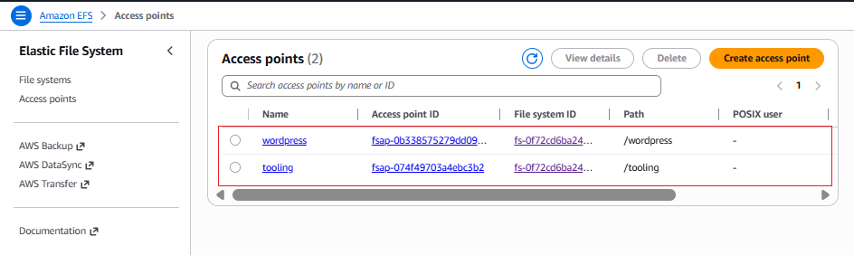

---

## Step 7 — Set Up RDS

### 7A — Create KMS Key

- KMS → Create Key → Symmetric → Encrypt and decrypt
- Alias: `oddshare-rds-key`

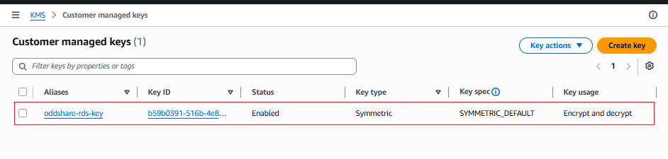

### 7B — Create DB Subnet Group

- RDS → Subnet Groups → Create
- Name: `oddshare-rds-subnet-group`
- VPC: `oddshare-vpc`
- Subnets: `private-subnet-3` (10.0.5.0/24) and `private-subnet-4` (10.0.6.0/24)

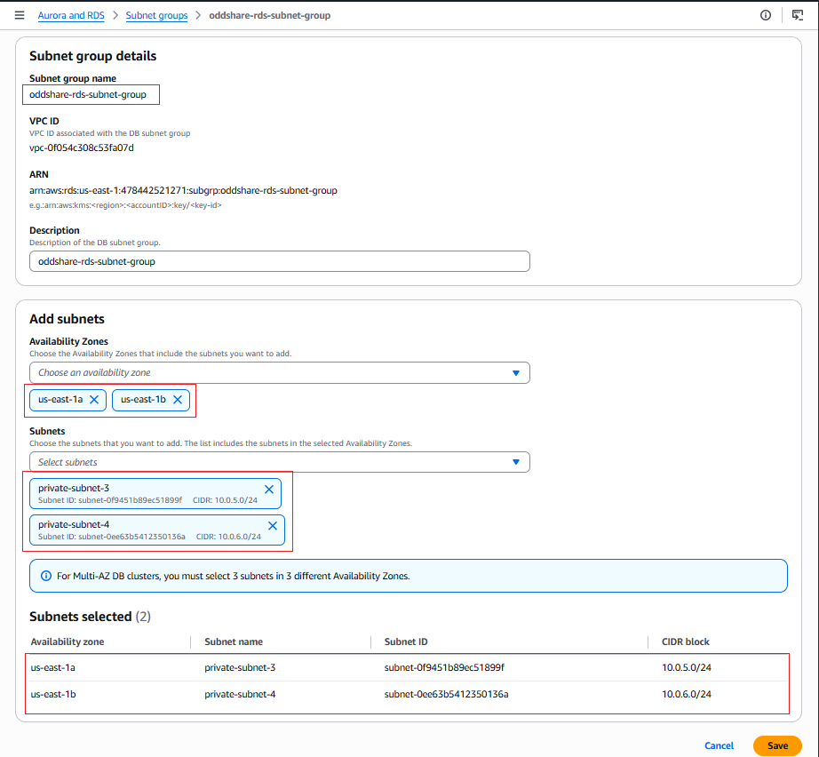

### 7C — Create RDS Instance

- Engine: MySQL 8.0
- Template: Dev/Test
- Deployment: Single-AZ DB instance
- DB identifier: `oddshare-rds`
- Master username: `admin`
- Instance class: `db.t3.small`
- Storage: 20 GB gp3, autoscaling disabled
- VPC: `oddshare-vpc`
- Subnet group: `oddshare-rds-subnet-group`
- Public access: **No**
- Security group: `datalayer-sg`
- Encryption: Enabled using `oddshare-rds-key`
- Monitoring: Database Insights Standard

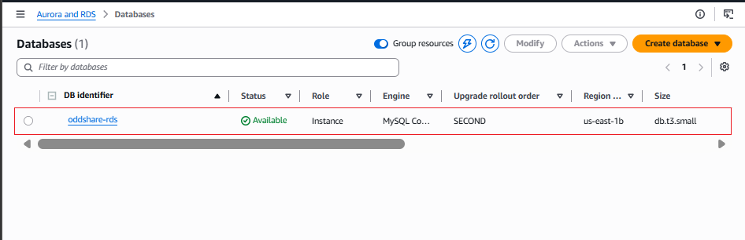

---

## Step 8 — Set Up Compute Resources

### 8A — Create Base AMI

Launched a CentOS Stream 9 EC2 instance (`t3.small`) in `public-subnet-1` with `bastion-sg`, then SSH'd in and installed all base packages:

```bash
sudo yum install -y epel-release
sudo yum install -y python3 chrony net-tools vim wget telnet htop
sudo yum install -y php
```

Created an AMI from the instance:
- EC2 → Actions → Image and templates → Create image
- Name: `oddshare-base-ami`
- Enable **No reboot**

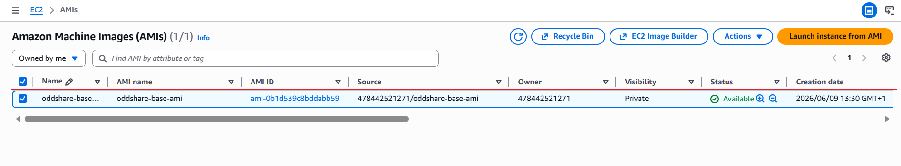

### 8B — Create Launch Templates

Created 4 launch templates all using `oddshare-base-ami`:

**nginx-lt:**
- Instance type: `t3.small`
- Security group: `nginx-sg`
- User data:
```bash
#!/bin/bash
yum update -y
yum install -y nginx
systemctl start nginx
systemctl enable nginx
```

**bastion-lt:**
- Instance type: `t3.small`
- Security group: `bastion-sg`
- User data:
```bash
#!/bin/bash
yum update -y
yum install -y ansible git
```

**wordpress-lt:**
- Instance type: `t3.small`
- Security group: `webserver-sg`
- User data:
```bash
#!/bin/bash
yum update -y
systemctl start httpd
systemctl enable httpd
```

**tooling-lt:**
- Instance type: `t3.small`
- Security group: `webserver-sg`
- User data:
```bash
#!/bin/bash
yum update -y
systemctl start httpd
systemctl enable httpd
```

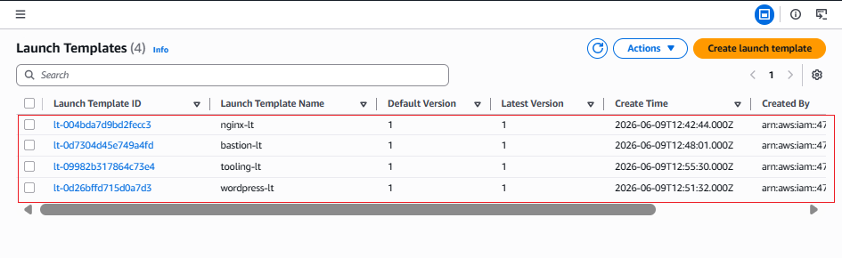

### 8C — Create Target Groups

| Name | Protocol | Port | Health Check Path | Success Codes |
|------|----------|------|-------------------|---------------|
| `nginx-tg` | HTTP | 80 | `/` | 200 |
| `wordpress-tg` | HTTP | 80 | `/` | 200,403 |
| `tooling-tg` | HTTP | 80 | `/` | 200,403 |

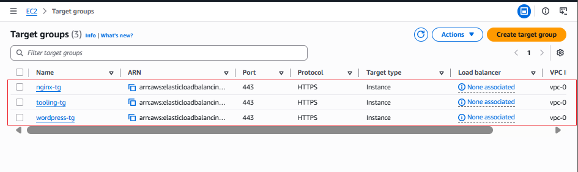

### 8D — Create Auto Scaling Groups

Created 4 ASGs with the following common settings:
- Desired: 2, Minimum: 2, Maximum: 4
- Scale out policy: CPU utilization ≥ 90%
- ELB health checks enabled
- Health check grace period: 300 seconds

| ASG Name | Launch Template | Subnets | Target Group |
|----------|----------------|---------|--------------|
| `nginx-asg` | `nginx-lt` | public-subnet-1, public-subnet-2 | `nginx-tg` |
| `bastion-asg` | `bastion-lt` | public-subnet-1, public-subnet-2 | — |
| `wordpress-asg` | `wordpress-lt` | private-subnet-1, private-subnet-2 | `wordpress-tg` |
| `tooling-asg` | `tooling-lt` | private-subnet-1, private-subnet-2 | `tooling-tg` |

Assigned **Elastic IPs** to the Bastion instances for direct SSH access.

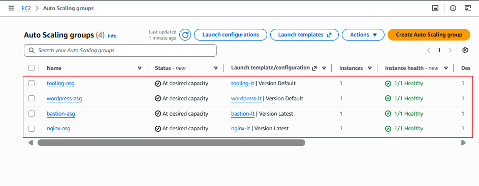

---

## Step 9 — Configure Application Load Balancers

### External ALB (Internet-facing)

- Name: `ext-alb`
- Scheme: **Internet-facing**
- Subnets: `public-subnet-1` + `public-subnet-2`
- Security group: `ext-alb-sg`
- Listener: HTTPS 443
- Certificate: ACM wildcard certificate (`*.oddshare.com`)
- Default action: Forward to `nginx-tg`

### Internal ALB

- Name: `int-alb`
- Scheme: **Internal**
- Subnets: `private-subnet-1` + `private-subnet-2`
- Security group: `int-alb-sg`
- Listener: HTTPS 443
- Certificate: ACM wildcard certificate
- Default action: Forward to `wordpress-tg`

Added a custom listener rule for the Tooling site:

| Rule Name | Condition | Action |
|-----------|-----------|--------|
| `tooling-rule` | Host header = `tooling.oddshare.com` | Forward to `tooling-tg` |

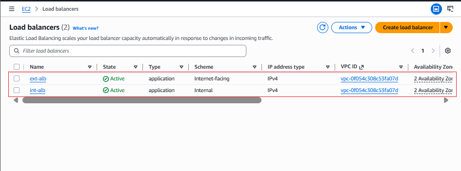

---

## Step 10 — Configure DNS with Route53

Created 3 alias A records in the `oddshare.com` hosted zone, all pointing to `ext-alb`:

| Record | Type | Value |
|--------|------|-------|
| `oddshare.com` | A (Alias) | ext-alb DNS name |
| `www.oddshare.com` | A (Alias) | ext-alb DNS name |
| `tooling.oddshare.com` | A (Alias) | ext-alb DNS name |

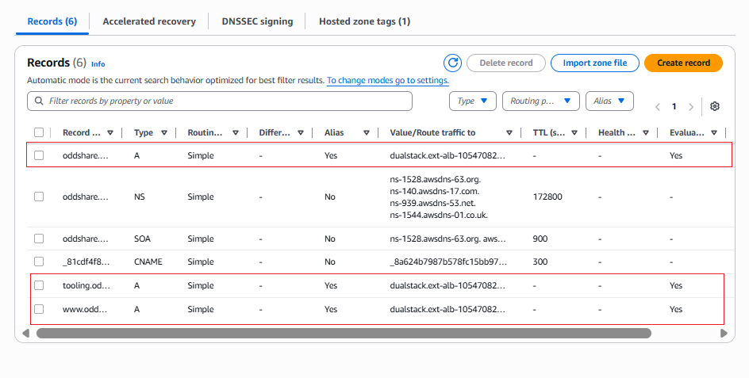

---

## Final Result

Visited in browser after deployment:

**https://oddshare.com** — WordPress site served via Nginx reverse proxy with HTTPS

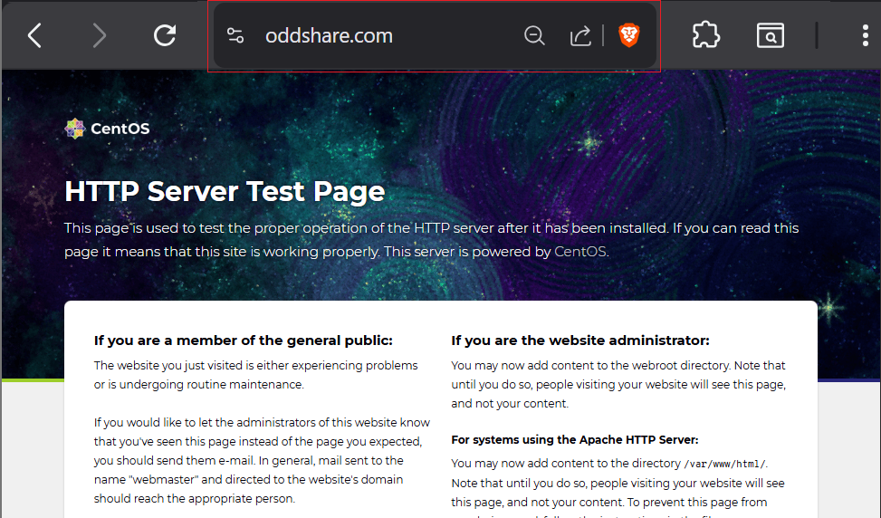

**https://tooling.oddshare.com** — Tooling site routed via internal ALB with HTTPS

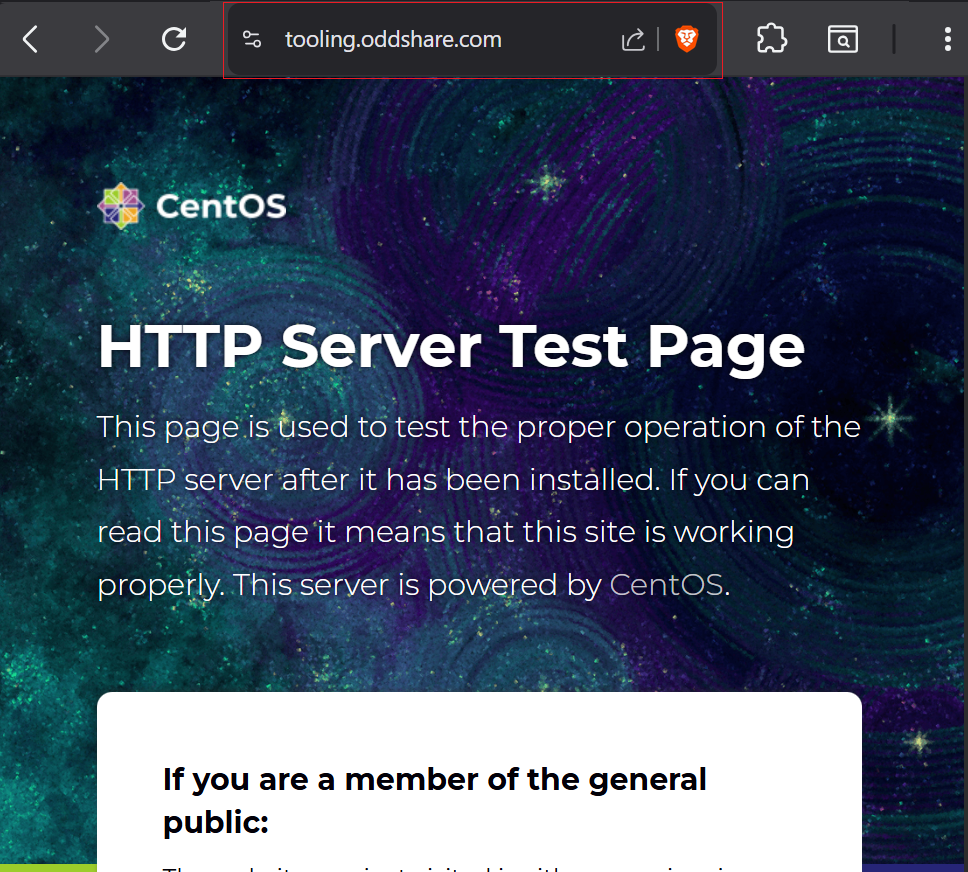

---

## Project Summary

| Component | Resource | Status |
|-----------|----------|--------|
| Networking | VPC, 6 subnets, IGW, NAT GW, Route Tables | |
| Security | 6 Security Groups, ACM Wildcard Certificate | |
| Storage | EFS with 2 access points (wordpress, tooling) | |
| Database | RDS MySQL 8.0 encrypted with KMS | |
| Compute | 4 Launch Templates + 4 Auto Scaling Groups | |
| Load Balancing | External ALB + Internal ALB with routing rules | |
| DNS | Route53 alias records for root, www, and tooling | |
| HTTPS | Wildcard ACM certificate on both ALBs | |

---