# IMPLEMENTATION OF A CLIENT SERVER ARCHITECTURE USING MYSQL DBMS
### Client Server Architecture | MySQL | AWS EC2

---

## What I Gained From This Project

After completing this project, I:

- Strengthened my understanding of client-server architecture and how two machines communicate over a network
- Gained practical experience installing and configuring MySQL server and client on separate EC2 instances
- Learned how to configure MySQL to accept remote connections by changing the bind-address
- Practiced creating MySQL users with remote access privileges and granting database permissions
- Successfully connected to a remote MySQL server from a client machine using only private IP addresses within a VPC

---

## Project Overview

This document details the implementation of a **Client-Server Architecture** using **MySQL DBMS** on two separate **AWS EC2** instances. One instance acts as the MySQL server and the other as the MySQL client. The client connects to the server remotely using the server's private IP address — no public IP required.

---

## Step 0 — Preparing Prerequisites

Verified internet connectivity on the local machine:

```bash
curl -Iv www.bing.com
```

**Result:** HTTP/1.1 200 OK — internet connection confirmed

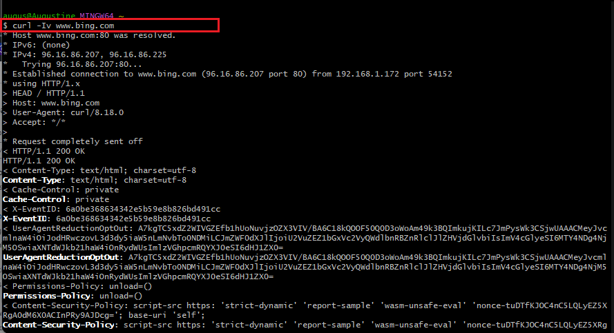

Launched two new EC2 instances — both **Ubuntu Server, t3.micro** in the same region and availability zone:

- Instance 1: `mysql-server`
- Instance 2: `mysql-client`

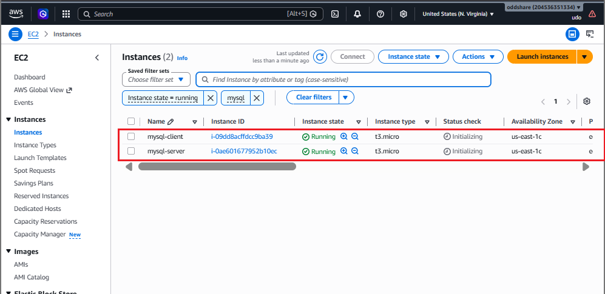

---

## Step 1 — Setting Up the MySQL Server

SSH into the `mysql-server` instance and updated the package list:

```bash
sudo apt update
```

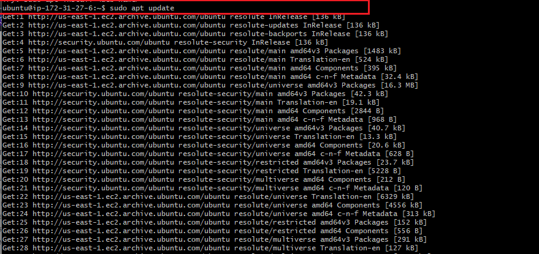

Installed MySQL server:

```bash
sudo apt install mysql-server
```

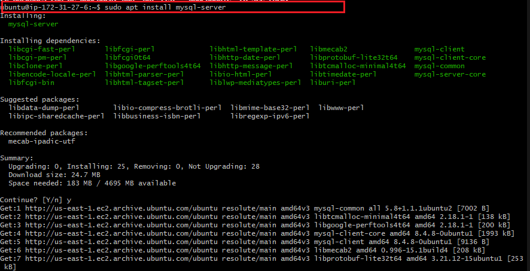

Verified MySQL service was running:

```bash
sudo systemctl status mysql.service
```

**Result:** Active (running) — MySQL Community Server 8.4.8

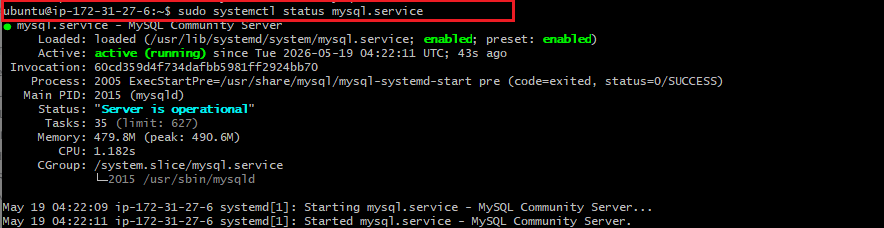

Logged into the MySQL console:

```bash
sudo mysql
```

**Server version confirmed:** MySQL 8.4.8-0ubuntu1

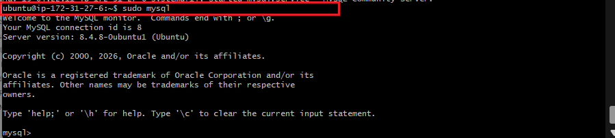

---

## Step 2 — Creating the Database and User

Inside the MySQL console, created a new database and a remote user:

```sql
CREATE DATABASE example_database;

CREATE USER 'first_user'@'%' IDENTIFIED WITH mysql_native_password BY 'PassWord.1';
```


Granted full privileges on the database to the new user:

```sql
GRANT ALL ON example_database.* TO 'first_user'@'%';
```


Verified the user could log in locally and see the database:

```bash
mysql -u first_user -p
```

```sql
SHOW DATABASES;
```

**Result:** `example_database` visible

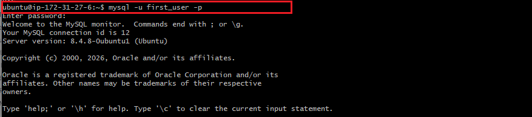

---

## Step 3 — Configuring MySQL for Remote Connections

By default MySQL only listens on `127.0.0.1` (localhost). To allow remote connections the bind-address must be changed.

Ran `mysql_secure_installation` to harden the server:

```bash
sudo mysql_secure_installation
```

Completed with:
- Validate password component enabled (MEDIUM policy)
- Password strength: 100
- Root password change skipped (already secure)
- Anonymous users to be removed
- Test database to be removed

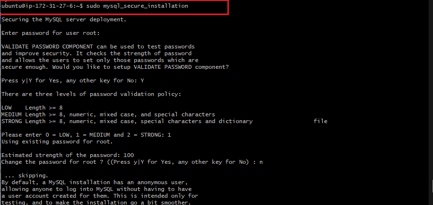

Encountered the `mysql_native_password` plugin error when attempting to set root password:

```sql
ALTER USER 'root'@'localhost' IDENTIFIED WITH mysql_native_password BY 'PassWord.1';
-- ERROR 1524 (HY000): Plugin 'mysql_native_password' is not loaded
```

Edited the MySQL config file to enable the plugin and change the bind-address:

```bash
sudo vim /etc/mysql/mysql.conf.d/mysqld.cnf
```

Changed:
```ini
bind-address = 0.0.0.0
```

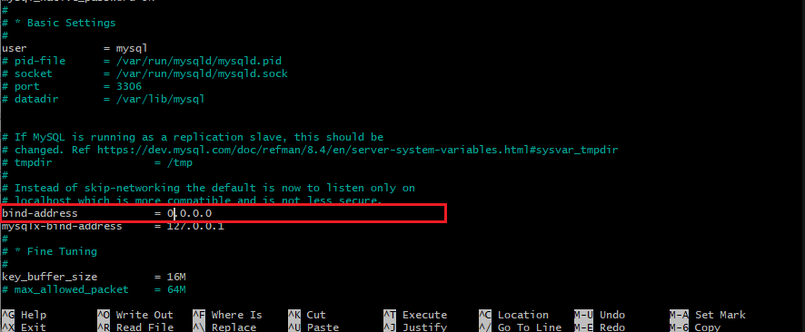

Restarted MySQL and verified it was running:

```bash
sudo systemctl restart mysql
sudo systemctl status mysql.service
```

**Result:** Active (running)

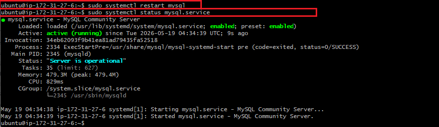

Re-ran the ALTER USER command successfully after restart:

```sql
ALTER USER 'root'@'localhost' IDENTIFIED WITH mysql_native_password BY 'PassWord.1';
```

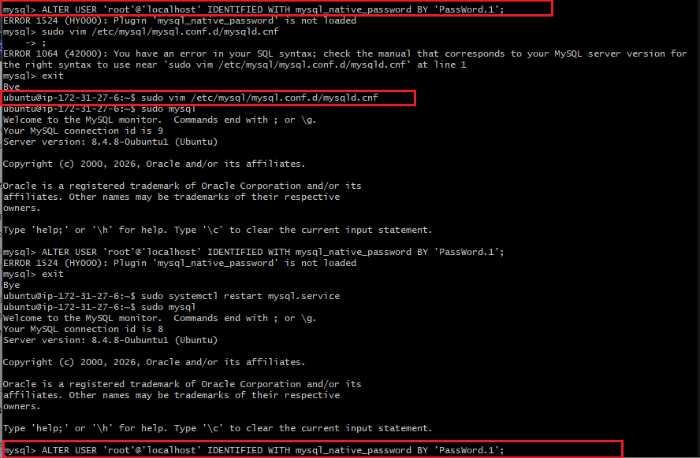

---

## Step 4 — Configuring the Security Group

To allow the MySQL client to connect to the MySQL server on port 3306, added an inbound rule to the `mysql-server` security group:

1. Navigated to **EC2 → Security Groups → mysql-server security group**
2. Clicked **Edit inbound rules → Add rule**
3. Added:

| Type | Protocol | Port range | Source |
|------|----------|------------|--------|
| MYSQL/Aurora | TCP | 3306 | 172.31.19.100/16 |

This allows all instances within the VPC to connect to MySQL on port 3306.

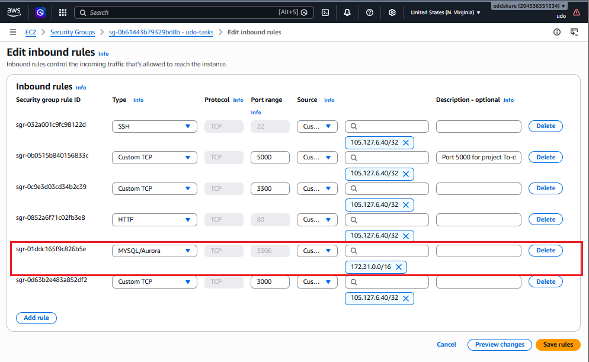

---

## Step 5 — Setting Up the MySQL Client

SSH into the `mysql-client` instance and updated the package list:

```bash
sudo apt update
```

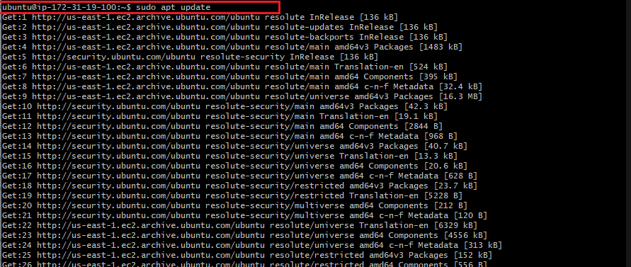

Upgraded existing packages:

```bash
sudo apt upgrade
```

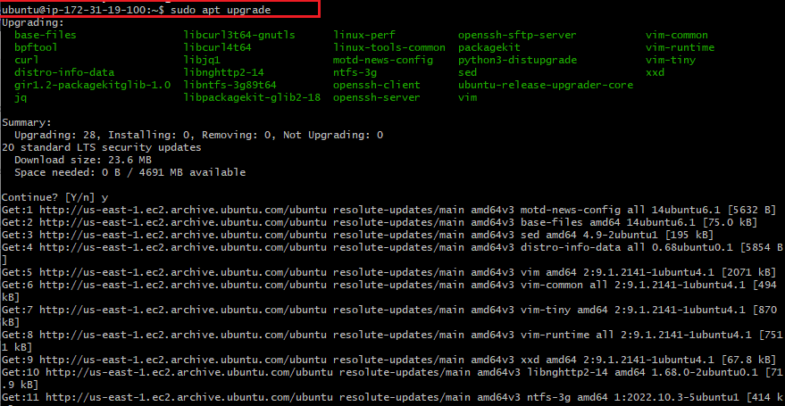

Installed MySQL client only (no server needed):

```bash
sudo apt install mysql-client -y
```

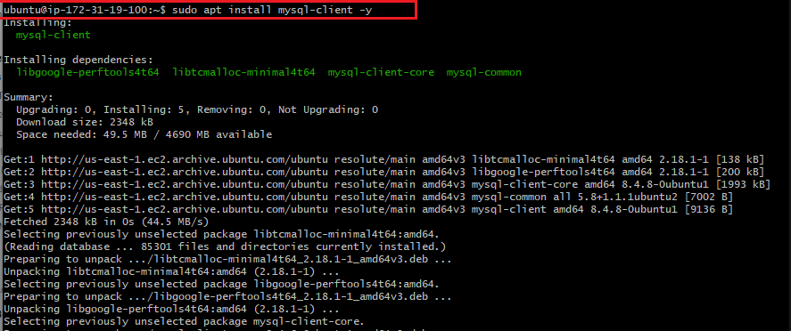

---

## Step 6 — Connecting Remotely from Client to Server

From the `mysql-client` instance, connected to the `mysql-server` using its **private IP address** `172.31.27.6`:

```bash
sudo mysql -u first_user -h 172.31.27.6 -p
```

**Result:** Successfully connected to the remote MySQL server

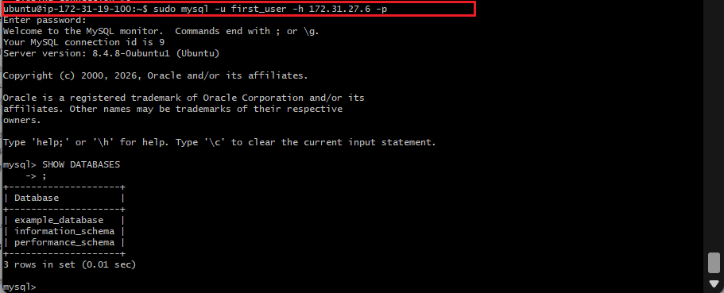

Verified database access from the client:

```sql
SHOW DATABASES;
```

**Result:** `example_database` visible from the remote client

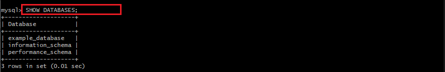

---

## Final Result — Client-Server Architecture Fully Operational

| Component | Details |
|-----------|---------|
| **Server Instance** | mysql-server — Ubuntu, t3.micro |
| **Client Instance** | mysql-client — Ubuntu, t3.micro |
| **MySQL Version** | 8.4.8-0ubuntu1 |
| **Connection Type** | Remote via Private IP (172.31.27.6) |
| **Port** | 3306 |
| **Database** | example_database |
| **Remote User** | first_user |

**The MySQL client instance successfully connected to the MySQL server instance over the AWS VPC private network using port 3306 — demonstrating a fully working Client-Server Architecture.**