# IMPLEMENTATION OF A CLIENT SERVER ARCHITECTURE USING MYSQL DATABASE MANAGEMENT SYSTEM (DBMS)
### WordPress | Apache | MySQL | PHP | AWS EC2 | LVM | RedHat

---

## What I Gained From This Project

After completing this project, I:

- Gained hands-on experience provisioning and configuring storage infrastructure on Linux using EBS volumes, partitions, and LVM
- Deepened my understanding of Three-Tier Architecture by deploying separate Web Server and Database Server EC2 instances
- Learned how to create physical volumes, volume groups, and logical volumes with LVM on RedHat Enterprise Linux
- Gained practical experience installing and configuring WordPress with Apache and PHP on a RedHat EC2 instance
- Configured a remote MySQL database server and connected it securely to a WordPress web server across private IPs
- Understood how to harden access using SELinux policies and AWS Security Group inbound rules
- Successfully deployed a fully operational WordPress CMS backed by a remote MySQL database on AWS EC2

---

## Project Overview

This document details the implementation of a **Client-Server Architecture** using a **WordPress Web Server** and a **remote MySQL Database Server**, both running on **RedHat Enterprise Linux 10.1** on **AWS EC2**. The project demonstrates real-world Three-Tier Architecture:

- **Presentation Layer** — Browser (Client)
- **Business Layer** — EC2 Web Server running Apache + WordPress + PHP
- **Data Layer** — EC2 Database Server running MySQL

---

## Architecture Overview

```
Browser (Client)
       ↓  HTTP Port 80
EC2 Web Server — Project6-web (172.31.14.129)
  └── Apache + WordPress + PHP
       ↓  MySQL Port 3306
EC2 DB Server — Project6-server (172.31.1.126)
  └── MySQL 8.0.45
```

Both instances: **RedHat Enterprise Linux 10.1 (Coughlan)** | `c7i.flex.large` | `us-east-1a`

---

## Step 1 — Prepare the Web Server

### Attach EBS Volumes & Verify

Launched a RedHat EC2 instance (`Project6-web`) and attached 3 EBS volumes (10 GiB each) in `us-east-1a`. Verified with `lsblk` — `nvme1n1`, `nvme2n1`, `nvme3n1` all visible as 10G disks:

```bash
lsblk
ls /dev/
```

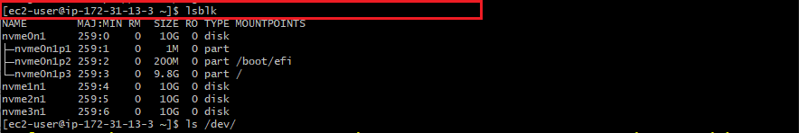

---

### Partition Each Disk with gdisk

Used `gdisk` to create a GPT partition with Linux LVM type (`8E00`) on each disk. Commands used inside gdisk: `n` → Enter → Enter → Enter → `8E00` → `p` → `w` → `Y`.

```bash
sudo gdisk /dev/nvme1n1
sudo gdisk /dev/nvme2n1
sudo gdisk /dev/nvme3n1
```

**Result:** All 3 disks partitioned successfully. `lsblk` confirmed `nvme1n1p1`, `nvme2n1p1`, `nvme3n1p1` 

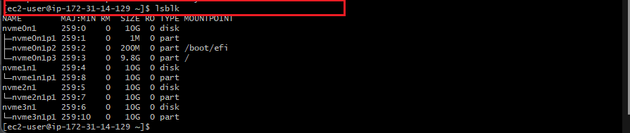

---

### Install LVM2, Create PVs, VG, and LVs

Installed `lvm2`, marked partitions as physical volumes, combined them into a volume group, then created two logical volumes:

```bash
sudo yum install lvm2
sudo lvmdiskscan

sudo pvcreate /dev/nvme1n1p1
sudo pvcreate /dev/nvme2n1p1
sudo pvcreate /dev/nvme3n1p1

sudo vgcreate webdata-vg /dev/nvme1n1p1 /dev/nvme2n1p1 /dev/nvme3n1p1

sudo lvcreate -n apps-lv -L 14G webdata-vg
sudo lvcreate -n logs-lv -L 14G webdata-vg
```

**Result:** `apps-lv` (14G) and `logs-lv` (14G) created inside `webdata-vg` (29.99G) 

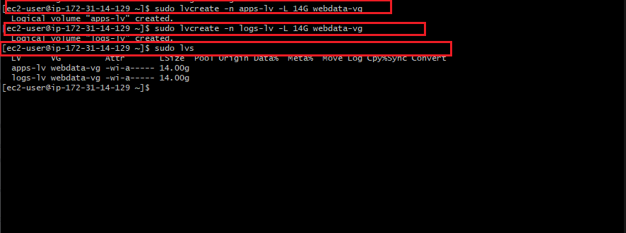

Verified the complete setup:

```bash
sudo vgdisplay -v
sudo lsblk
```

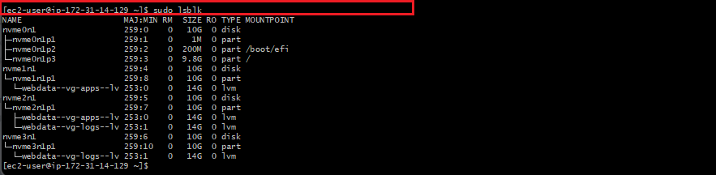

---

### Format, Mount, and Persist with /etc/fstab

Formatted both logical volumes with ext4, created mount directories, backed up existing logs, mounted the volumes, and restored logs:

```bash
sudo mkfs -t ext4 /dev/webdata-vg/apps-lv
sudo mkfs -t ext4 /dev/webdata-vg/logs-lv

sudo mkdir -p /var/www/html
sudo mkdir -p /home/recovery/logs

sudo mount /dev/webdata-vg/apps-lv /var/www/html/
sudo rsync -av /var/log/. /home/recovery/logs/
sudo mount /dev/webdata-vg/logs-lv /var/log
sudo rsync -av /home/recovery/logs/. /var/log
```

Got UUIDs and updated `/etc/fstab` for persistence:

```bash
sudo blkid
sudo vi /etc/fstab
```

```
# mount for wordpress webserver
UUID="59aa23cb-9ceb-476b-8503-23190316c221"  /var/www/html  ext4  defaults  0  0
UUID="728b136f-394e-41b3-8f6c-fe0bc95012a2"  /var/log       ext4  defaults  0  0
```

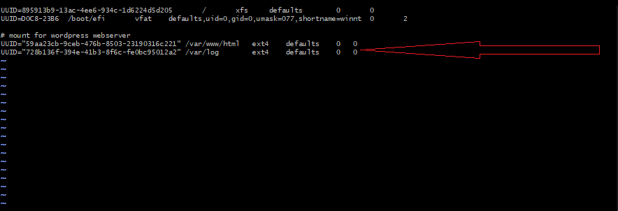

Tested and reloaded:

```bash
sudo mount -a
sudo systemctl daemon-reload
df -h
```

**Result:** `apps-lv` mounted at `/var/www/html` (14G), `logs-lv` at `/var/log` (14G) 

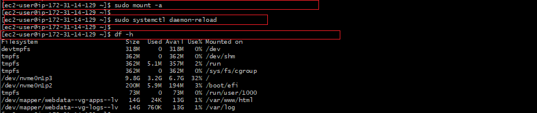

---

## Step 2 — Prepare the Database Server

### Launch DB Server & Repeat LVM Setup

Launched a second RedHat EC2 instance (`Project6-server`) and SSHed in:

```bash
ssh -i Downloads/udo-task.pem ec2-user@44.192.122.195
```

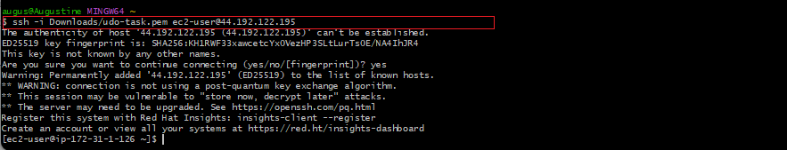

Repeated the same partitioning and LVM steps — this time creating `db-lv` (mounted to `/db`) instead of `apps-lv`:

```bash
sudo gdisk /dev/nvme1n1
sudo gdisk /dev/nvme2n1
sudo gdisk /dev/nvme3n1

sudo pvcreate /dev/nvme1n1p1 /dev/nvme2n1p1 /dev/nvme3n1p1
sudo vgcreate webdata-vg /dev/nvme1n1p1 /dev/nvme2n1p1 /dev/nvme3n1p1
sudo lvcreate -n db-lv   -L 14G webdata-vg
sudo lvcreate -n logs-lv -L 14G webdata-vg
```

**Result:** `db-lv` (14G) and `logs-lv` (14G) confirmed in `webdata-vg` 

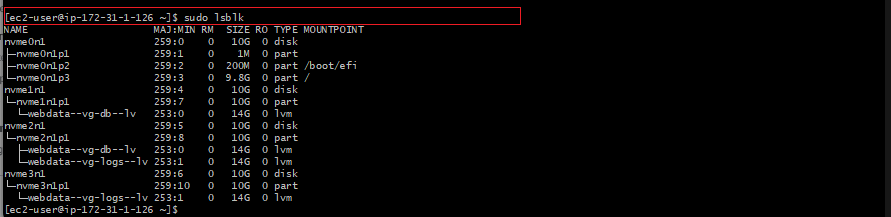

Formatted, mounted, and updated `/etc/fstab`:

```bash
sudo mkfs -t ext4 /dev/webdata-vg/db-lv
sudo mkfs -t ext4 /dev/webdata-vg/logs-lv
sudo mkdir -p /db
sudo mount /dev/webdata-vg/db-lv /db
```

```
# mounts for wordpress dbserver
UUID="1d444c85-d314-4c2c-84b8-043fa306efbb"  /db       ext4  defaults  0  0
UUID="653f8f8c-deb4-4c77-9b18-065dced7903f"  /var/log  ext4  defaults  0  0
```

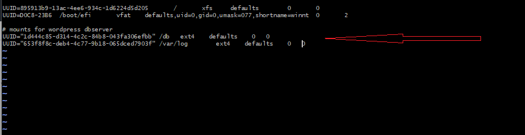

**Result:** `db-lv` mounted at `/db` (14G), `logs-lv` at `/var/log` (14G) 

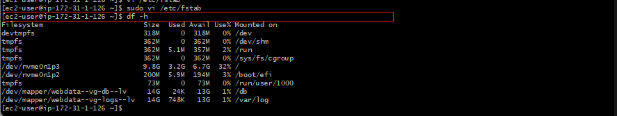

---

## Step 3 — Install WordPress on Web Server

Updated the system and installed Apache, PHP, and dependencies:

```bash
sudo yum -y update
sudo yum -y install wget httpd php php-mysqlnd php-fpm php-json
sudo systemctl enable httpd
sudo systemctl start httpd
```

Installed EPEL, Remi repos, and PHP 7.4:

```bash
sudo yum install https://dl.fedoraproject.org/pub/epel/epel-release-latest-8.noarch.rpm
sudo yum install yum-utils http://rpms.remirepo.net/enterprise/remi-release-8.rpm
sudo yum module reset php
sudo yum module enable php:remi-7.4
sudo yum install php php-opcache php-gd php-curl php-mysqlnd
sudo systemctl start php-fpm
sudo systemctl enable php-fpm
setsebool -P httpd_execmem 1
```

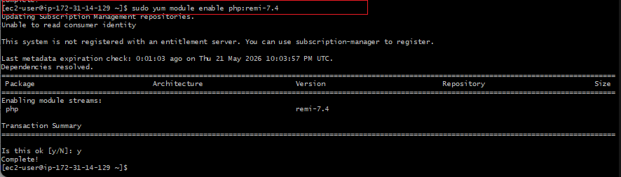

Downloaded and set up WordPress:

```bash
mkdir wordpress && cd wordpress
sudo wget http://wordpress.org/latest.tar.gz
sudo tar xzvf latest.tar.gz
sudo rm -rf latest.tar.gz
sudo cp wordpress/wp-config-sample.php wordpress/wp-config.php
sudo cp -R wordpress /var/www/html/
```

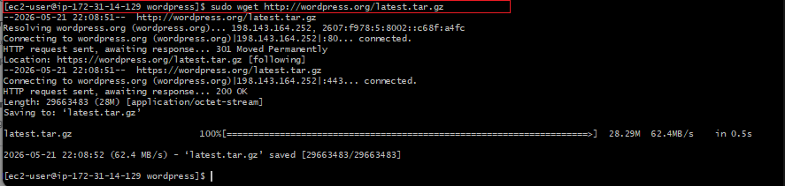

Configured SELinux policies so Apache can serve WordPress:

```bash
sudo chown -R apache:apache /var/www/html/wordpress
sudo chcon -t httpd_sys_rw_content_t /var/www/html/wordpress -R
sudo setsebool -P httpd_can_network_connect=1
sudo setsebool -P httpd_can_network_connect_db 1
```

---

## Step 4 — Install MySQL on DB Server

```bash
sudo yum install mysql-server
sudo systemctl restart mysqld
sudo systemctl enable mysqld
```

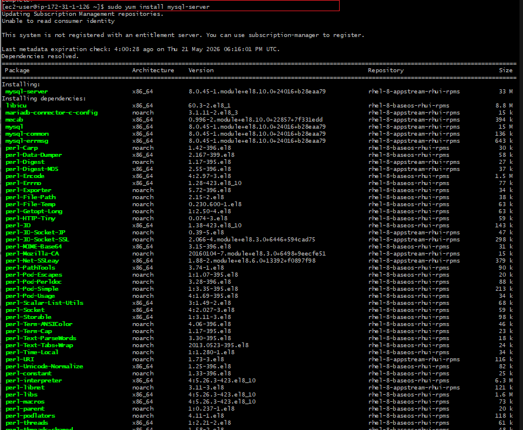

---

## Step 5 — Configure Database for WordPress

Logged into MySQL on the DB Server and created the WordPress database and user:

```bash
sudo mysql
```

```sql
CREATE DATABASE wordpress;
CREATE USER `myuser`@`172.31.14.129` IDENTIFIED BY 'mypass';
GRANT ALL ON wordpress.* TO 'myuser'@'172.31.14.129';
FLUSH PRIVILEGES;
SHOW DATABASES;
```

**Result:** `wordpress` database created, `myuser` granted access from Web Server IP 

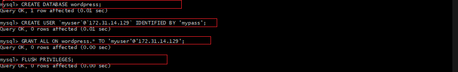

---

## Step 6 — Connect WordPress to Remote Database

### Configure Security Group & Test Connection

Configured AWS Security Group on DB Server to allow MySQL (port 3306) only from the Web Server's private IP `172.31.14.129/32`:

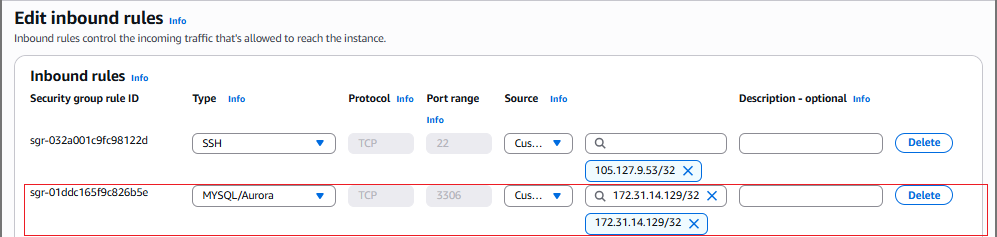

Installed MySQL client on the Web Server and tested the connection to the DB Server:

```bash
sudo yum install mysql
sudo mysql -u myuser -p -h 172.31.1.126
```

```sql
SHOW DATABASES;
```

**Result:** Successfully connected from Web Server to DB Server, `wordpress` database visible 

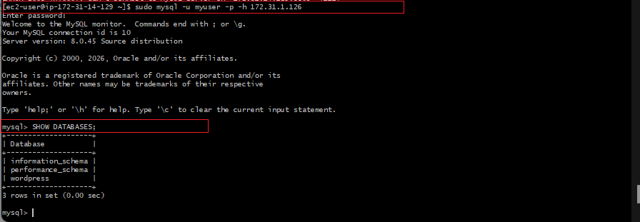

---

### Access WordPress in Browser

Navigated to `http://3.231.21.139/wordpress/` in the browser.

**Result:** WordPress installation page loaded 

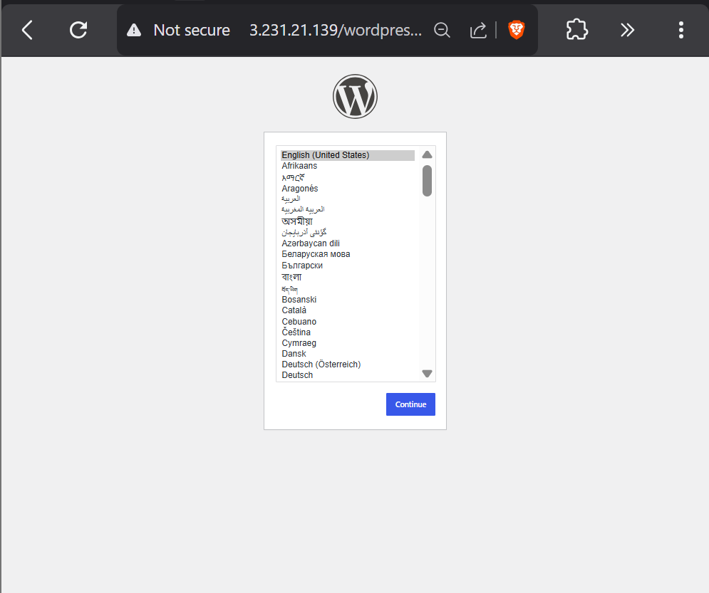

Completed the WordPress setup and logged into the Dashboard.

**Result:** WordPress Dashboard fully operational 

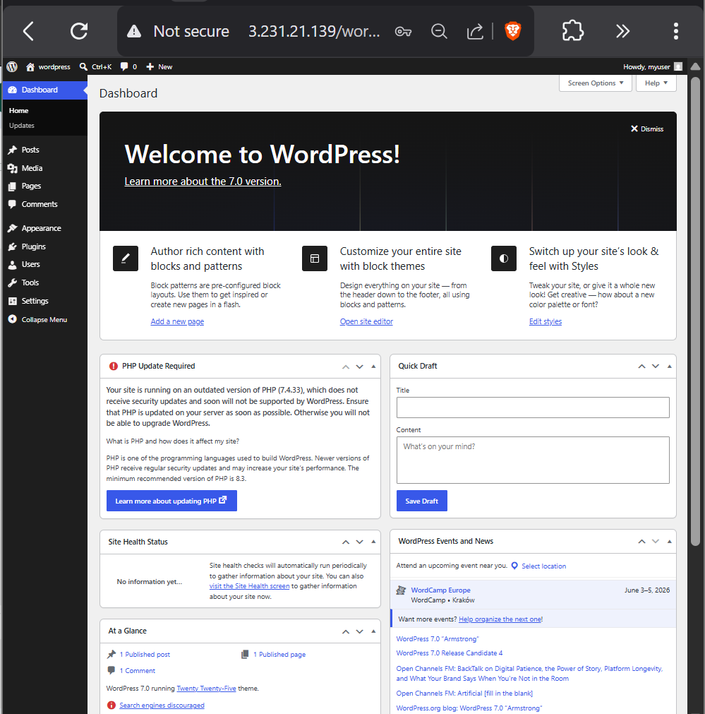

---

### Both EC2 Instances Confirmed Running

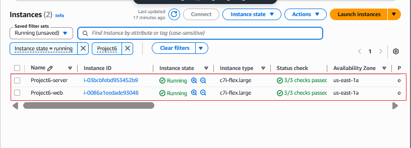

---

##  Final Result — Client-Server Architecture Fully Operational

| Component | Technology | Details |
|-----------|-----------|---------|
| **Web Server OS** | RedHat Enterprise Linux | 10.1 (Coughlan) |
| **Web Server** | Apache httpd | 2.4.37 |
| **PHP** | PHP-FPM | 7.4.33 (remi) |
| **CMS** | WordPress | 7.0 |
| **DB Server OS** | RedHat Enterprise Linux | 10.1 (Coughlan) |
| **Database** | MySQL Server | 8.0.45 |
| **Storage** | AWS EBS + LVM | 3 × 10 GiB per server |
| **Instance Type** | AWS EC2 | c7i.flex.large, us-east-1a |

**A fully operational Three-Tier WordPress architecture is deployed on AWS, with a Web Server and a remote MySQL Database Server communicating securely over private IP on port 3306.**