# DEVOPS TOOLING WEBSITE SOLUTION
### NFS | MySQL | Apache | PHP | RHEL 8 | AWS EC2 | LVM

---

## What I Gained From This Project

After completing this project, I:

- Gained hands-on experience implementing a multi-server architecture with shared storage using NFS
- Learned how to configure LVM with XFS filesystem — a step up from the ext4 used in Project 6
- Understood how to make Web Servers stateless by mounting shared storage from an NFS Server
- Configured NFS exports and AWS Security Group rules to allow controlled access across servers
- Deployed a real DevOps Tooling website (Propitix) backed by a shared MySQL database
- Troubleshot real-world issues including NFS connection timeouts, MySQL CIDR host restrictions, and MySQL client connectivity errors
- Deepened my understanding of how shared file systems work across multiple servers in production

---

## Project Overview

This project implements a **Four-Tier DevOps Tooling Website Solution** on AWS EC2, using:

- **NFS Server** — shared file storage for all Web Servers
- **MySQL Database Server** — centralized database on Ubuntu
- **3 Web Servers** (RHEL 8) — Apache + PHP, all reading from the same NFS share
- **Tooling Application** — Propitix DevOps Tooling Website deployed from GitHub

The architecture makes Web Servers **stateless** — meaning any web server can be added or removed without affecting data integrity, since all files live on the NFS Server and all data lives in the database.

---

## Architecture Overview

```
Browser (Client)
       ↓  HTTP Port 80
Web Server 1 | Web Server 2 | Web Server 3  (RHEL 8)
       ↓  NFS Mount (/var/www → /mnt/apps)
       NFS Server — 172.31.4.3 (RHEL 8)
       ↓
   MySQL DB Server — 172.31.14.57 (Ubuntu)
```

**All 5 instances:** `t3.small` | `us-east-1a`

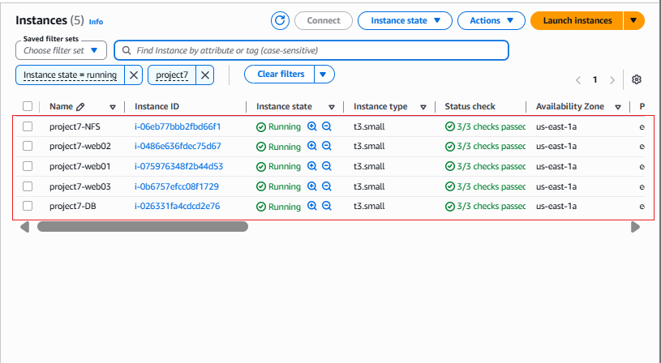

---

## Step 1 — Prepare the NFS Server

### Launch EC2 & Configure LVM with XFS

Launched a RHEL 8 EC2 instance (`project7-NFS`) and attached 3 EBS volumes (10 GiB each). Partitioned all 3 disks and set up LVM — same process as Project 6, but this time formatting as **XFS** instead of ext4.

Created 3 Logical Volumes of 9 GiB each:

```bash
sudo lvcreate -n lv-apps -L 9G webdata-vg
sudo lvcreate -n lv-logs -L 9G webdata-vg
sudo lvcreate -n lv-opt  -L 9G webdata-vg
```

**Result:** All 3 LVs created in `webdata-vg`

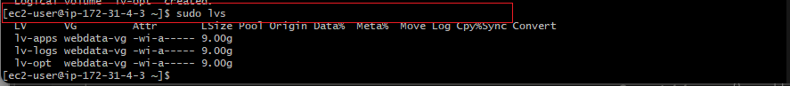

Formatted all 3 as **XFS** (not ext4):

```bash
sudo mkfs -t xfs /dev/webdata-vg/lv-apps
sudo mkfs -t xfs /dev/webdata-vg/lv-logs
sudo mkfs -t xfs /dev/webdata-vg/lv-opt
```

Created mount points and mounted:

```bash
sudo mkdir -p /mnt/apps /mnt/logs /mnt/opt
sudo mount /dev/webdata-vg/lv-apps /mnt/apps
sudo mount /dev/webdata-vg/lv-logs /mnt/logs
sudo mount /dev/webdata-vg/lv-opt  /mnt/opt
```

**Result:** All 3 volumes mounted — `lv-apps` at `/mnt/apps`, `lv-logs` at `/mnt/logs`, `lv-opt` at `/mnt/opt`

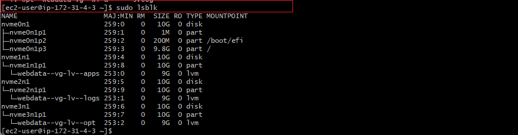

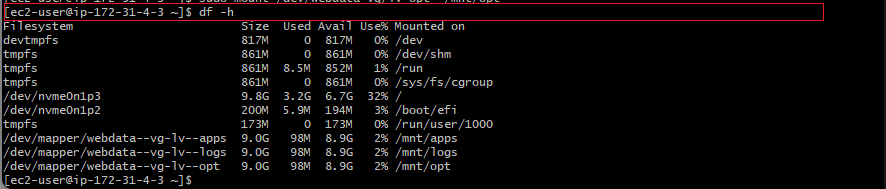

Updated `/etc/fstab` for persistence using UUIDs:

```
# mounts
UUID="4334186a-3d7f-42b0-9c55-5f7cb44b495d"  /mnt/apps  xfs  defaults  0  0
UUID="7315955f-852e-4031-b595-66b41c32ee5c"  /mnt/logs  xfs  defaults  0  0
UUID="868abd14-d0d4-4a61-ab61-68b9b65b5788"  /mnt/opt   xfs  defaults  0  0
```

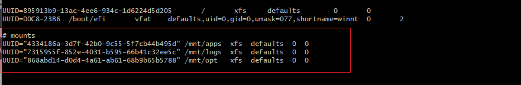

---

### Install and Start NFS Server

```bash
sudo yum -y update
sudo yum install nfs-utils -y
sudo systemctl start nfs-server.service
sudo systemctl enable nfs-server.service
sudo systemctl status nfs-server.service
```

**Result:** NFS server active (exited) — started and enabled successfully

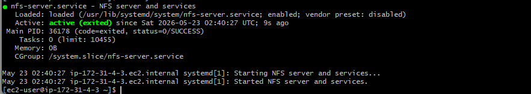

---

### Set Permissions and Configure Exports

Set permissions on all mount points so Web Servers can read, write and execute:

```bash
sudo chown -R nobody: /mnt/apps /mnt/logs /mnt/opt
sudo chmod -R 777 /mnt/apps /mnt/logs /mnt/opt
sudo systemctl restart nfs-server.service
```

Configured NFS exports for the subnet CIDR `172.31.0.0/20`:

```bash
sudo vi /etc/exports
```

```
/mnt/apps 172.31.0.0/20(rw,sync,no_all_squash,no_root_squash)
/mnt/logs 172.31.0.0/20(rw,sync,no_all_squash,no_root_squash)
/mnt/opt  172.31.0.0/20(rw,sync,no_all_squash,no_root_squash)
```

Exported the mounts:

```bash
sudo exportfs -arv
```

**Result:** All 3 directories exported to subnet `172.31.0.0/20`

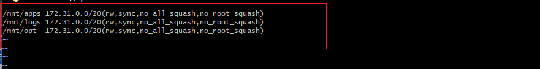

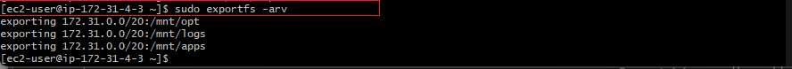

---

### Check NFS Port and Open Security Group

```bash
rpcinfo -p | grep nfs
```

**Result:** NFS running on TCP/UDP port `2049`

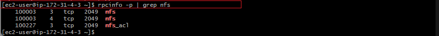

Opened the following ports on the NFS Server's AWS Security Group:

| Port | Protocol | Source |
|---|---|---|
| 2049 | TCP (NFS) | `172.31.0.0/20` |
| 2049 | UDP | `172.31.0.0/20` |
| 111 | TCP | `172.31.0.0/20` |
| 111 | UDP | `172.31.0.0/20` |
| 22 | TCP (SSH) | My IP |

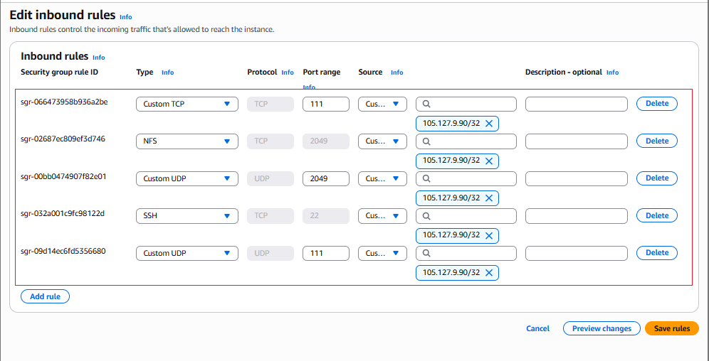

---

## Step 2 — Configure the Database Server

SSHed into the DB Server (`project7-DB` — Ubuntu) and installed MySQL:

```bash
sudo apt install mysql-server -y
sudo systemctl start mysql
sudo systemctl enable mysql
```

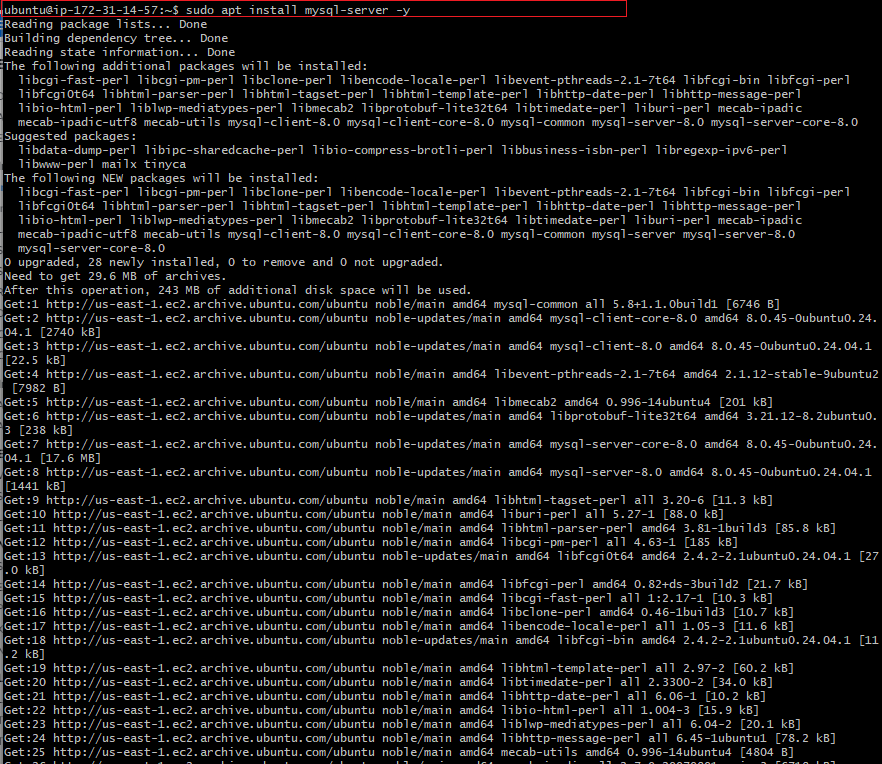

Logged into MySQL and set up the `tooling` database:

```bash
sudo mysql
```

```sql
CREATE DATABASE tooling;
CREATE USER 'webaccess'@'172.31.0.0/20' IDENTIFIED BY 'mypassword';
GRANT ALL ON tooling.* TO 'webaccess'@'172.31.0.0/20';
FLUSH PRIVILEGES;
SHOW DATABASES;
```

**Result:** `tooling` database created, `webaccess` user granted access

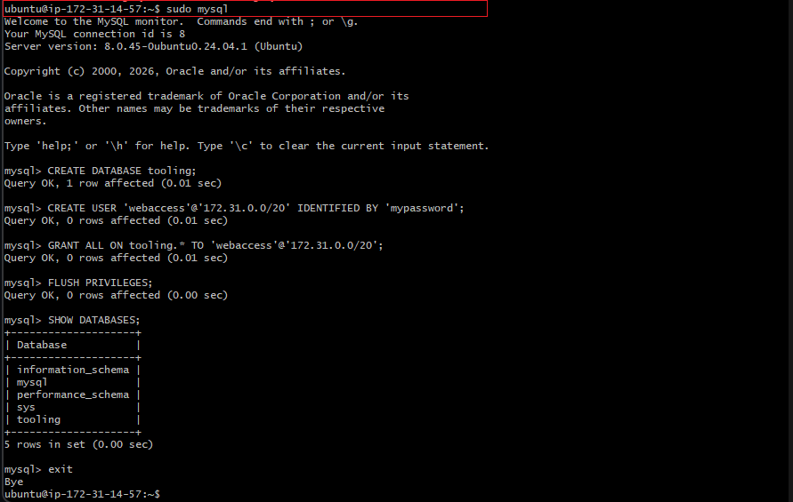

---

### Key Issue — MySQL CIDR Host Not Supported

**Problem:** After creating `webaccess` with host `172.31.0.0/20`, connecting from the Web Server returned:
```
ERROR 2003 (HY000): Can't connect to MySQL server on '172.31.14.57:3306' (110)
```

**Root Cause 1:** MySQL does not support CIDR notation (`/20`) for user hosts — it silently accepts the syntax but cannot match connections correctly.

**Root Cause 2:** MySQL's `bind-address` was set to `127.0.0.1` (localhost only), blocking all remote connections.

**Fix 1 — Update bind-address:**
```bash
sudo vi /etc/mysql/mysql.conf.d/mysqld.cnf
# Change: bind-address = 127.0.0.1
# To:     bind-address = 0.0.0.0
sudo systemctl restart mysql
```

**Fix 2 — Recreate user with `%` wildcard host:**
```sql
DROP USER 'webaccess'@'172.31.0.0/20';
CREATE USER 'webaccess'@'%' IDENTIFIED BY 'mypassword';
GRANT ALL ON tooling.* TO 'webaccess'@'%';
FLUSH PRIVILEGES;
```

**Result:** Web Servers could successfully connect to MySQL after both fixes

---

## Step 3 — Prepare the Web Servers

Repeated the following steps on all **3 Web Servers** (`project7-web01`, `project7-web02`, `project7-web03`).

### Install NFS Client and Mount NFS Share

```bash
sudo yum install nfs-utils nfs4-acl-tools -y
```

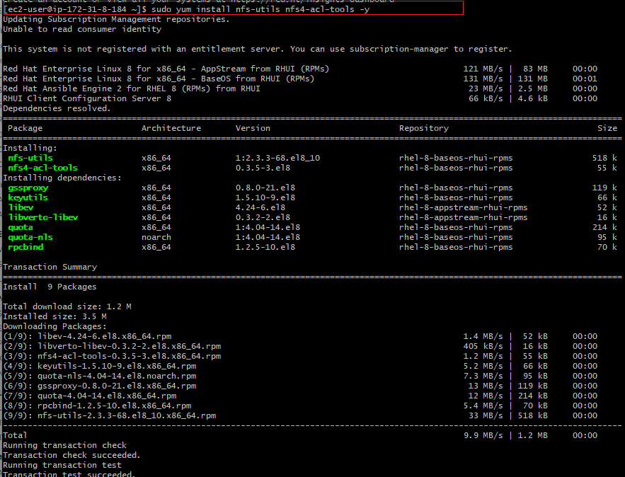

Created `/var/www` and mounted the NFS apps share:

```bash
sudo mkdir /var/www
sudo mount -t nfs -o rw,nosuid 172.31.4.3:/mnt/apps /var/www
```

**Result:** NFS share mounted at `/var/www` — Web Server now reads from NFS

Updated `/etc/fstab` for persistence:
```
172.31.4.3:/mnt/apps  /var/www  nfs  defaults  0  0
```

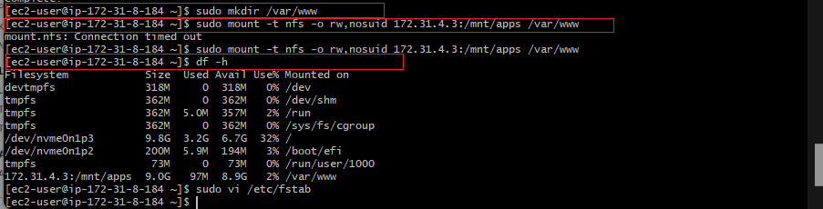

---

### Key Issue — NFS Mount Connection Timeout

**Problem:** First attempt to mount returned:
```
mount.nfs: Connection timed out
```

**Root Cause:** The NFS Server's Security Group only had SSH port open — NFS ports 2049 and 111 (TCP/UDP) were not yet open.

**Fix:** Added the correct inbound rules to the NFS Server Security Group for ports 2049 (TCP/UDP) and 111 (TCP/UDP) with the subnet CIDR as the source. The mount succeeded immediately after.

---

### Install Apache and PHP 7.4

```bash
sudo yum install httpd -y
sudo dnf install https://dl.fedoraproject.org/pub/epel/epel-release-latest-8.noarch.rpm
sudo dnf install dnf-utils http://rpms.remirepo.net/enterprise/remi-release-8.rpm
sudo dnf module reset php
sudo dnf module enable php:remi-7.4
sudo dnf install php php-opcache php-gd php-curl php-mysqlnd
sudo systemctl start php-fpm
sudo systemctl enable php-fpm
setsebool -P httpd_execmem 1
sudo systemctl start httpd
sudo systemctl enable httpd
```

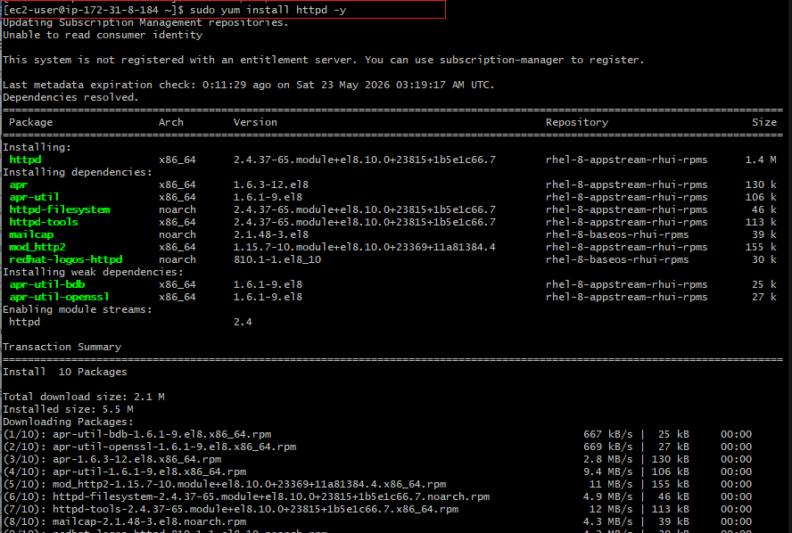

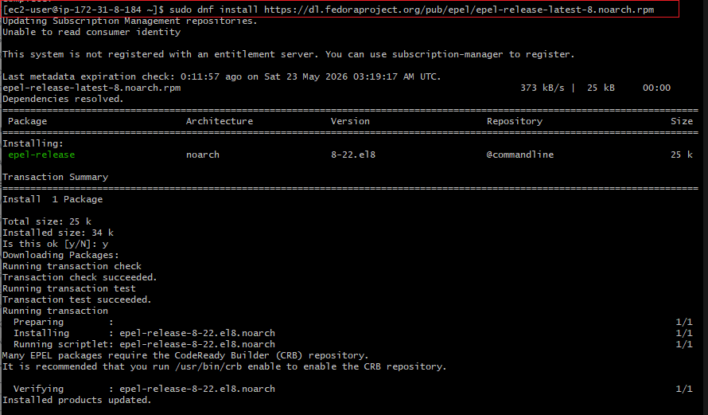

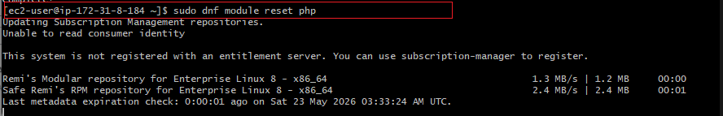

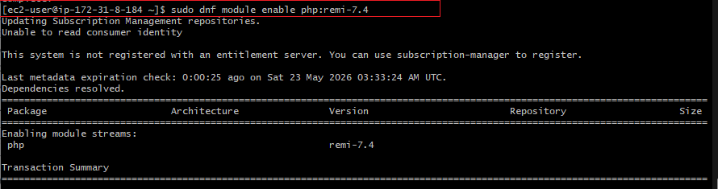

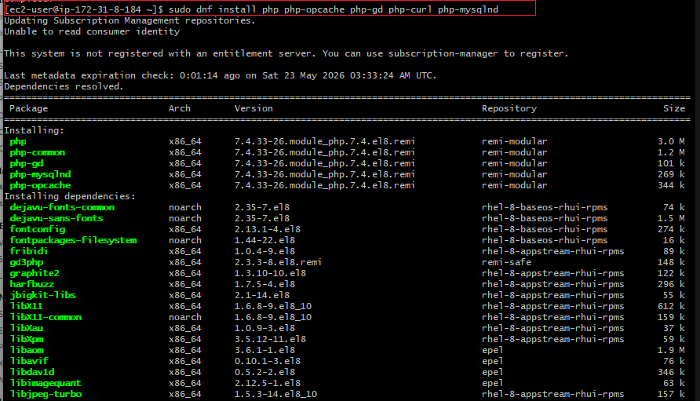

---

### Deploy Tooling Application from GitHub

Installed git and cloned the forked tooling repository:

```bash
sudo yum install git -y
git clone https://github.com/augustinenwike/tooling.git
sudo cp -R tooling/html/. /var/www/html/
```

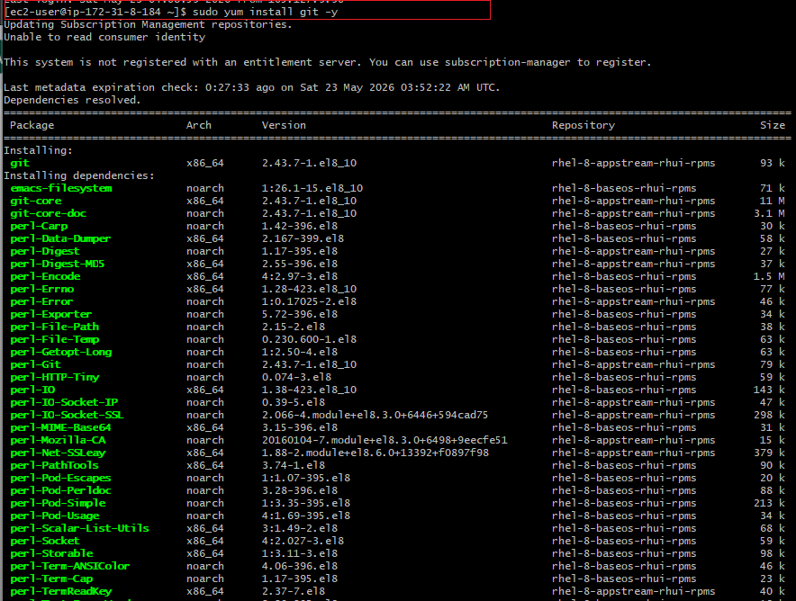

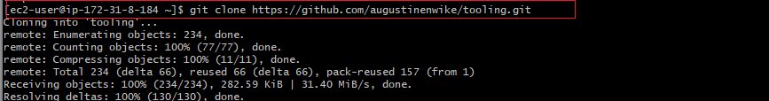

Installed MySQL client on Web Server to connect to DB Server:

```bash
sudo yum install mysql -y
```

Applied the tooling database schema:

```bash
mysql -h 172.31.14.57 -u webaccess -p tooling < tooling/tooling-db.sql
```

Updated the database connection in `functions.php`:

```bash
sudo vi /var/www/html/functions.php
```

```php
$db = mysqli_connect('172.31.14.57', 'webaccess', 'mypassword', 'tooling');
```

---

### Disable SELinux to Allow Apache Access

Encountered 403 errors initially due to SELinux blocking Apache from reading NFS-mounted files:

```bash
sudo setenforce 0
sudo vi /etc/sysconfig/selinux
# Set: SELINUX=disabled
sudo systemctl restart httpd
```

---

## Final Result — Tooling Website Fully Operational

Opened browser and navigated to:
```
http://13.222.65.211/login.php
```

**Result:** Propitix Tooling Website login page loaded

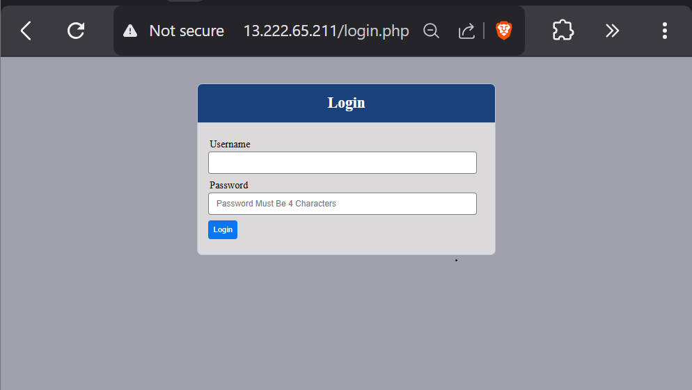

Logged in with `admin` / `admin`:

**Result:** Admin dashboard loaded — showing Jenkins, Grafana, Rancher, Prometheus, Kubernetes, Kibana, and JFrog Artifactory tools

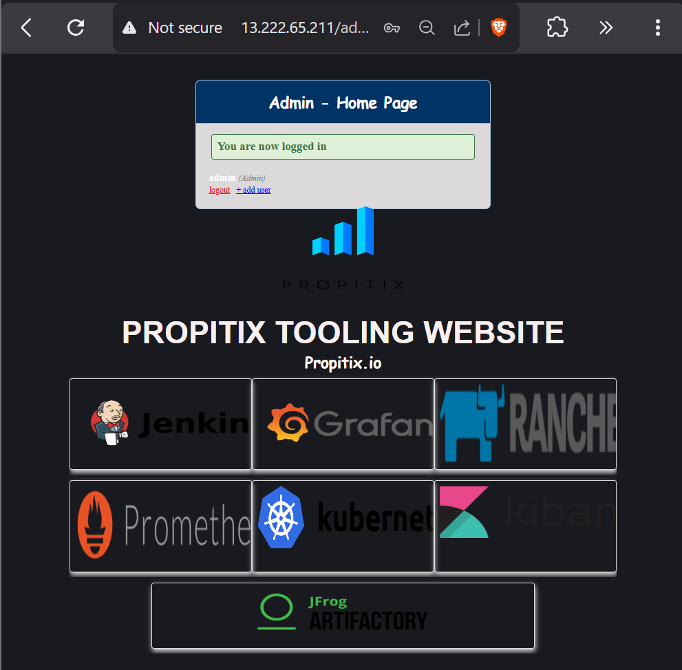

---

## Key Issues Faced & How They Were Resolved

| # | Issue | Root Cause | Fix |
|---|---|---|---|
| 1 | NFS mount — `Connection timed out` | NFS ports 2049 and 111 not open in Security Group | Added TCP/UDP 2049 and 111 inbound rules scoped to subnet CIDR |
| 2 | MySQL — `Can't connect (ERROR 2003)` | `bind-address = 127.0.0.1` blocked remote connections | Changed `bind-address` to `0.0.0.0` in `mysqld.cnf` and restarted MySQL |
| 3 | MySQL — `Access denied for webaccess` | MySQL does not support CIDR notation for user hosts; `172.31.0.0/20` didn't match connections | Recreated user with `%` wildcard host |
| 4 | Web Server — 403 Forbidden error | SELinux blocking Apache from reading NFS-mounted files | Disabled SELinux with `setenforce 0` and set `SELINUX=disabled` in config |
| 5 | `mysql` command not found on Web Server | MySQL client not installed | Installed with `sudo yum install mysql -y` |

---

## Final Infrastructure Summary

| Server | OS | Role | Private IP |
|---|---|---|---|
| `project7-NFS` | RHEL 8 | NFS Shared Storage | 172.31.4.3 |
| `project7-DB` | Ubuntu | MySQL Database | 172.31.14.57 |
| `project7-web01` | RHEL 8 | Web Server 1 | 172.31.8.184 |
| `project7-web02` | RHEL 8 | Web Server 2 | 172.31.x.x |
| `project7-web03` | RHEL 8 | Web Server 3 | 172.31.x.x |

| Component | Technology | Version |
|---|---|---|
| **OS** | Red Hat Enterprise Linux | 8 |
| **Web Server** | Apache httpd | 2.4.37 |
| **PHP** | PHP-FPM | 7.4.33 (remi) |
| **Database** | MySQL Server | 8.0.45 |
| **Shared Storage** | NFS Server | nfs-utils 1:2.3.3 |
| **Instance Type** | AWS EC2 | t3.small, us-east-1a |

**A fully operational multi-server DevOps Tooling Website is deployed on AWS, with 3 stateless Web Servers sharing files via NFS and a centralized MySQL database — demonstrating real-world Four-Tier Architecture.**