# PROJECT 8 — LOAD BALANCER SOLUTION WITH APACHE

### Horizontal Scaling | Apache Reverse Proxy | AWS EC2 | Traffic Distribution

---

## What I Gained From This Project

After completing this project, I:

- Understood **horizontal scaling** and why routing all traffic through a single Load Balancer IP improves both user experience and system availability
- Gained hands-on experience deploying and configuring **Apache as a reverse proxy Load Balancer** on Ubuntu 24.04 LTS
- Learned to enable Apache proxy modules (`proxy`, `proxy_balancer`, `proxy_http`, `lbmethod_bytraffic`, `headers`, `rewrite`) from the command line using `a2enmod`
- Configured a **load balancing cluster** (`balancer://mycluster`) distributing traffic equally across two RHEL 8 Web Servers using the `bytraffic` algorithm
- Implemented **local DNS hostname resolution** on the LB server via `/etc/hosts` as a clean alternative to hardcoding private IPs
- Unmounted the **shared NFS log directory** on each Web Server so each server maintains its own independent access logs
- Verified **live traffic distribution** by watching both Web Server access logs simultaneously while refreshing the Load Balancer URL

---

## Project Overview

This project extends the infrastructure built in Project 7 by introducing a dedicated **Apache Load Balancer** in front of the two existing Web Servers. Instead of users accessing three different IP addresses, all traffic is routed through a single Load Balancer public IP, which then distributes requests evenly between Web Server 1 and Web Server 2 using the `bytraffic` load-balancing algorithm.

---

## Architecture

```
            Browser (Client)
                   ↓
  Apache Load Balancer (Ubuntu 24.04)   ← NEW
          ↓                 ↓
Web Server 1 (RHEL 8)   Web Server 2 (RHEL 8)
          ↓                 ↓
     NFS Server — shared /var/www/html
                   ↓
          MySQL DB Server (Ubuntu)
```

---

## Step 0 — Prerequisites: All EC2 Instances Confirmed Running

Before launching the Load Balancer EC2, all instances from Project 7 were verified as running in the AWS Console:

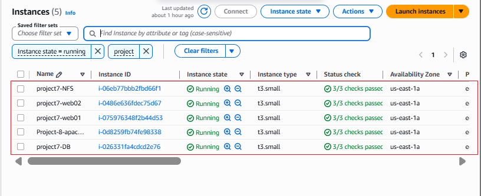

All five instances — `project7-NFS`, `project7-web02`, `project7-web01`, `Project-8-apac...` (Load Balancer), and `project7-DB` — show **Instance state: Running** with **3/3 status checks passed** 

---

## Step 1 — Launch & SSH into the Load Balancer EC2

A new EC2 instance was launched with the following configuration:

- **Name:** Project-8-apache-lb
- **OS:** Ubuntu Server 24.04 LTS (Noble)
- **Instance type:** t3.small
- **Security Group inbound rules:** Port 22 (SSH from My IP), Port 80 (HTTP from 0.0.0.0/0)

SSH connection established using the project `.pem` key:

```bash
ssh -i Downloads/udo-task.pem ubuntu@100.53.226.231
```

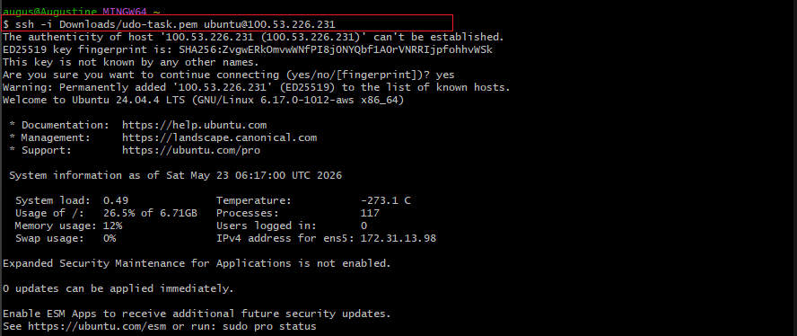

The server identified itself as **Ubuntu 24.04.4 LTS (GNU/Linux 6.17.0-1012-aws x86_64)** with Private IP `172.31.13.98`. Zero pending updates confirmed a clean base image.

---

## Step 2 — Install Apache and Dependencies

### 2A — Update Package List

```bash
sudo apt update
```

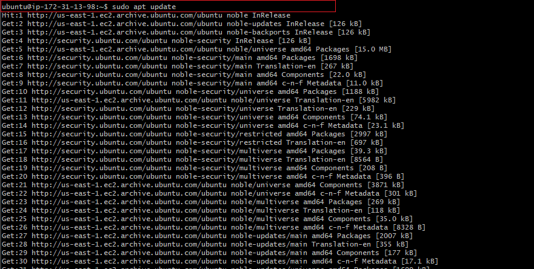

All Ubuntu Noble repositories — including `noble-updates`, `noble-backports`, and `noble-security` — were successfully indexed.

### 2B — Install Apache2

```bash
sudo apt install apache2 -y
```

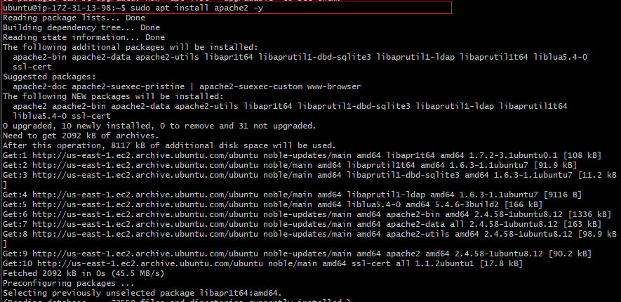

Apache 2.4.58 and all dependencies (`libapr1t64`, `libaprutil1t64`, `ssl-cert` etc.) installed successfully. 2092 kB downloaded in under 1 second from the us-east-1 mirror.

### 2C — Install libxml2-dev

```bash
sudo apt-get install libxml2-dev -y
```

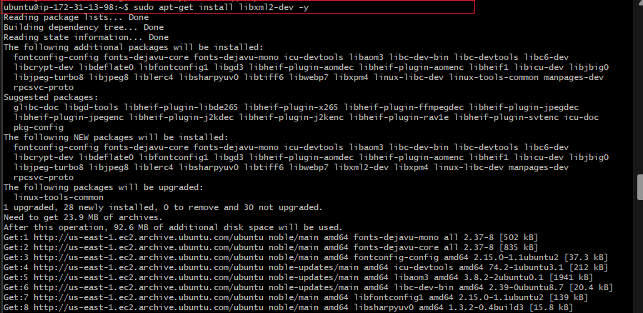

`libxml2-dev` and 28 related development libraries (fontconfig, icu-devtools, libc-dev etc.) were installed to support Apache proxy modules. Total download: 23.9 MB.

### 2D — Enable Required Apache Modules

Six Apache modules needed for load balancing were enabled in sequence:

```bash
sudo a2enmod rewrite
sudo a2enmod proxy
sudo a2enmod proxy_balancer
sudo a2enmod proxy_http
sudo a2enmod headers
sudo a2enmod lbmethod_bytraffic
sudo systemctl restart apache2
```

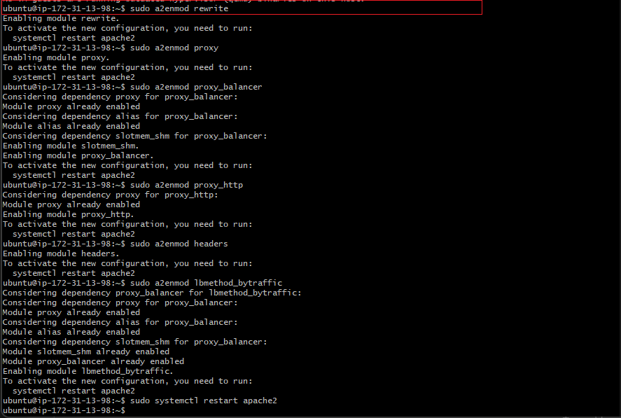

All six modules activated successfully. The `proxy_balancer` module automatically pulled in its dependencies: `alias`, `slotmem_shm`, and `proxy`. Apache was then restarted to load the new configuration.

### 2E — Verify Apache is Running

```bash
sudo systemctl status apache2
```

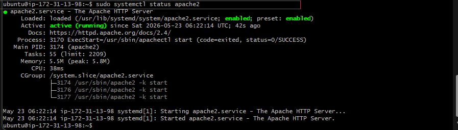

`apache2.service` confirmed **Active: active (running)** since `Sat 2026-05-23 06:22:14 UTC`. The service is **enabled** (starts on boot) and three worker processes (PIDs 3174, 3176, 3177) are running as expected 

---

## Step 3 — Configure Load Balancing

The default Apache virtual host config was opened and the balancer proxy block added inside the `<VirtualHost *:80>` section:

```bash
sudo vi /etc/apache2/sites-available/000-default.conf
```

Configuration added:

```apache
<Proxy "balancer://mycluster">
    BalancerMember http://172.31.8.184:80 loadfactor=5 timeout=1
    BalancerMember http://172.31.7.167:80 loadfactor=5 timeout=1
    ProxySet lbmethod=bytraffic
</Proxy>

ProxyPreserveHost On
ProxyPass / balancer://mycluster/
ProxyPassReverse / balancer://mycluster/
```

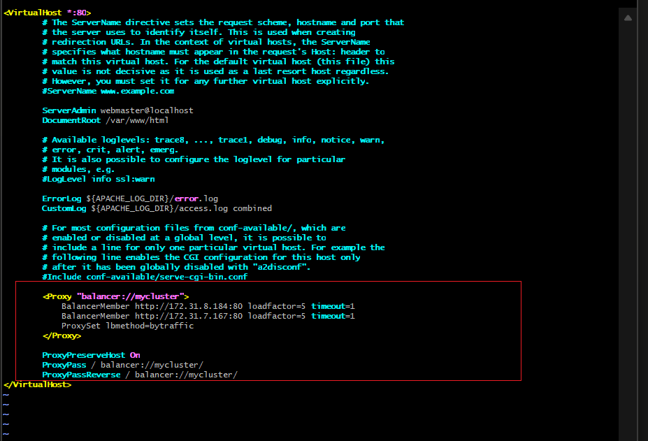

The complete VirtualHost configuration confirms:

- `<Proxy "balancer://mycluster">` block defining both Web Servers with equal `loadfactor=5` and `timeout=1`
- `BalancerMember http://172.31.8.184:80` — Web Server 1 private IP
- `BalancerMember http://172.31.7.167:80` — Web Server 2 private IP
- `ProxySet lbmethod=bytraffic` — distributes requests proportionally by traffic volume
- `ProxyPreserveHost On` — forwards the original Host header to backend servers
- `ProxyPass / balancer://mycluster/` — routes all incoming requests through the cluster
- `ProxyPassReverse / balancer://mycluster/` — rewrites Location headers in responses

Apache was restarted after saving the configuration:

```bash
sudo systemctl restart apache2
```

---

## Step 4 — Configure Local DNS Hostnames (Optional)

To avoid memorising raw IP addresses, friendly hostnames were added to the Load Balancer's `/etc/hosts` file:

```bash
sudo vi /etc/hosts
```

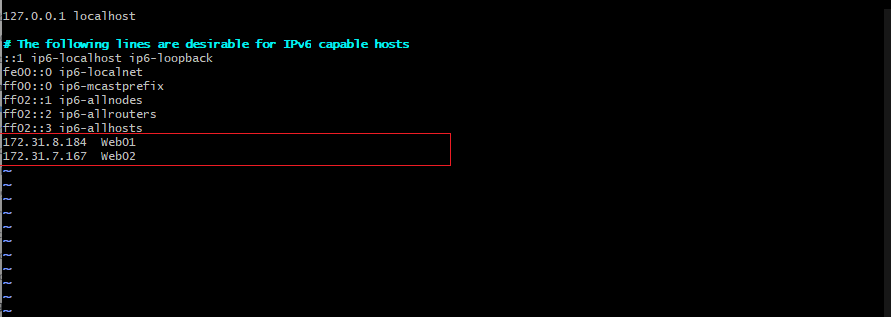

Two entries were appended at the bottom:

```
172.31.8.184  Web01
172.31.7.167  Web02
```

The Apache config was then updated to reference `Web01` and `Web02` by name instead of IP:

```apache
BalancerMember http://Web01:80 loadfactor=5 timeout=1
BalancerMember http://Web02:80 loadfactor=5 timeout=1
```

Local resolution was confirmed with:

```bash
curl http://Web01
curl http://Web02
```

---

## Step 5 — Unmount NFS Log Directory on Web Servers

In Project 7 both Web Servers had `/var/log/httpd` mounted to the NFS Server's `/mnt/logs` directory, meaning all access logs were written to a single shared location. For Project 8, this mount was removed so each Web Server maintains its own independent logs for traffic verification.

```bash
sudo systemctl stop httpd
sudo umount /var/log/httpd
sudo systemctl start httpd
```

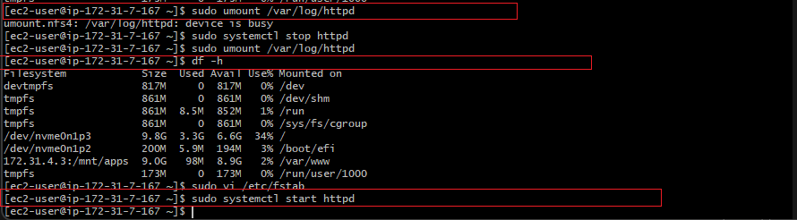

The second `df -h` output confirms the NFS logs mount (`172.31.4.3:/mnt/logs`) is gone from the filesystem. The `/var/www` NFS mount remains intact for serving shared web content. The `/etc/fstab` entry for the logs mount was also removed to prevent it auto-remounting on reboot.

> **Key Issue — "Device is Busy"**
>
> When first attempting `sudo umount /var/log/httpd`, the error appeared:
> ```
> umount.nfs4: /var/log/httpd: device is busy
> ```
> **Root cause:** Apache (`httpd`) was running and actively writing to `/var/log/httpd`, so the Linux kernel refused to unmount a filesystem in use.
>
> **Fix:** Stop `httpd` first, unmount, then start `httpd` again. Also removed the fstab entry to prevent auto-remount on reboot.

---

## Step 6 — Test the Load Balancer

With the Load Balancer configured and the NFS log directories unmounted on both Web Servers, the Tooling Website was accessed through the Load Balancer's public IP:

```
http://100.53.226.231/admin_tooling.php
```

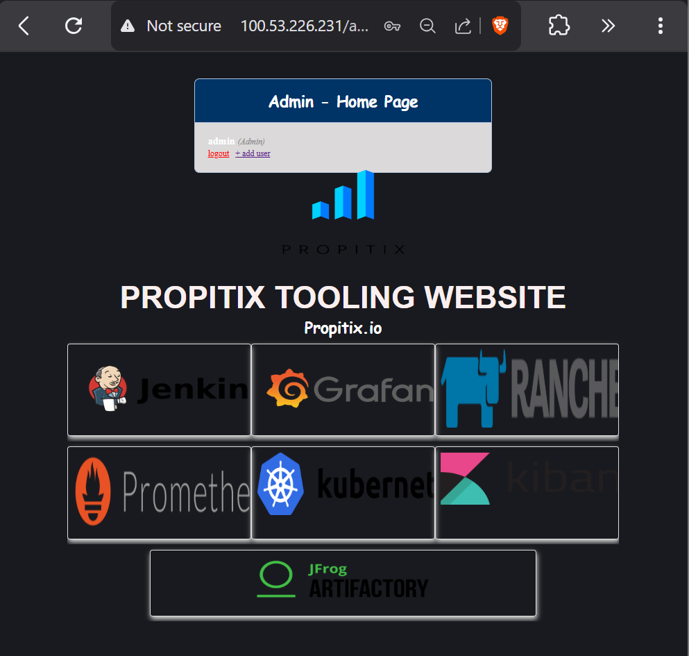

The **Propitix Tooling Website** admin home page loaded successfully through the Load Balancer IP. The page is served via the `admin` account and displays the full DevOps tools dashboard — Jenkins, Grafana, Rancher, Prometheus, Kubernetes, Kibana, and JFrog Artifactory 

---

## Step 7 — Verify Traffic Distribution Across Both Web Servers

Two separate SSH terminals were opened — one to Web Server 1 and one to Web Server 2 — with both access logs watched in real time while the browser was refreshed multiple times.

```bash
sudo tail -f /var/log/httpd/access_log
```

### Web Server 1 — Access Log (172.31.7.167)

Web Server 1 recorded a `GET /login.php HTTP/1.1 200` request from client IP `172.31.13.98` (the Load Balancer's private IP), confirming requests are being proxied through the LB.

### Web Server 2 — Access Log (172.31.8.184)

Web Server 2 simultaneously received and logged multiple requests — `GET /login.php`, `POST /login.php`, `GET /tooling_stylesheets.css`, `GET /admin_tooling.php`, and multiple image asset requests — all originating from `172.31.13.98`.

### Both Servers Receiving Traffic — Side-by-Side View

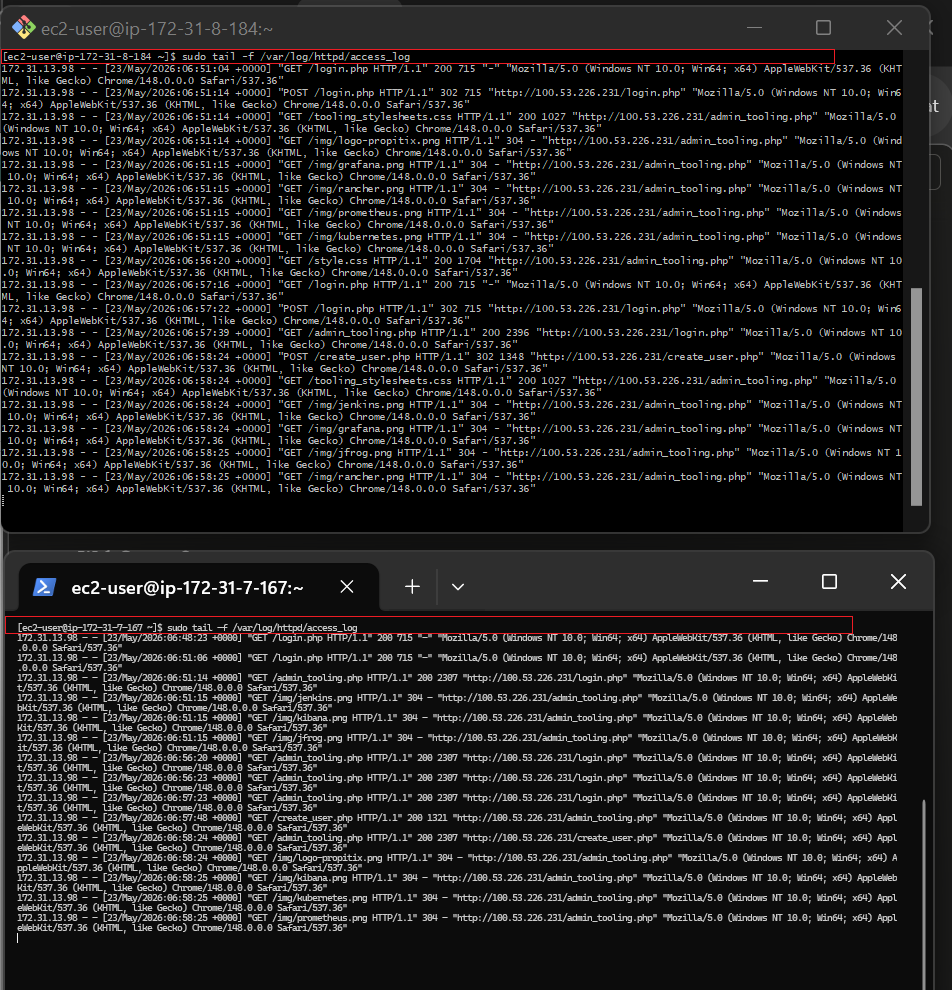

Both Web Server 1 (top terminal) and Web Server 2 (bottom terminal) are receiving and logging separate HTTP requests from the same client session. The `bytraffic` algorithm distributes requests based on traffic volume — Web Server 2 picked up the heavier page load requests while Web Server 1 handled lighter login page hits, confirming genuine load distribution 

---

## Load Balancing Configuration Summary

| Parameter | Web Server 1 | Web Server 2 |
|-----------|-------------|-------------|
| Private IP | 172.31.8.184 | 172.31.7.167 |
| Hostname alias | Web01 | Web02 |
| loadfactor | 5 (50% of traffic) | 5 (50% of traffic) |
| timeout | 1 second | 1 second |
| lbmethod | bytraffic | bytraffic |

Both servers have equal `loadfactor=5`, resulting in an approximate 50/50 traffic split. The `loadfactor` can be adjusted to shift more traffic to a more powerful server — e.g. setting `loadfactor=10` on Web Server 2 would give it twice as many requests as Web Server 1.

---

## Key Issues Faced & How They Were Resolved

### Issue 1 — NFS Log Mount "Device is Busy"

| | |
|---|---|
| **Symptom** | `umount.nfs4: /var/log/httpd: device is busy` |
| **Root Cause** | Apache `httpd` was running and actively writing to `/var/log/httpd`, so the Linux kernel blocked the unmount of the NFS-backed filesystem. |
| **Fix** | Stop `httpd` → unmount → start `httpd`. Also removed the `/etc/fstab` entry to prevent auto-remount on reboot. |

---

### Issue 2 — Ubuntu 24.04 Instead of 20.04

| | |
|---|---|
| **Symptom** | EC2 launched with Ubuntu 24.04 LTS (Noble) rather than 20.04 as specified in the project guide. |
| **Impact** | Package names and apt mirror URLs differed slightly from the guide. All installation commands still succeeded — Ubuntu 24.04 is fully compatible with Apache 2.4 and all required proxy modules. |
| **Fix** | No changes required. The environment worked correctly on Noble. Kept note for future projects that the EC2 AMI selection in the AWS console defaults to the latest LTS. |

---

##  Final Result — Load Balancer Fully Operational

- **Single access point:** all users reach the Tooling Website through one public IP (`100.53.226.231`)
- **Even traffic distribution:** both Web Servers receive requests, confirmed by live access log monitoring
- **Independent logging:** each Web Server writes its own logs after NFS log mount was removed
- **Persistent configuration:** fstab updated and Apache modules enabled persist across reboots
- **Horizontal scalability established:** additional Web Servers can be added to the balancer cluster as needed

---