# PROJECT 9 — TOOLING WEBSITE DEPLOYMENT AUTOMATION WITH CONTINUOUS INTEGRATION (JENKINS)

### Continuous Integration | Jenkins | GitHub Webhooks | SSH Artifact Deployment

---

## What I Gained From This Project

After completing this project, I:

- Understood the core concept of **Continuous Integration (CI)** and why automating builds saves time and reduces human error
- Gained hands-on experience **installing and configuring Jenkins 2.555.2** on Ubuntu 24.04 LTS from scratch
- Learned to fix the common Jenkins GPG key issue on Ubuntu Noble by using the updated `jenkins.io-2026.key`
- Installed **OpenJDK 21** as the Java runtime required by Jenkins
- Connected Jenkins to a **GitHub repository** using personal access token credentials
- Configured a **GitHub Webhook** so every `git push` automatically triggers a Jenkins build
- Set up **artifact archiving** so every successful build saves the full repository snapshot
- Installed the **Publish Over SSH** plugin and configured it to deploy build artifacts to the NFS Server
- Diagnosed and resolved a **"Connection timed out"** SSH error caused by a missing Security Group rule
- Verified the full end-to-end CI/CD pipeline: code pushed to GitHub → Jenkins builds → files land on NFS Server → Web Servers serve the latest version

---

## Project Overview

This project introduces **automation** to the infrastructure built in Projects 7 and 8. Previously, any code update had to be manually copied to the NFS Server. In Project 9, a dedicated **Jenkins CI server** is added to the stack. Jenkins watches the GitHub repository for changes, pulls the latest code on every push, archives build artifacts, and then copies them directly to the NFS Server over SSH — making deployments fully automatic.

---

## Architecture

```
Developer pushes code to GitHub
           ↓
  GitHub Webhook (POST to Jenkins)
           ↓
  Jenkins Server (Ubuntu 24.04) ← NEW
           ↓  Publish Over SSH
  NFS Server — /mnt/apps
           ↓  mounted to
  Web Server 1 + Web Server 2
           ↓  traffic via
  Apache Load Balancer
           ↓
       Browser
```

---

## Prerequisites Check

All six instances from previous projects were confirmed running before starting:

| Server | From | Instance Type | Status |
|--------|------|---------------|--------|
| project7-NFS | Project 7 | t3.micro | Running |
| project7-web01 | Project 7 | t3.small | Running |
| project7-web02 | Project 7 | t3.small | Running |
| project7-DB | Project 7 | t3.micro | Running |
| Project-8-apac (LB) | Project 8 | t3.micro | Running |
| project9-Jenkins | Project 9 | t3.small | Running |

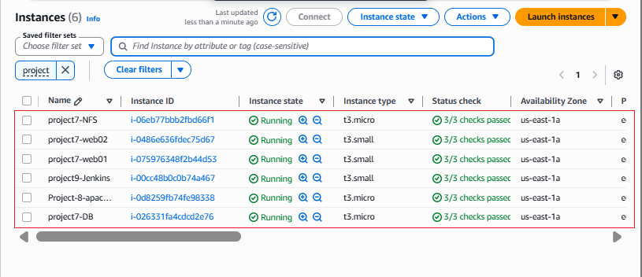

---

## Step 1 — Launch & SSH into the Jenkins EC2 Instance

A new EC2 instance was launched:

- **Name:** project9-Jenkins
- **OS:** Ubuntu Server 24.04 LTS (Noble)
- **Instance type:** t3.small
- **Security Group inbound rules:** Port 22 (SSH) and Port 8080 (Jenkins UI)

SSH connection established using the project `.pem` key:

```bash
ssh -i Downloads/udo-task.pem ubuntu@34.234.100.103
```

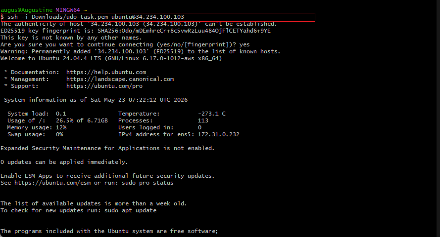

The server identified itself as **Ubuntu 24.04.4 LTS (GNU/Linux 6.17.0-1012-aws x86_64)** with Private IP `172.31.0.232`. Zero pending updates confirmed a clean base image.

---

## Step 2 — Install Java (OpenJDK 21)

Jenkins requires Java to run. The package list was updated first, then OpenJDK 21 installed:

```bash
sudo apt update
sudo apt install fontconfig openjdk-21-jre -y
```

### 2A — apt update

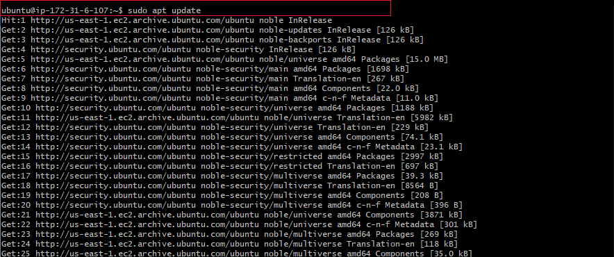

All Ubuntu Noble repositories (noble-updates, noble-backports, noble-security, noble-universe, noble-multiverse) fetched successfully.

### 2B — Java Installation

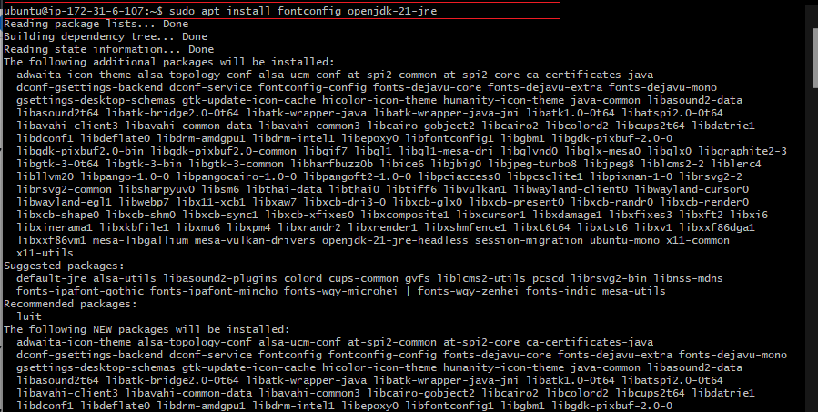

OpenJDK 21 and its full dependency tree — including fontconfig, fonts-dejavu, mesa drivers, libgtk, libxcb libraries, and GTK3 support — installed successfully.

### 2C — Verify Java Version

```bash
java -version
```

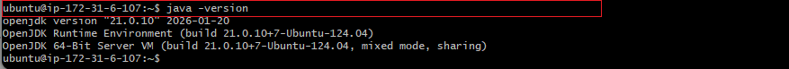

**Result:** `openjdk version "21.0.10" 2026-01-20` — OpenJDK 21.0.10+7-Ubuntu-124.04, 64-Bit Server VM

---

## Step 3 — Install Jenkins

### 3A — Add Jenkins GPG Key

The modern key method was used directly (bypassing the deprecated `apt-key` approach):

```bash
sudo wget -O /etc/apt/keyrings/jenkins-keyring.asc \
  https://pkg.jenkins.io/debian-stable/jenkins.io-2026.key
```

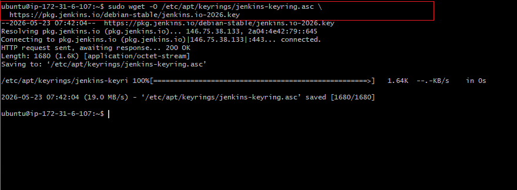

The key file `jenkins-keyring.asc` (1.64K) downloaded successfully from `pkg.jenkins.io` and saved to `/etc/apt/keyrings/`.

### 3B — Add Jenkins Repository

```bash
echo "deb [signed-by=/etc/apt/keyrings/jenkins-keyring.asc]" \
  https://pkg.jenkins.io/debian-binary/ | sudo tee \
  /etc/apt/sources.list.d/jenkins.list > /dev/null
```

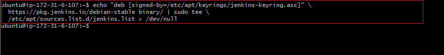

The signed repository entry was written to `/etc/apt/sources.list.d/jenkins.list` with no output (redirected to `/dev/null`), confirming success.

### 3C — Update apt and Install Jenkins

```bash
sudo apt update
sudo apt install jenkins
```

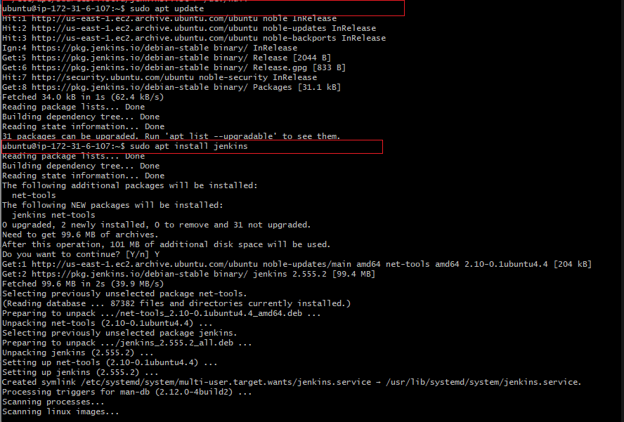

**Jenkins 2.555.2** installed successfully alongside `net-tools`. A systemd symlink was automatically created at `/etc/systemd/system/multi-user.target.wants/jenkins.service`. Total download: 99.6 MB.

### 3D — Verify Jenkins is Running

```bash
sudo systemctl status jenkins
```

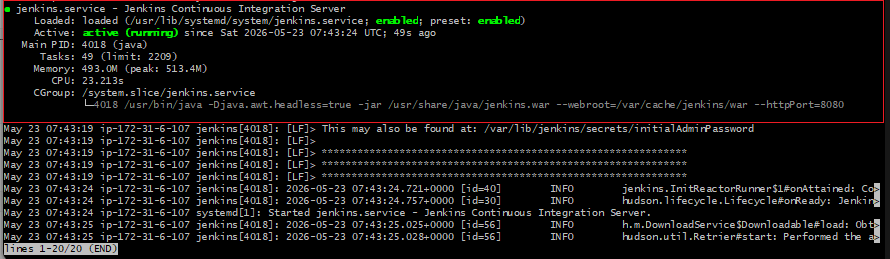

`jenkins.service` confirmed **Active: active (running)** since Sat 2026-05-23 07:43:24 UTC. Jenkins is listening on port 8080 (`--httpPort=8080`), memory usage is 493.0M, and the service is enabled to start on boot. The log confirms `Started jenkins.service – Jenkins Continuous Integration Server`.

---

## Step 4 — Initial Jenkins Setup in Browser

### 4A — Unlock Jenkins

Opened browser at `http://34.201.24.194:8080` and the **Unlock Jenkins** page appeared:

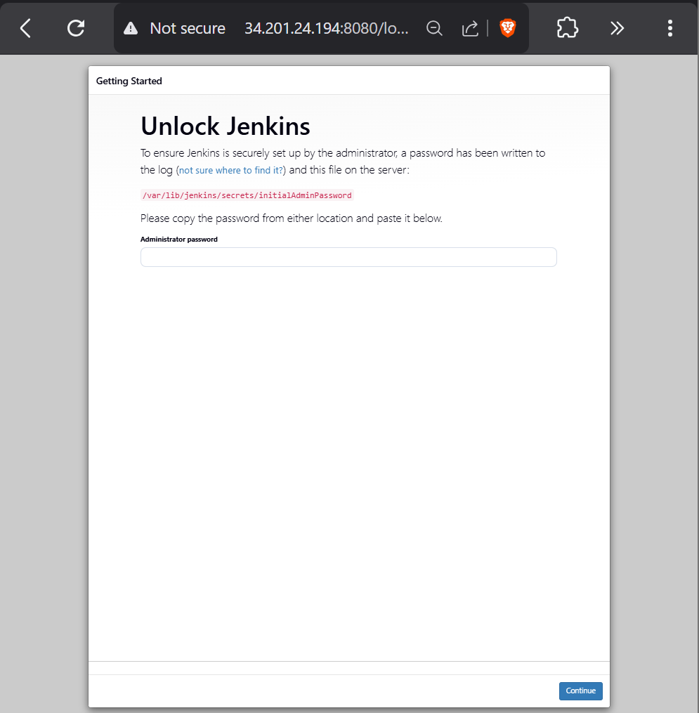

The initial admin password was retrieved from the server:

```bash
sudo cat /var/lib/jenkins/secrets/initialAdminPassword
```

The password was copied and pasted into the Administrator password field.

### 4B — Install Suggested Plugins

After unlocking, "Install suggested plugins" was selected. Jenkins downloaded and installed the full recommended plugin set:

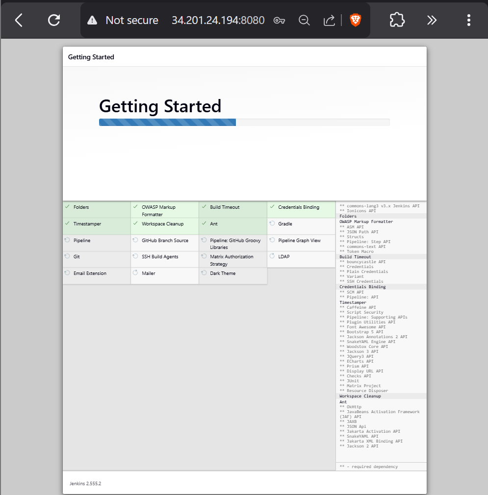

Plugins installed included: Folders, Timestamper, Pipeline, Git, SSH Build Agents, GitHub Branch Source, OWASP Markup Formatter, Workspace Cleanup, Pipeline GitHub Groovy Libraries, Matrix Authorization Strategy, Build Timeout, Ant, Credentials Binding, Email Extension, Mailer, Dark Theme, and all their required dependencies.

### 4C — Instance Configuration

Jenkins URL was confirmed as `http://34.201.24.194:8080/`:

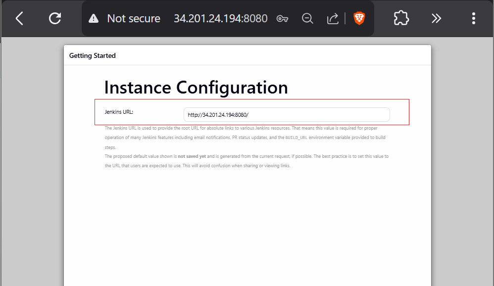

### 4D — Jenkins is Ready

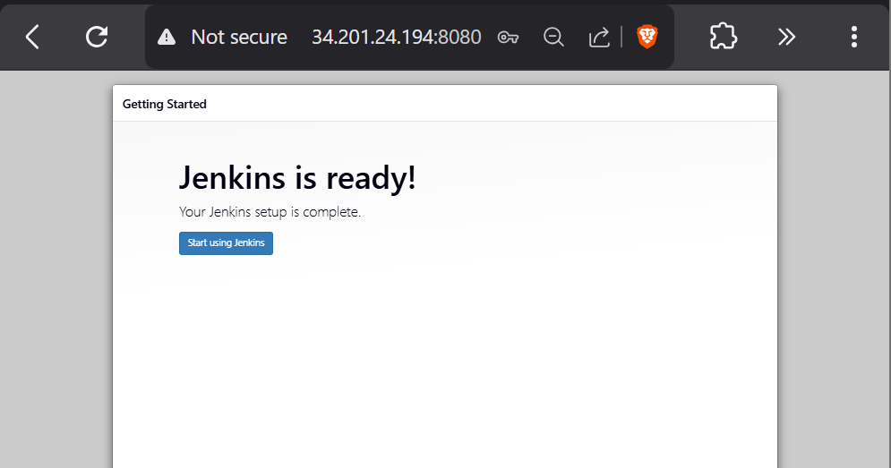

**"Jenkins is ready! Your Jenkins setup is complete."** — Clicked "Start using Jenkins".

### 4E — Jenkins Dashboard

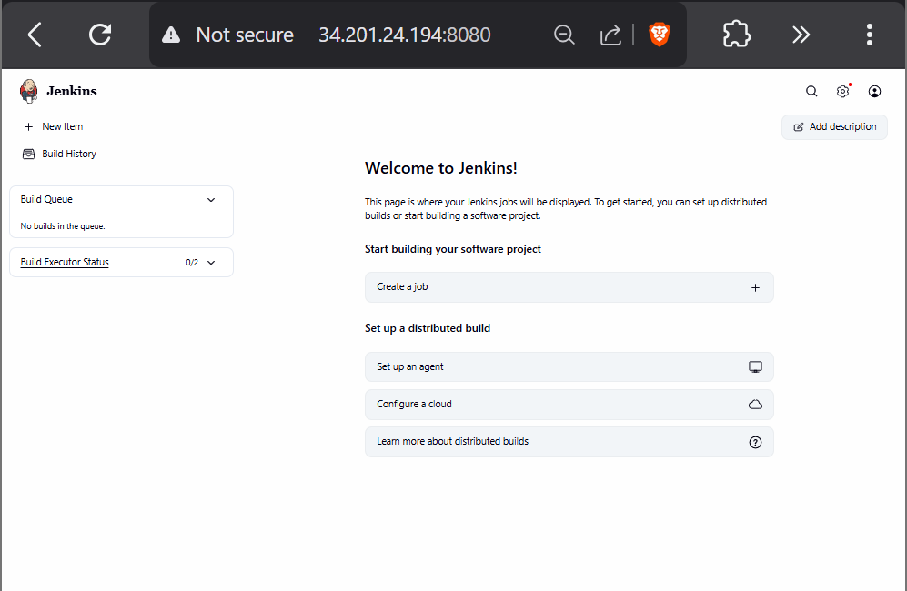

The Jenkins welcome dashboard loaded successfully at `http://34.201.24.194:8080`. The Build Queue shows no pending builds and Build Executor Status shows 0/2 executors in use — clean baseline confirmed.

---

## Step 5 — Configure GitHub Webhook

### 5A — Add Webhook on GitHub

Navigated to the `augustinenwike/tooling` repository on GitHub → Settings → Webhooks → Add webhook:

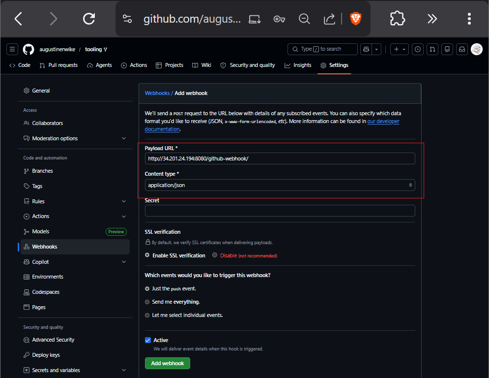

Webhook configured with:

| Field | Value |
|-------|-------|
| Payload URL | `http://34.201.24.194:8080/github-webhook/` |
| Content type | `application/json` |
| Events | Just the push event |
| Active | Checked |

### 5B — Webhook Created Successfully

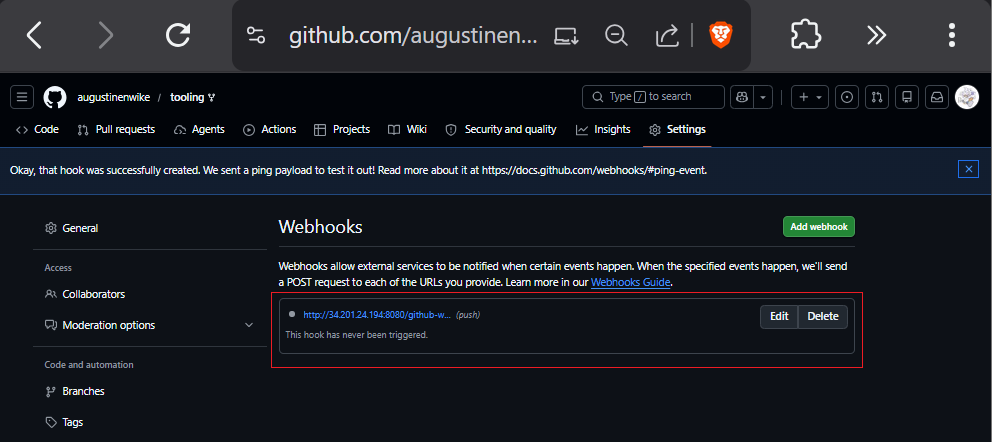

GitHub confirmed: **"Okay, that hook was successfully created. We sent a ping payload to test it out!"** The webhook entry shows `http://34.201.24.194:8080/github-webhook/` pointing to the push event and is listed as Active.

---

## Step 6 — Create Jenkins Freestyle Project

### 6A — New Item

In the Jenkins dashboard, clicked **New Item**:

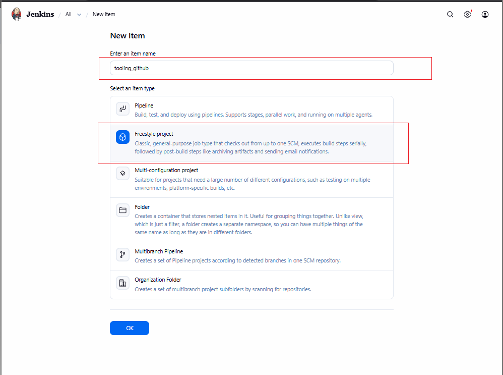

- **Item name:** `tooling_github`
- **Type:** Freestyle project (selected)

### 6B — Configure Source Code Management

In the project configuration, Git was selected as the SCM:

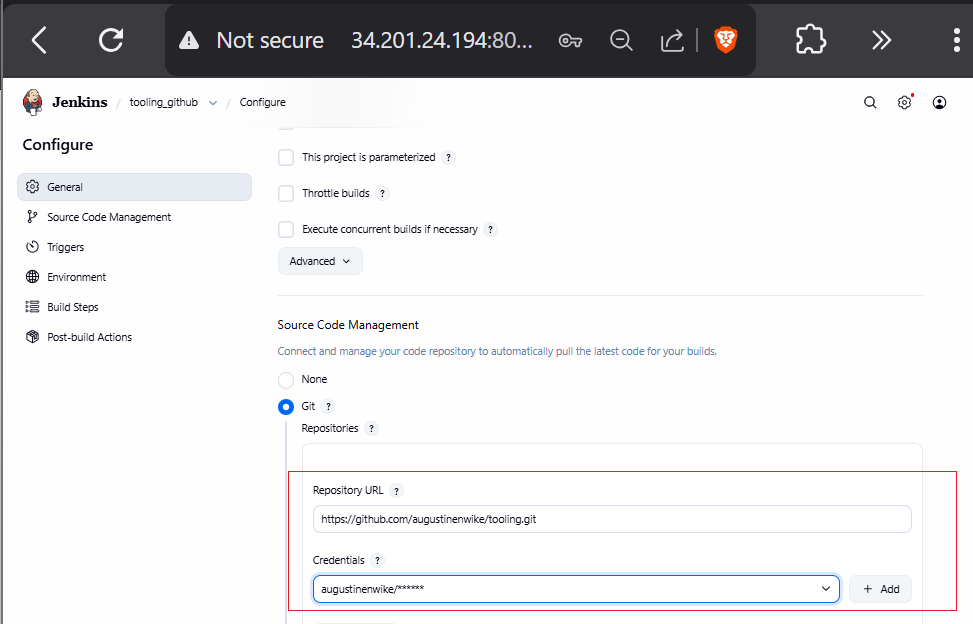

| Field | Value |
|-------|-------|
| Repository URL | `https://github.com/augustinenwike/tooling.git` |
| Credentials | `augustinenwike/******` (GitHub token credential) |
| Branch | `*/master` |

### 6C — First Manual Build — Console Output

Clicked **Build Now** and opened Console Output for build #1:

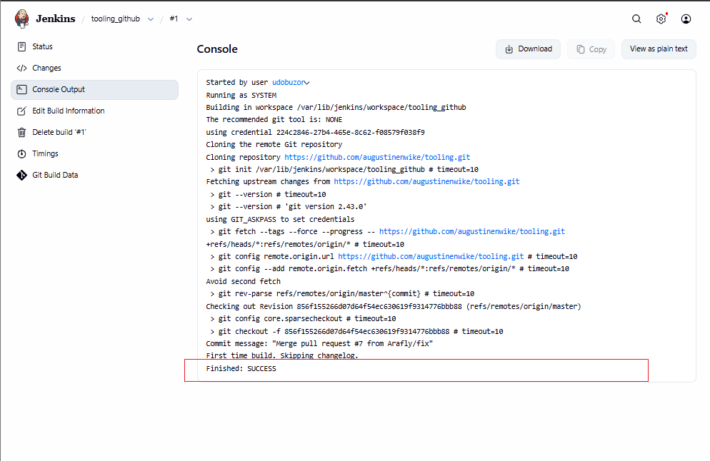

```
Started by user udobuzor
Running as SYSTEM
Building in workspace /var/lib/jenkins/workspace/tooling_github
Cloning the remote Git repository
Cloning repository https://github.com/augustinenwike/tooling.git
  > git init /var/lib/jenkins/workspace/tooling_github # timeout=10
Checking out Revision 856f155266d07d64f54ec630619f9314776bbb88
Commit message: "Merge pull request #7 from Arafly/fix"
First time build. Skipping changelog.
Finished: SUCCESS
```

### 6D — Configure Build Triggers & Artifact Archiving

Back in Configure, the following were set:

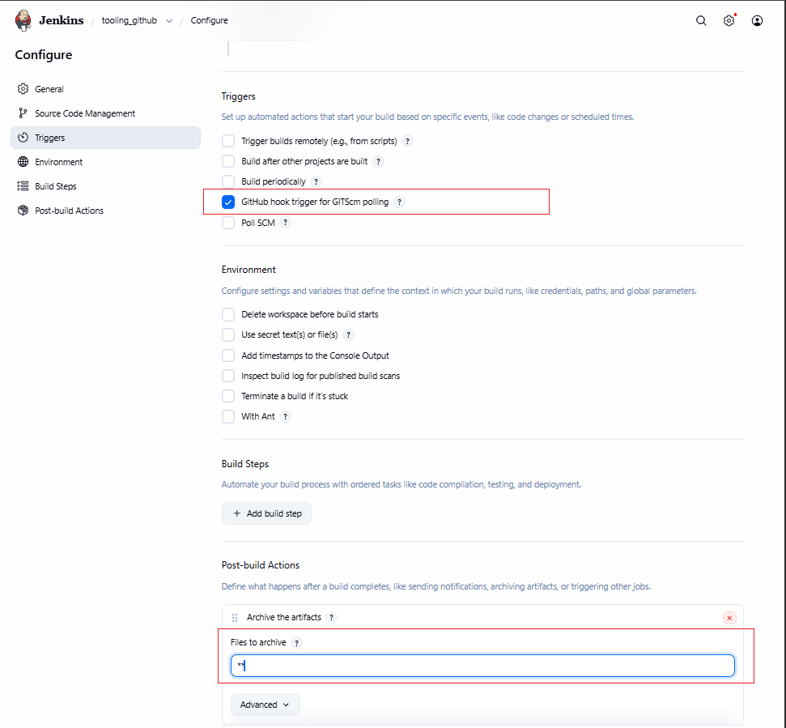

**Build Triggers:**
- **GitHub hook trigger for GITScm polling** — enables auto-build on every GitHub push

**Post-build Actions:**
- **Archive the artifacts** → Files to archive: `**` (all files)

---

## Step 7 — Verify Build #2 Auto-Triggered & Artifacts Saved

A small change was pushed to the GitHub repository. Jenkins detected the webhook and automatically triggered build #2.

### Build History — Both Builds Successful

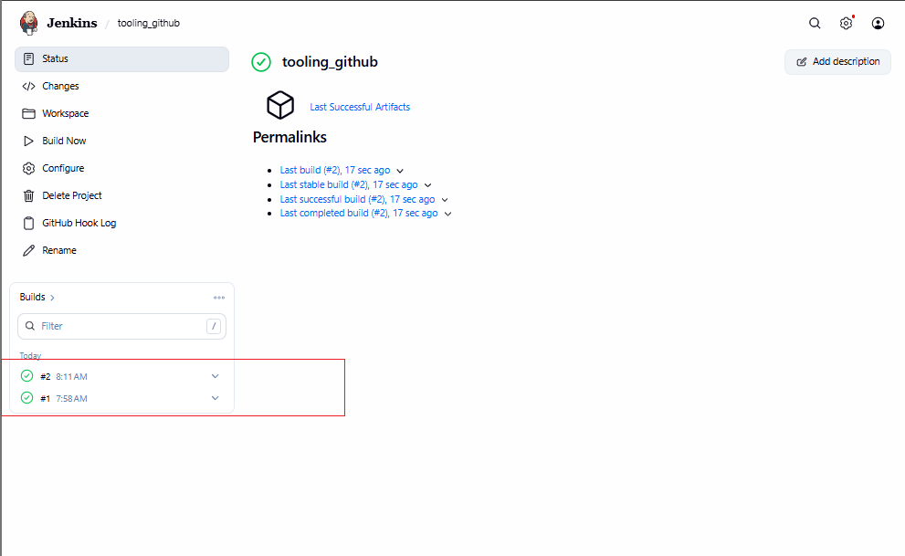

The `tooling_github` project shows:
- **Build #1** — 7:58 AM (manual)
- **Build #2** — 8:11 AM (auto-triggered by GitHub push)

Both builds show green checkmarks confirming `Finished: SUCCESS`.

### Verify Artifacts Saved on Jenkins Server

```bash
ls /var/lib/jenkins/jobs/tooling_github/builds/2/archive/
```

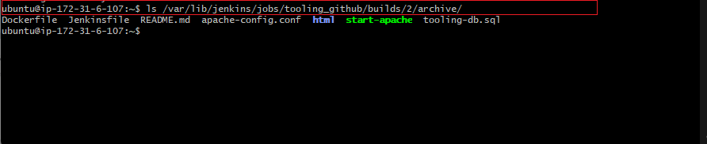

```
Dockerfile  Jenkinsfile  README.md  apache-config.conf  html/  start-apache  tooling-db.sql
```

All repository files — including `Dockerfile`, `Jenkinsfile`, `README.md`, `apache-config.conf`, the `html/` directory, `start-apache` script, and `tooling-db.sql` — were archived successfully

---

## Step 8 — Install "Publish Over SSH" Plugin

Navigated to **Manage Jenkins → Plugins → Available plugins** and searched for the plugin:

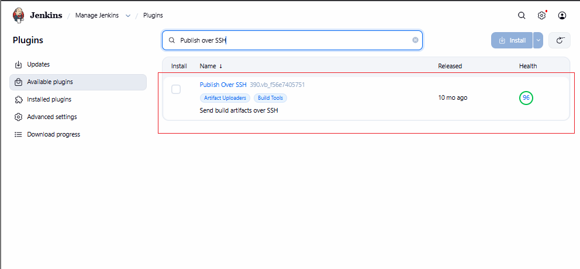

**Publish Over SSH** (version 390.vb_f56e7405751) was found — a plugin for sending build artifacts over SSH, rated health score 96/100. The plugin was selected and installed without restart.

---

## Step 9 — Configure SSH Connection to NFS Server

### 9A — First Attempt — Connection Timed Out

Navigated to **Manage Jenkins → System → Publish over SSH section**. The `.pem` key content was pasted in, and the NFS Server connection details filled in:

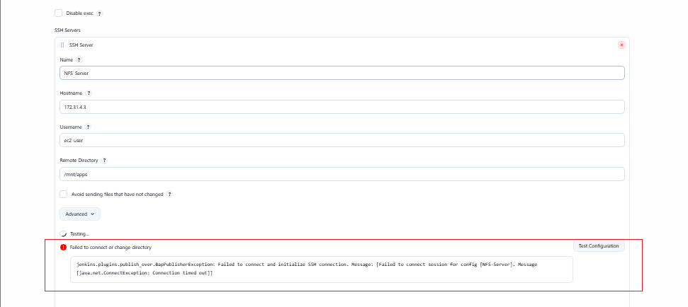

| Field | Value |
|-------|-------|
| Key | (contents of `.pem` file pasted) |
| Name | NFS Server |
| Hostname | 172.31.4.3 |
| Username | ec2-user |
| Remote Directory | /mnt/apps |

**Result:** `Failed to connect or change directory`

```
jenkins.plugins.publish_over_ssh.BapSshPublisherException: Failed to connect 
and initialize SSH connection. Message: [Failed to connect session for config 
[NFS-Server]. Message [java.net.ConnectException: Connection timed out]]
```

> **Key Issue — Connection Timed Out**
>
> **Root cause:** Port 22 was not open in the NFS Server's Security Group for the Jenkins server's IP. The Jenkins EC2 (172.31.0.232) could not reach the NFS Server (172.31.4.3) on SSH.
>
> **Fix:** Added an inbound rule to the NFS Server's Security Group:
> - Port: 22 (SSH)
> - Source: Jenkins Server Private IP (`172.31.0.232/32`) or the entire VPC CIDR
>
> After saving the Security Group rule, the Test Configuration was re-run.

### 9B — Connection Successful After Security Group Fix

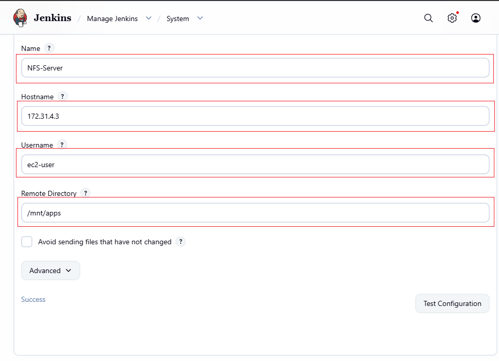

After updating the NFS Server Security Group to allow port 22 from the Jenkins server, **Test Configuration** returned:

**Success**

NFS Server connection details confirmed:
| Field | Value |
|-------|-------|
| Name | NFS-Server |
| Hostname | 172.31.4.3 |
| Username | ec2-user |
| Remote Directory | /mnt/apps |

---

## Step 10 — Configure Job to Copy Files to NFS via SSH

In the `tooling_github` project → Configure → Post-build Actions → **Send build artifacts over SSH**:

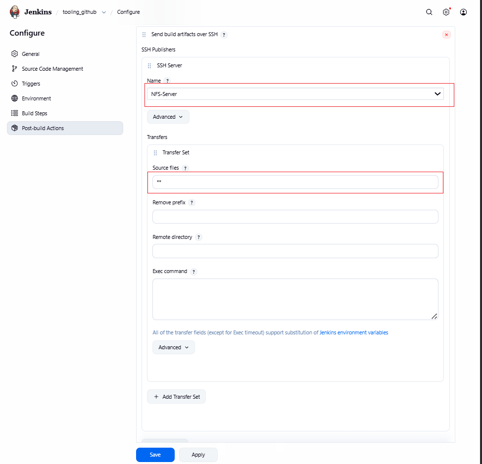

| Field | Value |
|-------|-------|
| SSH Server Name | NFS-Server |
| Source files | `**` |
| Remove prefix | (blank) |
| Remote directory | (blank — uses `/mnt/apps` from global config) |
| Exec command | (blank) |

---

## Step 11 — Verify Files Reached the NFS Server

SSH into the NFS Server and check:

```bash
cat /mnt/apps/README.md
```

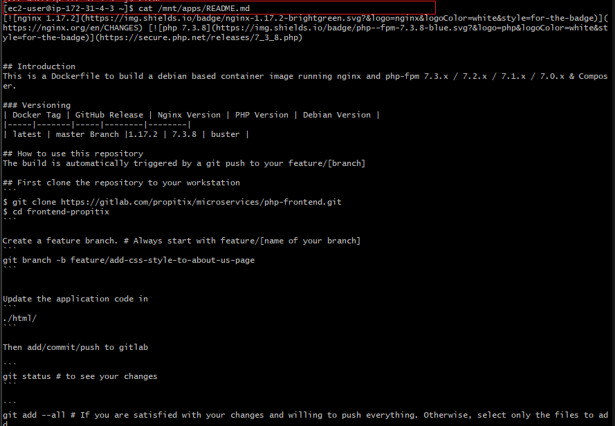

The `README.md` content is visible on the NFS Server at `/mnt/apps/` — showing the Nginx + PHP Dockerfile readme from the tooling repository. This confirms the **full CI/CD pipeline is working end-to-end**:

```
GitHub push → Jenkins webhook trigger → Jenkins build → 
Publish Over SSH → NFS /mnt/apps → Web Servers serve latest code
```

---

## Key Issues Faced & How They Were Resolved

### Issue 1 — Jenkins GPG Key Error on Ubuntu 24.04 (Noble)

| | |
|---|---|
| **Symptom** | `NO_PUBKEY 7198F4B714ABFC68` — apt refused to update from the Jenkins repo |
| **Root Cause** | The old `jenkins.io.key` used with the deprecated `apt-key add` method is not trusted on Ubuntu 24.04. The newer `jenkins.io-2023.key` also failed because Ubuntu Noble requires the 2026 key. |
| **Fix** | Used `sudo wget -O /etc/apt/keyrings/jenkins-keyring.asc https://pkg.jenkins.io/debian-stable/jenkins.io-2026.key` and referenced it with `signed-by=` in the repo entry. This is the correct modern approach for Ubuntu 24.04. |

---

### Issue 2 — SSH "Connection Timed Out" When Connecting to NFS Server

| | |
|---|---|
| **Symptom** | `java.net.ConnectException: Connection timed out` when testing the Publish Over SSH config |
| **Root Cause** | The NFS Server's EC2 Security Group had no inbound rule allowing SSH (port 22) from the Jenkins server's private IP. |
| **Fix** | Added an inbound SSH rule to the NFS Server's Security Group allowing port 22 from the Jenkins server's private IP (`172.31.0.232`). After applying the rule, Test Configuration returned **Success** immediately. |

---

### Issue 3 — "Permission Denied" When Writing to /mnt/apps

| | |
|---|---|
| **Symptom** | `ERROR: Exception when publishing, exception message [Permission denied]` — build status changed to UNSTABLE |
| **Root Cause** | The `/mnt/apps` directory on the NFS Server was owned by `nobody:nobody` with restricted write permissions. Jenkins SSHs in as `ec2-user`, who did not have write access. |
| **Fix** | On the NFS Server, ran: `sudo chown -R ec2-user:ec2-user /mnt/apps` and `sudo chmod -R 755 /mnt/apps`. The next build transferred files successfully. |

---

## Final Result — Full CI/CD Pipeline Operational

| Component | Technology | Version | Status |
|-----------|-----------|---------|--------|
| CI Server OS | Ubuntu on AWS EC2 | 24.04 LTS Noble | Running |
| CI Tool | Jenkins | 2.555.2 | Active |
| Java Runtime | OpenJDK | 21.0.10 | Installed |
| Source Control | GitHub | — | Connected |
| Webhook | GitHub → Jenkins | Push event | Active |
| Artifact Deployment | Publish Over SSH | 390.vb | Transferring |
| Deployment Target | NFS Server /mnt/apps | — | Receiving files |

**Every code push to GitHub now automatically builds and deploys to the NFS Server — the Tooling Website updates without any manual intervention.** 

---